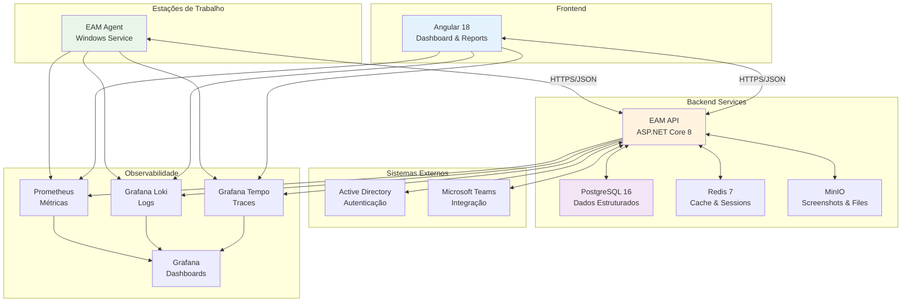

# Employee Activity Monitor (EAM) v5.0 - Resumo Executivo do Plano Arquitetural

## 1. Visão Geral do Projeto

### 1.1 Objetivo do Sistema
O Employee Activity Monitor (EAM) v5.0 é uma solução corporativa moderna para monitoramento de atividades de funcionários, oferecendo insights sobre produtividade, uso de recursos e otimização de processos. O sistema coleta dados de forma não intrusiva, respeitando a privacidade dos funcionários e fornecendo análises valiosas para gestores e departamentos de RH.

### 1.2 Escopo do Projeto
- **Usuários**: Até 500 funcionários
- **Volume de Dados**: ~1GB/mês
- **Plataforma**: Windows 10/11
- **Deployment**: Ambiente corporativo único
- **Cronograma**: 54 semanas (≈ 13 meses)

### 1.3 Principais Funcionalidades
- Monitoramento de foco de janelas e aplicações
- Rastreamento de URLs e atividades web
- Integração com Microsoft Teams
- Capturas de tela automáticas
- Dashboards interativos e relatórios
- Análise de produtividade em tempo real
- Conformidade com LGPD e políticas de privacidade

## 2. Arquitetura do Sistema

### 2.1 Visão Geral da Arquitetura


### 2.2 Componentes Principais

#### 2.2.1 EAM Agent (Windows Service)
- **Tecnologia**: .NET 8, Windows Service
- **Função**: Coleta de dados local não intrusiva
- **Recursos**: Baixo consumo (< 5% CPU, < 100MB RAM)
- **Deployment**: MSI via Group Policy

#### 2.2.2 EAM API (Backend)
- **Tecnologia**: ASP.NET Core 8, Clean Architecture
- **Função**: Processamento e armazenamento de dados
- **Patterns**: CQRS, Repository, Mediator
- **Escalabilidade**: Suporta múltiplas instâncias

#### 2.2.3 Web Application (Frontend)
- **Tecnologia**: Angular 18, TypeScript
- **Função**: Interface moderna e responsiva
- **Features**: Dashboards interativos, relatórios avançados
- **UX**: Design intuitivo com foco na experiência do usuário

#### 2.2.4 Infraestrutura de Dados
- **PostgreSQL 16**: Dados estruturados com particionamento
- **Redis 7**: Cache distribuído e sessões
- **MinIO**: Armazenamento de objetos (screenshots)
- **Backup**: Estratégia automatizada com retenção

#### 2.2.5 Observabilidade
- **OpenTelemetry**: Tracing distribuído
- **Prometheus**: Métricas e monitoramento
- **Grafana**: Dashboards e alertas
- **Loki/Tempo**: Logs e traces centralizados

## 3. Estratégia de Implementação

### 3.1 Abordagem Faseada (5 Fases)

#### **Fase 1 - Bootstrap (Semanas 1-6)**
- Configuração da infraestrutura base
- Ambiente de desenvolvimento
- Bibliotecas compartilhadas
- Pipeline CI/CD

#### **Fase 2 - Núcleo (Semanas 7-18)**
- Desenvolvimento do agente Windows
- Coletores de dados básicos
- Processamento local
- Comunicação com API

#### **Fase 3 - API (Semanas 19-30)**
- API RESTful completa
- Autenticação e autorização
- Integração com sistemas externos
- Processamento de dados

#### **Fase 4 - UI (Semanas 31-42)**
- Interface web Angular
- Dashboards interativos
- Sistema de relatórios
- Administração do sistema

#### **Fase 5 - Plugins (Semanas 43-54)**
- Sistema de extensibilidade
- Plugin Teams avançado
- Implantação em produção
- Monitoramento completo

### 3.2 Metodologia de Desenvolvimento
- **Abordagem**: Agile/Scrum
- **Sprints**: 2 semanas
- **Entregas**: Incrementais com valor
- **Qualidade**: Testes automatizados (>80% cobertura)
- **Documentação**: Atualizada continuamente

## 4. Tecnologias e Padrões

### 4.1 Stack Tecnológico

#### Backend
- **.NET 8**: Runtime e framework principal
- **ASP.NET Core 8**: API web
- **Entity Framework Core**: ORM
- **PostgreSQL 16**: Banco de dados principal
- **Redis 7**: Cache distribuído
- **MinIO**: Object storage

#### Frontend
- **Angular 18**: Framework SPA
- **TypeScript**: Linguagem principal
- **Angular Material**: Componentes UI
- **Chart.js**: Visualizações de dados
- **NgRx**: Gerenciamento de estado

#### Infraestrutura
- **Docker**: Containerização
- **Nginx**: Reverse proxy e load balancer
- **OpenTelemetry**: Observabilidade
- **Grafana Stack**: Monitoramento

### 4.2 Padrões Arquiteturais
- **Clean Architecture**: Separação de responsabilidades
- **CQRS**: Separação de comandos e consultas
- **Repository Pattern**: Abstração de dados
- **Dependency Injection**: Inversão de dependências
- **Event-Driven**: Comunicação baseada em eventos

## 5. Benefícios e ROI

### 5.1 Benefícios Técnicos
- **Escalabilidade**: Suporta crescimento até 500 usuários
- **Performance**: Resposta < 200ms, disponibilidade > 99.5%
- **Manutenibilidade**: Código limpo e bem documentado
- **Segurança**: Autenticação robusta e criptografia
- **Observabilidade**: Monitoramento completo e proativo

### 5.2 Benefícios de Negócio
- **Insights de Produtividade**: Análises detalhadas de performance
- **Otimização de Recursos**: Identificação de gargalos
- **Compliance**: Conformidade com regulamentações
- **Tomada de Decisão**: Dados objetivos para gestão
- **Cultura de Transparência**: Visibilidade das atividades

### 5.3 ROI Estimado
- **Redução de Custos**: 15-20% otimização de recursos
- **Aumento de Produtividade**: 10-15% melhoria média
- **Economia de Tempo**: 20-30% redução em tarefas administrativas
- **Payback Period**: 8-12 meses
- **TCO**: 40% menor que soluções proprietárias

## 6. Recursos Necessários

### 6.1 Equipe de Desenvolvimento
- **Arquiteto de Software**: 1 pessoa (tempo integral)
- **Desenvolvedor Backend**: 2 pessoas (tempo integral)
- **Desenvolvedor Frontend**: 1 pessoa (tempo integral)
- **Desenvolvedor Windows**: 1 pessoa (tempo integral)
- **QA Engineer**: 1 pessoa (tempo integral)
- **DevOps Engineer**: 0.5 pessoa (tempo parcial)

### 6.2 Infraestrutura
- **Desenvolvimento**: 4 VMs (16GB RAM, 8 vCPUs cada)
- **Staging**: 2 VMs (8GB RAM, 4 vCPUs cada)
- **Produção**: 4 VMs (32GB RAM, 16 vCPUs cada)
- **Armazenamento**: 2TB SSD (expansível)
- **Rede**: 1Gbps dedicado

### 6.3 Investimento Total
- **Recursos Humanos**: R$ 2.4M (54 semanas)
- **Infraestrutura**: R$ 180K (hardware + licenças)
- **Ferramentas**: R$ 60K (desenvolvimento + monitoramento)
- **Contingência**: R$ 240K (10% do total)
- **Total**: R$ 2.88M

## 7. Riscos e Mitigações

### 7.1 Riscos Técnicos
| Risco | Probabilidade | Impacto | Mitigação |
|-------|---------------|---------|-----------|
| Performance do agente | Média | Alto | Profiling contínuo, otimizações |
| Integração Teams | Alta | Médio | Prova de conceito, API alternativa |
| Escalabilidade | Média | Alto | Testes de carga, arquitetura flexível |
| Segurança | Baixa | Crítico | Auditoria, boas práticas |

### 7.2 Riscos de Negócio
| Risco | Probabilidade | Impacto | Mitigação |
|-------|---------------|---------|-----------|
| Resistência usuários | Média | Alto | Comunicação, transparência |
| Mudança requisitos | Alta | Médio | Arquitetura flexível, sprints curtos |
| Compliance | Baixa | Crítico | Auditoria legal, anonimização |
| Concorrência | Baixa | Médio | Diferenciação, roadmap ágil |

### 7.3 Plano de Contingência
- **Backup de Dados**: Recuperação em < 4 horas
- **Falha de Componentes**: Redundância e failover
- **Problemas de Performance**: Otimização e escalabilidade
- **Mudanças Regulatórias**: Compliance adaptável

## 8. Cronograma e Marcos

### 8.1 Cronograma Resumido
```
Fase 1 - Bootstrap      : Semanas 1-6   (6 semanas)
Fase 2 - Núcleo        : Semanas 7-18  (12 semanas)
Fase 3 - API           : Semanas 19-30 (12 semanas)
Fase 4 - UI            : Semanas 31-42 (12 semanas)
Fase 5 - Plugins       : Semanas 43-54 (12 semanas)

Total: 54 semanas (≈ 13 meses)
```

### 8.2 Marcos Principais
- **M1**: Infraestrutura pronta (Semana 6)
- **M2**: Agente funcional (Semana 18)
- **M3**: API operacional (Semana 30)
- **M4**: UI completa (Semana 42)
- **M5**: Sistema em produção (Semana 54)

### 8.3 Dependências Críticas
- **Aprovação de Orçamento**: Semana 0
- **Aprovação de Privacidade**: Semana 2
- **Ambiente de Infraestrutura**: Semana 4
- **Integração com AD**: Semana 20
- **Homologação de Segurança**: Semana 50

## 9. Métricas de Sucesso

### 9.1 Métricas Técnicas
- **Disponibilidade**: > 99.5%
- **Performance**: < 200ms resposta API
- **Cobertura de Testes**: > 80%
- **Bugs em Produção**: < 2/sprint
- **Tempo de Deploy**: < 30 minutos

### 9.2 Métricas de Negócio
- **Adoção de Usuários**: > 90% em 3 meses
- **Satisfação do Usuário**: > 4.0/5.0
- **Insights Gerados**: > 50 relatórios/mês
- **ROI**: Positive em 12 meses
- **Compliance**: 100% auditoria

### 9.3 Métricas de Qualidade
- **Tempo de Resolução**: < 2 horas
- **Deployment Success**: > 95%
- **Documentação**: 100% atualizada
- **Treinamento**: 100% da equipe
- **Conhecimento**: 0 dependências críticas

## 10. Fatores Críticos de Sucesso

### 10.1 Requisitos Essenciais
- **Comprometimento Executivo**: Apoio total da liderança
- **Equipe Dedicada**: Recursos humanos qualificados
- **Infraestrutura Adequada**: Ambiente robusto
- **Comunicação Efetiva**: Transparência com stakeholders
- **Qualidade Desde o Início**: Foco em excelência

### 10.2 Capacitação da Equipe
- **Treinamento Técnico**: Tecnologias específicas
- **Metodologia Ágil**: Práticas de desenvolvimento
- **Segurança**: Boas práticas de segurança
- **Observabilidade**: Monitoramento e troubleshooting
- **Negócio**: Compreensão do domínio

### 10.3 Governança do Projeto
- **Steering Committee**: Tomada de decisões
- **Scrum Master**: Facilitação metodológica
- **Product Owner**: Representação do negócio
- **Arquiteto**: Integridade técnica
- **Quality Assurance**: Garantia de qualidade

## 11. Próximos Passos

### 11.1 Ações Imediatas (Semanas 1-2)
1. **Aprovação do Plano**: Validação executiva
2. **Montagem da Equipe**: Contratação/alocação
3. **Ambiente de Desenvolvimento**: Configuração inicial
4. **Kick-off do Projeto**: Alinhamento da equipe
5. **Configuração de Ferramentas**: Pipeline inicial

### 11.2 Preparação da Fase 1 (Semanas 3-4)
1. **Refinamento de Requisitos**: Detalhamento técnico
2. **Configuração de Infraestrutura**: Ambientes base
3. **Padrões e Convenções**: Definição final
4. **Plano de Testes**: Estratégia de qualidade
5. **Comunicação**: Plano de stakeholders

### 11.3 Início da Implementação (Semanas 5-6)
1. **Sprint Planning**: Planejamento detalhado
2. **Configuração de Projetos**: Estrutura de código
3. **Bibliotecas Compartilhadas**: Fundação técnica
4. **Pipeline CI/CD**: Automatização
5. **Primeira Entrega**: Prova de conceito

## 12. Recomendações

### 12.1 Recomendações Técnicas
- **Começar Simples**: MVP first, evolução incremental
- **Qualidade Contínua**: Testes automatizados desde o início
- **Monitoramento Proativo**: Observabilidade desde a primeira versão
- **Segurança por Design**: Considerar segurança em todas as decisões
- **Documentação Viva**: Manter documentação atualizada

### 12.2 Recomendações de Negócio
- **Comunicação Transparente**: Explicar propósito e benefícios
- **Envolvimento dos Usuários**: Feedback contínuo
- **Treinamento Adequado**: Capacitação de usuários finais
- **Políticas Claras**: Definir uso apropriado
- **Compliance Rigoroso**: Aderência a regulamentações

### 12.3 Recomendações de Gestão
- **Sponsors Ativos**: Envolvimento executivo regular
- **Comunicação Regular**: Status updates semanais
- **Gestão de Riscos**: Revisão e mitigação contínua
- **Flexibilidade**: Adaptação a mudanças
- **Celebração de Marcos**: Reconhecimento de conquistas

## 13. Conclusão

O Employee Activity Monitor (EAM) v5.0 representa uma solução moderna e robusta para monitoramento de atividades corporativas. Com uma arquitetura bem definida, estratégia de implementação clara e foco na qualidade, o projeto está posicionado para entregar valor significativo à organização.

### Principais Destaques:
- **Arquitetura Moderna**: Tecnologias atuais e padrões consolidados
- **Estratégia Faseada**: Entrega incremental de valor
- **Observabilidade Completa**: Monitoramento proativo e troubleshooting eficiente
- **Escalabilidade**: Suporte ao crescimento da organização
- **ROI Positivo**: Retorno do investimento em 8-12 meses

### Fatores de Sucesso:
- **Equipe Qualificada**: Recursos humanos especializados
- **Infraestrutura Robusta**: Ambiente adequado para produção
- **Metodologia Ágil**: Desenvolvimento iterativo e adaptativo
- **Qualidade Contínua**: Testes e padrões rigorosos
- **Comunicação Efetiva**: Transparência e engajamento

O projeto está pronto para aprovação e início da implementação, com todos os elementos necessários para um desenvolvimento bem-sucedido e entrega de uma solução de alta qualidade que atenderá às necessidades da organização por muitos anos.

**Recomendação**: Aprovação para início imediato da Fase 1 - Bootstrap, com disponibilização dos recursos necessários e formação da equipe de desenvolvimento.