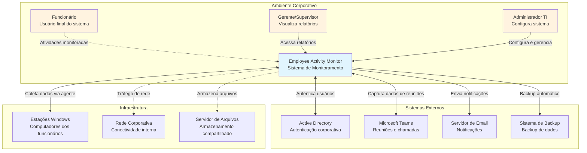
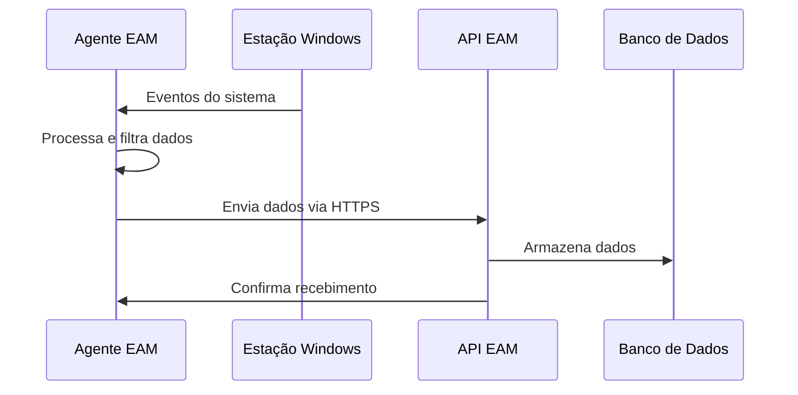
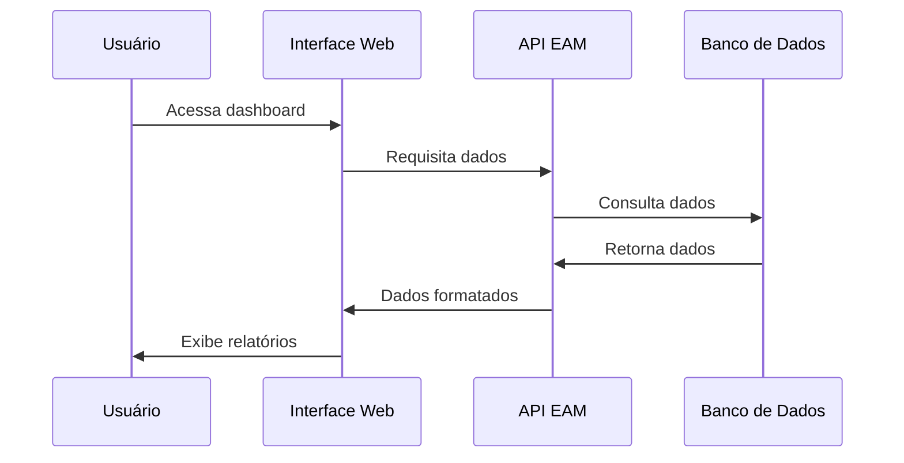
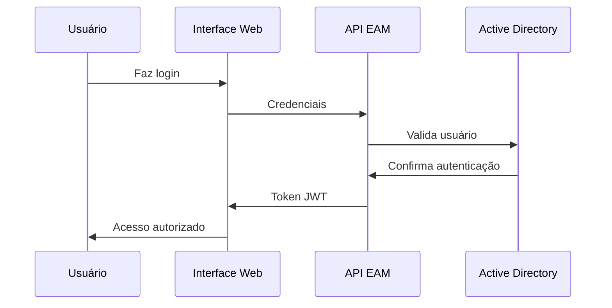

# Employee Activity Monitor (EAM) v5.0 - System Context (C4 Model)

## 1. System Context Diagram

### Visão Geral do Sistema
O Employee Activity Monitor é um sistema corporativo que monitora e analisa as atividades dos funcionários em seus computadores Windows, fornecendo insights sobre produtividade e uso de recursos.

## 2. Atores do Sistema

### 2.1 Usuários Primários

#### **Funcionário**
- **Papel**: Usuário final monitorado
- **Responsabilidades**: 
  - Utiliza o computador para trabalho
  - Interage com aplicações monitoras
  - Visualiza próprias estatísticas básicas
- **Acesso**: Limitado a dados próprios

#### **Gerente/Supervisor**
- **Papel**: Tomador de decisões
- **Responsabilidades**:
  - Visualiza relatórios de produtividade
  - Analisa tendências de equipe
  - Toma decisões baseadas em dados
- **Acesso**: Dados da equipe sob supervisão

#### **Administrador TI**
- **Papel**: Gestor técnico do sistema
- **Responsabilidades**:
  - Configura políticas de monitoramento
  - Gerencia usuários e permissões
  - Monitora saúde do sistema
- **Acesso**: Acesso administrativo completo

### 2.2 Sistemas Externos

#### **Active Directory**
- **Integração**: Autenticação e autorização
- **Dados**: Usuários, grupos, políticas
- **Protocolo**: LDAP/LDAPS

#### **Microsoft Teams**
- **Integração**: Graph API
- **Dados**: Reuniões, chamadas, status
- **Protocolo**: REST API

#### **Servidor de Email**
- **Integração**: SMTP/Exchange
- **Dados**: Notificações, relatórios
- **Protocolo**: SMTP, Exchange Web Services

#### **Sistema de Backup**
- **Integração**: Backup automático
- **Dados**: Dados críticos, configurações
- **Protocolo**: File system, APIs específicas

### 2.3 Infraestrutura

#### **Estações Windows**
- **Componente**: Agente EAM
- **Função**: Coleta de dados local
- **Requisitos**: Windows 10/11, .NET 8

#### **Rede Corporativa**
- **Função**: Conectividade segura
- **Requisitos**: HTTPS, VPN support
- **Protocolos**: TCP/IP, HTTP/HTTPS

#### **Servidor de Arquivos**
- **Função**: Armazenamento de screenshots
- **Requisitos**: Acesso via rede
- **Protocolos**: SMB, NFS

## 3. Fluxos de Dados Principais

### 3.1 Fluxo de Coleta de Dados

### 3.2 Fluxo de Visualização

### 3.3 Fluxo de Autenticação

## 4. Requisitos Não Funcionais

### 4.1 Performance
- **Latência**: < 200ms para consultas básicas
- **Throughput**: 1000 eventos/segundo por agente
- **Concorrência**: 100 usuários simultâneos

### 4.2 Disponibilidade
- **Uptime**: 99.5% (4 horas downtime/mês)
- **RTO**: < 4 horas (Recovery Time Objective)
- **RPO**: < 1 hora (Recovery Point Objective)

### 4.3 Segurança
- **Autenticação**: Multi-factor authentication
- **Autorização**: Role-based access control
- **Criptografia**: AES-256 para dados sensíveis
- **Audit**: Log completo de ações

### 4.4 Escalabilidade
- **Usuários**: 500 funcionários
- **Dados**: 1GB/mês
- **Crescimento**: 20% ao ano

### 4.5 Usabilidade
- **Interface**: Web responsiva
- **Acessibilidade**: WCAG 2.1 AA
- **Navegadores**: Chrome, Firefox, Edge
- **Mobile**: Visualização em tablets

## 5. Restrições e Premissas

### 5.1 Restrições
- **Plataforma**: Windows 10/11 apenas
- **Rede**: Ambiente corporativo controlado
- **Compliance**: LGPD, políticas internas
- **Orçamento**: Solução custo-efetiva

### 5.2 Premissas
- **Infraestrutura**: Rede estável e segura
- **Usuários**: Treinamento adequado
- **Suporte**: Equipe TI disponível
- **Integração**: APIs externas estáveis

## 6. Riscos Identificados

### 6.1 Riscos Técnicos
- **Falhas de rede**: Perda de dados temporária
- **Sobrecarga**: Performance degradada
- **Incompatibilidade**: Versões Windows

### 6.2 Riscos de Negócio
- **Privacidade**: Preocupações dos funcionários
- **Compliance**: Mudanças regulatórias
- **Adoção**: Resistência à mudança

### 6.3 Mitigações
- **Redundância**: Backup automático
- **Monitoramento**: Alertas proativos
- **Comunicação**: Transparência sobre uso
- **Treinamento**: Capacitação contínua