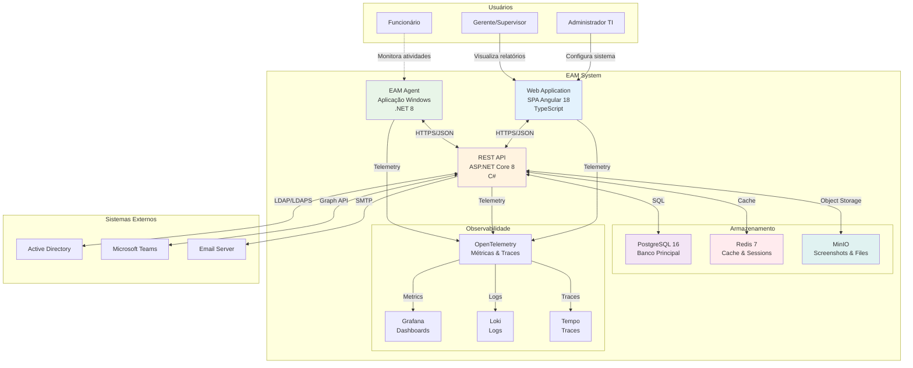
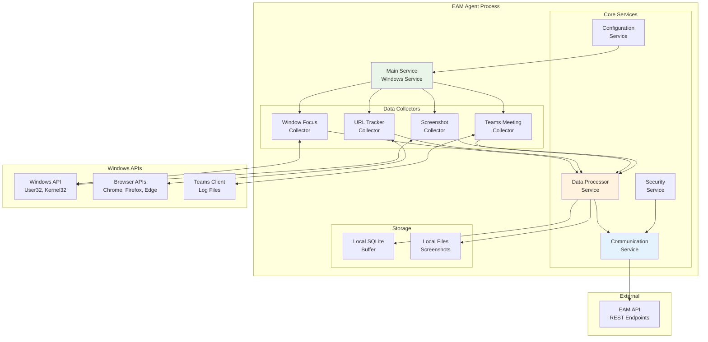
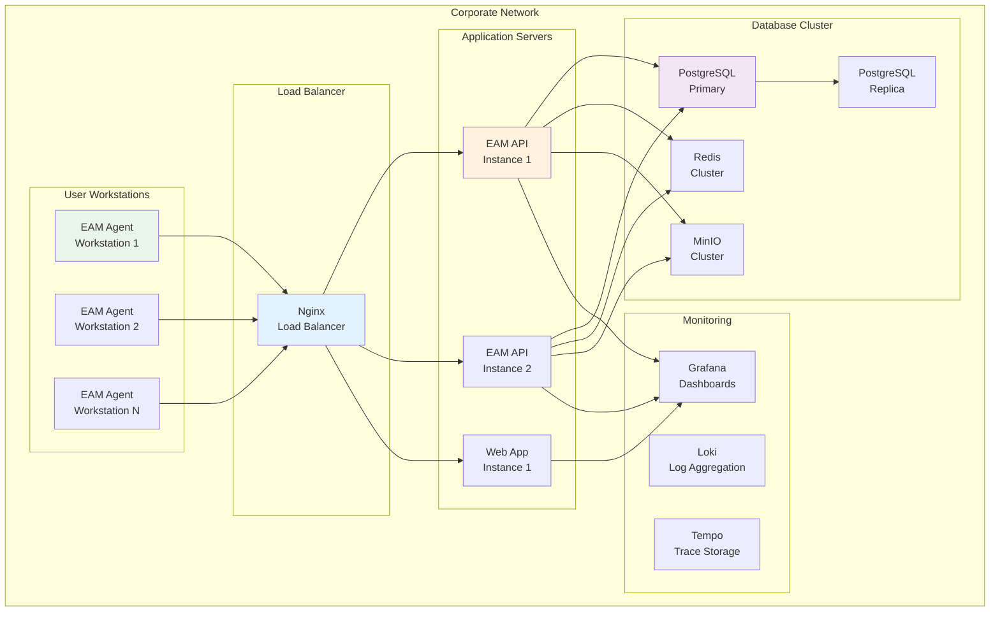

# Employee Activity Monitor (EAM) v5.0 - Container & Component (C4 Model)

## 1. Container Diagram

### Visão Geral dos Containers
O sistema EAM é composto por múltiplos containers que trabalham em conjunto para fornecer funcionalidade completa de monitoramento.



## 2. Container Specifications

### 2.1 EAM Agent (Container)
- **Tipo**: Aplicação Windows Desktop
- **Tecnologia**: .NET 8, WPF (interface minimal)
- **Função**: Coleta dados da estação de trabalho
- **Deployment**: MSI Installer via Group Policy

#### Responsabilidades:
- Captura foco de janelas ativas
- Monitora URLs de navegadores
- Detecta reuniões Microsoft Teams
- Captura screenshots periódicos
- Envia dados via HTTPS para API

#### Configuração:
```json
{
  "ApiEndpoint": "https://eam-api.company.com",
  "ScreenshotInterval": 300,
  "DataSyncInterval": 60,
  "EnableWebTracking": true,
  "EnableTeamsTracking": true
}
```

### 2.2 Web Application (Container)
- **Tipo**: Single Page Application
- **Tecnologia**: Angular 18, TypeScript
- **Função**: Interface web para usuários
- **Deployment**: Nginx container

#### Responsabilidades:
- Dashboard executivo
- Relatórios de produtividade
- Configurações do sistema
- Gestão de usuários
- Visualização de dados

#### Tecnologias:
- Angular 18 + Angular Material
- PrimeNG para componentes avançados
- Chart.js para gráficos
- NgRx para gerenciamento de estado
- PWA para acesso offline

### 2.3 REST API (Container)
- **Tipo**: Web API
- **Tecnologia**: ASP.NET Core 8, C#
- **Função**: Backend principal do sistema
- **Deployment**: Docker container

#### Responsabilidades:
- Recebe dados do agente
- Autentica usuários
- Processa e armazena dados
- Fornece endpoints para web app
- Integra com sistemas externos

#### Arquitetura:
- Clean Architecture
- CQRS pattern
- Mediator pattern
- Repository pattern
- Unit of Work pattern

### 2.4 PostgreSQL (Container)
- **Tipo**: Banco de dados relacional
- **Tecnologia**: PostgreSQL 16
- **Função**: Armazenamento principal
- **Deployment**: Docker container

#### Responsabilidades:
- Dados de usuários
- Logs de atividades
- Configurações do sistema
- Relatórios e métricas
- Audit trails

### 2.5 Redis (Container)
- **Tipo**: Cache em memória
- **Tecnologia**: Redis 7
- **Função**: Cache e sessões
- **Deployment**: Docker container

#### Responsabilidades:
- Cache de consultas frequentes
- Sessões de usuários
- Rate limiting
- Pub/Sub para notificações
- Distributed locks

### 2.6 MinIO (Container)
- **Tipo**: Object Storage
- **Tecnologia**: MinIO S3-compatible
- **Função**: Armazenamento de arquivos
- **Deployment**: Docker container

#### Responsabilidades:
- Screenshots dos usuários
- Arquivos de configuração
- Backups automáticos
- Logs de auditoria
- Relatórios exportados

## 3. Component Diagram - EAM Agent



## 4. Component Diagram - REST API

```mermaid
graph TB
    subgraph "EAM API"
        subgraph "Controllers"
            AuthController[Auth Controller<br/>JWT Authentication]
            DataController[Data Controller<br/>Agent Data Ingestion]
            ReportController[Report Controller<br/>Analytics & Reports]
            UserController[User Controller<br/>User Management]
            ConfigController[Config Controller<br/>System Configuration]
        end
        
        subgraph "Application Services"
            AuthService[Authentication<br/>Service]
            DataService[Data Processing<br/>Service]
            ReportService[Report Generation<br/>Service]
            UserService[User Management<br/>Service]
            NotificationService[Notification<br/>Service]
        end
        
        subgraph "Domain Services"
            ActivityDomain[Activity<br/>Domain Service]
            UserDomain[User<br/>Domain Service]
            SecurityDomain[Security<br/>Domain Service]
            IntegrationDomain[Integration<br/>Domain Service]
        end
        
        subgraph "Infrastructure"
            DataRepository[Data<br/>Repository]
            UserRepository[User<br/>Repository]
            ConfigRepository[Config<br/>Repository]
            CacheService[Cache<br/>Service]
            StorageService[Storage<br/>Service]
            EmailService[Email<br/>Service]
        end
        
        subgraph "External Integrations"
            ADService[Active Directory<br/>Integration]
            TeamsService[Teams Graph API<br/>Integration]
            TelemetryService[OpenTelemetry<br/>Service]
        end
    end
    
    subgraph "External Systems"
        PostgreSQL[(PostgreSQL<br/>Database)]
        Redis[(Redis<br/>Cache)]
        MinIO[(MinIO<br/>Storage)]
        ActiveDirectory[Active Directory]
        MicrosoftGraph[Microsoft Graph]
        SMTPServer[SMTP Server]
    end
    
    %% Controller -> Service
    AuthController --> AuthService
    DataController --> DataService
    ReportController --> ReportService
    UserController --> UserService
    ConfigController --> UserService
    
    %% Service -> Domain
    AuthService --> SecurityDomain
    DataService --> ActivityDomain
    ReportService --> ActivityDomain
    UserService --> UserDomain
    
    %% Service -> Repository
    DataService --> DataRepository
    UserService --> UserRepository
    ReportService --> DataRepository
    AuthService --> UserRepository
    
    %% Infrastructure
    DataRepository --> PostgreSQL
    UserRepository --> PostgreSQL
    ConfigRepository --> PostgreSQL
    CacheService --> Redis
    StorageService --> MinIO
    EmailService --> SMTPServer
    
    %% External Services
    ADService --> ActiveDirectory
    TeamsService --> MicrosoftGraph
    AuthService --> ADService
    DataService --> TeamsService
    NotificationService --> EmailService
    
    style AuthController fill:#ffebee
    style DataController fill:#e8f5e8
    style ReportController fill:#e3f2fd
    style UserController fill:#fff3e0
```



## 5. Component Diagram - Web Application

```mermaid
graph TB
    subgraph "Angular Web Application"
        subgraph "Core Module"
            AppComponent[App Component<br/>Root Component]
            AuthGuard[Auth Guard<br/>Route Protection]
            AuthService[Auth Service<br/>Authentication]
            HttpInterceptor[HTTP Interceptor<br/>Token & Error Handling]
        end
        
        subgraph "Shared Module"
            SharedComponents[Shared Components<br/>Reusable UI]
            SharedServices[Shared Services<br/>Common Logic]
            SharedPipes[Shared Pipes<br/>Data Transformation]
        end
        
        subgraph "Feature Modules"
            DashboardModule[Dashboard Module<br/>Main Overview]
            ReportsModule[Reports Module<br/>Analytics & Reports]
            UsersModule[Users Module<br/>User Management]
            SettingsModule[Settings Module<br/>Configuration]
        end
        
        subgraph "Services"
            DataService[Data Service<br/>API Communication]
            StateService[State Service<br/>NgRx Store]
            NotificationService[Notification Service<br/>User Feedback]
            ChartService[Chart Service<br/>Data Visualization]
        end
        
        subgraph "State Management"
            AppStore[NgRx Store<br/>Application State]
            Effects[NgRx Effects<br/>Side Effects]
            Selectors[NgRx Selectors<br/>State Queries]
        end
    end
    
    subgraph "External"
        EAMAPI[EAM REST API<br/>Backend Services]
        Browser[Browser APIs<br/>Local Storage, etc.]
    end
    
    %% Component relationships
    AppComponent --> AuthGuard
    AppComponent --> DashboardModule
    AppComponent --> ReportsModule
    AppComponent --> UsersModule
    AppComponent --> SettingsModule
    
    %% Services
    AuthService --> DataService
    DataService --> HttpInterceptor
    StateService --> AppStore
    AppStore --> Effects
    AppStore --> Selectors
    
    %% External communication
    DataService --> EAMAPI
    AuthService --> Browser
    HttpInterceptor --> EAMAPI
    
    %% Shared resources
    DashboardModule --> SharedComponents
    ReportsModule --> SharedComponents
    UsersModule --> SharedComponents
    SettingsModule --> SharedComponents
    
    style AppComponent fill:#e3f2fd
    style DataService fill:#e8f5e8
    style AppStore fill:#fff3e0
    style EAMAPI fill:#ffebee
```



## 6. Inter-Container Communication

### 6.1 Agent ↔ API
- **Protocolo**: HTTPS/JSON
- **Autenticação**: Certificate-based
- **Payload**: Compressed JSON
- **Frequência**: Configurable (default: 60s)

### 6.2 Web App ↔ API
- **Protocolo**: HTTPS/JSON
- **Autenticação**: JWT Bearer Token
- **Payload**: JSON REST
- **Comunicação**: Request/Response + WebSocket

### 6.3 API ↔ Databases
- **PostgreSQL**: Connection pooling, prepared statements
- **Redis**: Connection multiplexing, pub/sub
- **MinIO**: S3-compatible API, multipart uploads

### 6.4 Cross-Cutting Concerns
- **Logging**: Structured logging (Serilog)
- **Monitoring**: OpenTelemetry traces
- **Security**: HTTPS everywhere, input validation
- **Error Handling**: Global exception handlers
- **Caching**: Multi-level caching strategy

## 7. Deployment Architecture



## 8. Considerações de Arquitetura

### 8.1 Escalabilidade
- **Horizontal**: Múltiplas instâncias da API
- **Vertical**: Otimização de recursos
- **Database**: Read replicas, connection pooling
- **Cache**: Distributed caching com Redis

### 8.2 Disponibilidade
- **Load Balancing**: Nginx com health checks
- **Failover**: Automatic failover para replicas
- **Backup**: Automated backups dos dados
- **Monitoring**: Proactive monitoring e alertas

### 8.3 Segurança
- **Network**: HTTPS/TLS 1.3 everywhere
- **Authentication**: JWT + Active Directory
- **Authorization**: Role-based access control
- **Data**: Encryption at rest e in transit

### 8.4 Performance
- **Caching**: Multi-level caching strategy
- **Database**: Indexing otimizado
- **Compression**: Gzip compression
- **CDN**: Static assets delivery