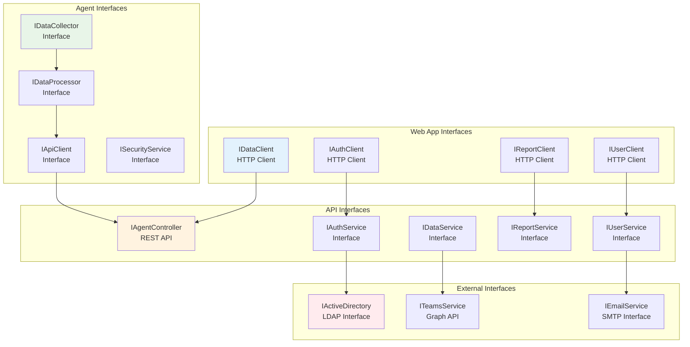

# Employee Activity Monitor (EAM) v5.0 - Interfaces e Contratos

## 1. Visão Geral das Interfaces

### 1.1 Mapa de Interfaces


## 2. Agent Interfaces

### 2.1 IDataCollector
```csharp
namespace EAM.Agent.Core.Interfaces
{
    /// <summary>
    /// Interface para coletores de dados do sistema
    /// </summary>
    public interface IDataCollector
    {
        /// <summary>
        /// Inicia a coleta de dados
        /// </summary>
        Task StartCollectionAsync(CancellationToken cancellationToken = default);
        
        /// <summary>
        /// Para a coleta de dados
        /// </summary>
        Task StopCollectionAsync(CancellationToken cancellationToken = default);
        
        /// <summary>
        /// Obtém dados coletados
        /// </summary>
        Task<IEnumerable<CollectedData>> GetCollectedDataAsync(
            DateTime from, 
            DateTime to, 
            CancellationToken cancellationToken = default);
        
        /// <summary>
        /// Configurações do coletor
        /// </summary>
        CollectorConfiguration Configuration { get; set; }
        
        /// <summary>
        /// Status do coletor
        /// </summary>
        CollectorStatus Status { get; }
        
        /// <summary>
        /// Evento disparado quando dados são coletados
        /// </summary>
        event EventHandler<DataCollectedEventArgs> DataCollected;
    }
}
```

### 2.2 IDataProcessor
```csharp
namespace EAM.Agent.Core.Interfaces
{
    /// <summary>
    /// Interface para processamento de dados coletados
    /// </summary>
    public interface IDataProcessor
    {
        /// <summary>
        /// Processa dados brutos coletados
        /// </summary>
        Task<ProcessedData> ProcessDataAsync(
            CollectedData rawData,
            CancellationToken cancellationToken = default);
        
        /// <summary>
        /// Processa lote de dados
        /// </summary>
        Task<IEnumerable<ProcessedData>> ProcessBatchAsync(
            IEnumerable<CollectedData> rawDataBatch,
            CancellationToken cancellationToken = default);
        
        /// <summary>
        /// Valida dados processados
        /// </summary>
        Task<ValidationResult> ValidateDataAsync(
            ProcessedData data,
            CancellationToken cancellationToken = default);
        
        /// <summary>
        /// Compacta dados para envio
        /// </summary>
        Task<CompressedData> CompressDataAsync(
            ProcessedData data,
            CancellationToken cancellationToken = default);
    }
}
```

### 2.3 IApiClient
```csharp
namespace EAM.Agent.Core.Interfaces
{
    /// <summary>
    /// Interface para comunicação com a API
    /// </summary>
    public interface IApiClient
    {
        /// <summary>
        /// Envia dados de atividade para a API
        /// </summary>
        Task<ApiResponse> SendActivityDataAsync(
            IEnumerable<ActivityData> activities,
            CancellationToken cancellationToken = default);
        
        /// <summary>
        /// Envia screenshot para a API
        /// </summary>
        Task<ApiResponse> SendScreenshotAsync(
            ScreenshotData screenshot,
            CancellationToken cancellationToken = default);
        
        /// <summary>
        /// Obtém configurações do servidor
        /// </summary>
        Task<AgentConfiguration> GetConfigurationAsync(
            CancellationToken cancellationToken = default);
        
        /// <summary>
        /// Registra o agente no servidor
        /// </summary>
        Task<RegistrationResult> RegisterAgentAsync(
            AgentInfo agentInfo,
            CancellationToken cancellationToken = default);
        
        /// <summary>
        /// Verifica conectividade com a API
        /// </summary>
        Task<bool> CheckConnectivityAsync(
            CancellationToken cancellationToken = default);
    }
}
```

## 3. API REST Contracts

### 3.1 Agent Data Endpoints
```csharp
namespace EAM.Api.Controllers
{
    /// <summary>
    /// Controller para recepção de dados do agente
    /// </summary>
    [ApiController]
    [Route("api/v1/agent")]
    public interface IAgentController
    {
        /// <summary>
        /// Registra um novo agente
        /// </summary>
        [HttpPost("register")]
        Task<ActionResult<AgentRegistrationResponse>> RegisterAsync(
            [FromBody] AgentRegistrationRequest request);
        
        /// <summary>
        /// Envia dados de atividade
        /// </summary>
        [HttpPost("activities")]
        Task<ActionResult<DataSubmissionResponse>> SubmitActivitiesAsync(
            [FromBody] ActivityDataRequest request);
        
        /// <summary>
        /// Envia screenshot
        /// </summary>
        [HttpPost("screenshots")]
        Task<ActionResult<DataSubmissionResponse>> SubmitScreenshotAsync(
            [FromForm] ScreenshotSubmissionRequest request);
        
        /// <summary>
        /// Obtém configurações para o agente
        /// </summary>
        [HttpGet("configuration/{agentId}")]
        Task<ActionResult<AgentConfigurationResponse>> GetConfigurationAsync(
            [FromRoute] Guid agentId);
        
        /// <summary>
        /// Heartbeat do agente
        /// </summary>
        [HttpPost("heartbeat")]
        Task<ActionResult<HeartbeatResponse>> HeartbeatAsync(
            [FromBody] HeartbeatRequest request);
    }
}
```

### 3.2 Web Application Endpoints
```csharp
namespace EAM.Api.Controllers
{
    /// <summary>
    /// Controller para dashboard e relatórios
    /// </summary>
    [ApiController]
    [Route("api/v1/dashboard")]
    public interface IDashboardController
    {
        /// <summary>
        /// Obtém dados do dashboard
        /// </summary>
        [HttpGet]
        Task<ActionResult<DashboardResponse>> GetDashboardDataAsync(
            [FromQuery] DashboardRequest request);
        
        /// <summary>
        /// Obtém métricas de produtividade
        /// </summary>
        [HttpGet("productivity")]
        Task<ActionResult<ProductivityMetricsResponse>> GetProductivityMetricsAsync(
            [FromQuery] ProductivityMetricsRequest request);
        
        /// <summary>
        /// Obtém atividades de usuário
        /// </summary>
        [HttpGet("user-activities")]
        Task<ActionResult<UserActivitiesResponse>> GetUserActivitiesAsync(
            [FromQuery] UserActivitiesRequest request);
        
        /// <summary>
        /// Obtém relatório de tempo
        /// </summary>
        [HttpGet("time-report")]
        Task<ActionResult<TimeReportResponse>> GetTimeReportAsync(
            [FromQuery] TimeReportRequest request);
    }
}
```

### 3.3 User Management Endpoints
```csharp
namespace EAM.Api.Controllers
{
    /// <summary>
    /// Controller para gerenciamento de usuários
    /// </summary>
    [ApiController]
    [Route("api/v1/users")]
    public interface IUserController
    {
        /// <summary>
        /// Lista usuários
        /// </summary>
        [HttpGet]
        Task<ActionResult<PagedResponse<UserResponse>>> GetUsersAsync(
            [FromQuery] UserListRequest request);
        
        /// <summary>
        /// Obtém usuário específico
        /// </summary>
        [HttpGet("{userId}")]
        Task<ActionResult<UserResponse>> GetUserAsync(
            [FromRoute] Guid userId);
        
        /// <summary>
        /// Atualiza usuário
        /// </summary>
        [HttpPut("{userId}")]
        Task<ActionResult<UserResponse>> UpdateUserAsync(
            [FromRoute] Guid userId,
            [FromBody] UpdateUserRequest request);
        
        /// <summary>
        /// Define permissões do usuário
        /// </summary>
        [HttpPut("{userId}/permissions")]
        Task<ActionResult> SetUserPermissionsAsync(
            [FromRoute] Guid userId,
            [FromBody] UserPermissionsRequest request);
    }
}
```

## 4. Data Transfer Objects (DTOs)

### 4.1 Activity Data DTOs
```csharp
namespace EAM.Shared.Models
{
    /// <summary>
    /// Dados de atividade coletados pelo agente
    /// </summary>
    public class ActivityData
    {
        public Guid Id { get; set; }
        public Guid AgentId { get; set; }
        public Guid UserId { get; set; }
        public DateTime Timestamp { get; set; }
        public ActivityType Type { get; set; }
        public string Application { get; set; }
        public string WindowTitle { get; set; }
        public string Url { get; set; }
        public TimeSpan Duration { get; set; }
        public bool IsActive { get; set; }
        public Dictionary<string, object> Metadata { get; set; }
    }
    
    /// <summary>
    /// Dados de screenshot
    /// </summary>
    public class ScreenshotData
    {
        public Guid Id { get; set; }
        public Guid AgentId { get; set; }
        public Guid UserId { get; set; }
        public DateTime Timestamp { get; set; }
        public string FilePath { get; set; }
        public string FileHash { get; set; }
        public int Width { get; set; }
        public int Height { get; set; }
        public long FileSize { get; set; }
        public ScreenshotQuality Quality { get; set; }
    }
    
    /// <summary>
    /// Dados de reunião Teams
    /// </summary>
    public class TeamsActivityData
    {
        public Guid Id { get; set; }
        public Guid AgentId { get; set; }
        public Guid UserId { get; set; }
        public DateTime StartTime { get; set; }
        public DateTime? EndTime { get; set; }
        public string MeetingId { get; set; }
        public string MeetingTitle { get; set; }
        public MeetingType Type { get; set; }
        public int ParticipantCount { get; set; }
        public bool IsOrganizer { get; set; }
        public MeetingStatus Status { get; set; }
    }
}
```

### 4.2 Request/Response DTOs
```csharp
namespace EAM.Shared.Models.Requests
{
    /// <summary>
    /// Requisição para submissão de atividades
    /// </summary>
    public class ActivityDataRequest
    {
        public Guid AgentId { get; set; }
        public IEnumerable<ActivityData> Activities { get; set; }
        public DateTime CollectionTimestamp { get; set; }
        public string AgentVersion { get; set; }
        public string ComputerName { get; set; }
        public string UserName { get; set; }
    }
    
    /// <summary>
    /// Resposta para submissão de dados
    /// </summary>
    public class DataSubmissionResponse
    {
        public bool Success { get; set; }
        public string Message { get; set; }
        public int ProcessedCount { get; set; }
        public int ErrorCount { get; set; }
        public IEnumerable<string> Errors { get; set; }
        public DateTime ServerTimestamp { get; set; }
    }
    
    /// <summary>
    /// Requisição de dashboard
    /// </summary>
    public class DashboardRequest
    {
        public DateTime FromDate { get; set; }
        public DateTime ToDate { get; set; }
        public IEnumerable<Guid> UserIds { get; set; }
        public IEnumerable<string> Applications { get; set; }
        public DashboardScope Scope { get; set; }
    }
    
    /// <summary>
    /// Resposta do dashboard
    /// </summary>
    public class DashboardResponse
    {
        public ProductivitySummary ProductivitySummary { get; set; }
        public IEnumerable<ApplicationUsage> TopApplications { get; set; }
        public IEnumerable<WebsiteUsage> TopWebsites { get; set; }
        public IEnumerable<UserActivity> RecentActivities { get; set; }
        public TimeDistribution TimeDistribution { get; set; }
        public IEnumerable<TeamsMeetingSummary> MeetingsSummary { get; set; }
    }
}
```

### 4.3 Configuration DTOs
```csharp
namespace EAM.Shared.Models.Configuration
{
    /// <summary>
    /// Configuração do agente
    /// </summary>
    public class AgentConfiguration
    {
        public Guid AgentId { get; set; }
        public int DataSyncInterval { get; set; }
        public int ScreenshotInterval { get; set; }
        public bool EnableWebTracking { get; set; }
        public bool EnableTeamsTracking { get; set; }
        public bool EnableScreenshots { get; set; }
        public ScreenshotQuality ScreenshotQuality { get; set; }
        public IEnumerable<string> MonitoredApplications { get; set; }
        public IEnumerable<string> ExcludedApplications { get; set; }
        public IEnumerable<string> ExcludedUrls { get; set; }
        public SecuritySettings SecuritySettings { get; set; }
    }
    
    /// <summary>
    /// Configurações de segurança
    /// </summary>
    public class SecuritySettings
    {
        public bool EncryptLocalData { get; set; }
        public bool RequireHttps { get; set; }
        public string CertificateThumbprint { get; set; }
        public int MaxRetryAttempts { get; set; }
        public TimeSpan RetryDelay { get; set; }
    }
}
```

## 5. Service Interfaces

### 5.1 Authentication Service
```csharp
namespace EAM.Api.Core.Interfaces
{
    /// <summary>
    /// Interface para serviços de autenticação
    /// </summary>
    public interface IAuthService
    {
        /// <summary>
        /// Autentica usuário
        /// </summary>
        Task<AuthResult> AuthenticateAsync(
            string username, 
            string password,
            CancellationToken cancellationToken = default);
        
        /// <summary>
        /// Autentica via Active Directory
        /// </summary>
        Task<AuthResult> AuthenticateWithActiveDirectoryAsync(
            string username,
            string password,
            CancellationToken cancellationToken = default);
        
        /// <summary>
        /// Gera token JWT
        /// </summary>
        Task<string> GenerateJwtTokenAsync(
            User user,
            CancellationToken cancellationToken = default);
        
        /// <summary>
        /// Valida token JWT
        /// </summary>
        Task<TokenValidationResult> ValidateTokenAsync(
            string token,
            CancellationToken cancellationToken = default);
        
        /// <summary>
        /// Renova token JWT
        /// </summary>
        Task<string> RefreshTokenAsync(
            string refreshToken,
            CancellationToken cancellationToken = default);
    }
}
```

### 5.2 Data Service
```csharp
namespace EAM.Api.Core.Interfaces
{
    /// <summary>
    /// Interface para serviços de dados
    /// </summary>
    public interface IDataService
    {
        /// <summary>
        /// Processa dados de atividade
        /// </summary>
        Task<ProcessingResult> ProcessActivityDataAsync(
            IEnumerable<ActivityData> activities,
            CancellationToken cancellationToken = default);
        
        /// <summary>
        /// Armazena screenshot
        /// </summary>
        Task<StorageResult> StoreScreenshotAsync(
            ScreenshotData screenshot,
            Stream imageStream,
            CancellationToken cancellationToken = default);
        
        /// <summary>
        /// Obtém atividades de usuário
        /// </summary>
        Task<IEnumerable<ActivityData>> GetUserActivitiesAsync(
            Guid userId,
            DateTime fromDate,
            DateTime toDate,
            CancellationToken cancellationToken = default);
        
        /// <summary>
        /// Obtém métricas de produtividade
        /// </summary>
        Task<ProductivityMetrics> GetProductivityMetricsAsync(
            IEnumerable<Guid> userIds,
            DateTime fromDate,
            DateTime toDate,
            CancellationToken cancellationToken = default);
        
        /// <summary>
        /// Obtém relatório de tempo
        /// </summary>
        Task<TimeReport> GetTimeReportAsync(
            TimeReportRequest request,
            CancellationToken cancellationToken = default);
    }
}
```

## 6. Event Contracts

### 6.1 Domain Events
```csharp
namespace EAM.Shared.Events
{
    /// <summary>
    /// Evento base para o sistema
    /// </summary>
    public abstract class DomainEvent
    {
        public Guid Id { get; } = Guid.NewGuid();
        public DateTime Timestamp { get; } = DateTime.UtcNow;
        public string EventType { get; }
        public string Source { get; set; }
        public string UserId { get; set; }
        
        protected DomainEvent(string eventType)
        {
            EventType = eventType;
        }
    }
    
    /// <summary>
    /// Evento de dados recebidos
    /// </summary>
    public class DataReceivedEvent : DomainEvent
    {
        public Guid AgentId { get; set; }
        public int RecordCount { get; set; }
        public DataType DataType { get; set; }
        public long DataSize { get; set; }
        
        public DataReceivedEvent() : base(nameof(DataReceivedEvent))
        {
        }
    }
    
    /// <summary>
    /// Evento de usuário logado
    /// </summary>
    public class UserLoggedInEvent : DomainEvent
    {
        public Guid UserId { get; set; }
        public string UserName { get; set; }
        public string IpAddress { get; set; }
        public string UserAgent { get; set; }
        
        public UserLoggedInEvent() : base(nameof(UserLoggedInEvent))
        {
        }
    }
}
```

### 6.2 Integration Events
```csharp
namespace EAM.Shared.Events.Integration
{
    /// <summary>
    /// Evento de integração com Teams
    /// </summary>
    public class TeamsIntegrationEvent : DomainEvent
    {
        public Guid UserId { get; set; }
        public string MeetingId { get; set; }
        public string Action { get; set; }
        public DateTime MeetingStartTime { get; set; }
        public DateTime? MeetingEndTime { get; set; }
        
        public TeamsIntegrationEvent() : base(nameof(TeamsIntegrationEvent))
        {
        }
    }
    
    /// <summary>
    /// Evento de sincronização com AD
    /// </summary>
    public class ActiveDirectorySyncEvent : DomainEvent
    {
        public string Operation { get; set; }
        public int UsersProcessed { get; set; }
        public int GroupsProcessed { get; set; }
        public bool Success { get; set; }
        public string ErrorMessage { get; set; }
        
        public ActiveDirectorySyncEvent() : base(nameof(ActiveDirectorySyncEvent))
        {
        }
    }
}
```

## 7. External Service Interfaces

### 7.1 Active Directory Interface
```csharp
namespace EAM.Infrastructure.Interfaces
{
    /// <summary>
    /// Interface para integração com Active Directory
    /// </summary>
    public interface IActiveDirectoryService
    {
        /// <summary>
        /// Autentica usuário no AD
        /// </summary>
        Task<bool> AuthenticateUserAsync(
            string username,
            string password,
            CancellationToken cancellationToken = default);
        
        /// <summary>
        /// Obtém informações do usuário
        /// </summary>
        Task<ActiveDirectoryUser> GetUserInfoAsync(
            string username,
            CancellationToken cancellationToken = default);
        
        /// <summary>
        /// Obtém grupos do usuário
        /// </summary>
        Task<IEnumerable<string>> GetUserGroupsAsync(
            string username,
            CancellationToken cancellationToken = default);
        
        /// <summary>
        /// Sincroniza usuários do AD
        /// </summary>
        Task<SyncResult> SyncUsersAsync(
            CancellationToken cancellationToken = default);
    }
}
```

### 7.2 Teams Service Interface
```csharp
namespace EAM.Infrastructure.Interfaces
{
    /// <summary>
    /// Interface para integração com Microsoft Teams
    /// </summary>
    public interface ITeamsService
    {
        /// <summary>
        /// Obtém reuniões do usuário
        /// </summary>
        Task<IEnumerable<TeamsMeeting>> GetUserMeetingsAsync(
            string userId,
            DateTime fromDate,
            DateTime toDate,
            CancellationToken cancellationToken = default);
        
        /// <summary>
        /// Obtém presença do usuário
        /// </summary>
        Task<TeamsPresence> GetUserPresenceAsync(
            string userId,
            CancellationToken cancellationToken = default);
        
        /// <summary>
        /// Obtém atividades do usuário
        /// </summary>
        Task<IEnumerable<TeamsActivity>> GetUserActivitiesAsync(
            string userId,
            DateTime fromDate,
            DateTime toDate,
            CancellationToken cancellationToken = default);
    }
}
```

## 8. Validation Contracts

### 8.1 Data Validation
```csharp
namespace EAM.Shared.Validation
{
    /// <summary>
    /// Interface para validação de dados
    /// </summary>
    public interface IDataValidator<in T>
    {
        /// <summary>
        /// Valida dados
        /// </summary>
        Task<ValidationResult> ValidateAsync(
            T data,
            CancellationToken cancellationToken = default);
        
        /// <summary>
        /// Valida lote de dados
        /// </summary>
        Task<BatchValidationResult> ValidateBatchAsync(
            IEnumerable<T> dataBatch,
            CancellationToken cancellationToken = default);
    }
    
    /// <summary>
    /// Resultado da validação
    /// </summary>
    public class ValidationResult
    {
        public bool IsValid { get; set; }
        public IEnumerable<ValidationError> Errors { get; set; }
        public Dictionary<string, object> Context { get; set; }
    }
    
    /// <summary>
    /// Erro de validação
    /// </summary>
    public class ValidationError
    {
        public string Field { get; set; }
        public string Message { get; set; }
        public string Code { get; set; }
        public object Value { get; set; }
    }
}
```

## 9. Telemetry Contracts

### 9.1 Telemetry Interface
```csharp
namespace EAM.Shared.Telemetry
{
    /// <summary>
    /// Interface para telemetria
    /// </summary>
    public interface ITelemetryService
    {
        /// <summary>
        /// Registra métrica
        /// </summary>
        void RecordMetric(string name, double value, IDictionary<string, object> tags = null);
        
        /// <summary>
        /// Registra evento
        /// </summary>
        void RecordEvent(string name, IDictionary<string, object> properties = null);
        
        /// <summary>
        /// Inicia trace
        /// </summary>
        IDisposable StartTrace(string operationName, IDictionary<string, object> tags = null);
        
        /// <summary>
        /// Registra exceção
        /// </summary>
        void RecordException(Exception exception, IDictionary<string, object> context = null);
    }
}
```

## 10. Considerações de Versionamento

### 10.1 API Versioning
- **URL Versioning**: `/api/v1/`, `/api/v2/`
- **Header Versioning**: `X-API-Version: 1.0`
- **Backward Compatibility**: Manter versões antigas por 6 meses
- **Deprecation Strategy**: Avisos com 3 meses de antecedência

### 10.2 Contract Evolution
- **Additive Changes**: Novos campos opcionais
- **Breaking Changes**: Nova versão da API
- **Schema Migration**: Suporte a múltiplas versões simultaneamente
- **Client Updates**: Estratégia de atualização gradual

### 10.3 Data Contracts
- **Immutable Contracts**: Contratos principais não mudam
- **Extension Points**: Campos `metadata` para extensibilidade
- **Validation**: Validação rigorosa de entrada
- **Error Handling**: Códigos de erro padronizados