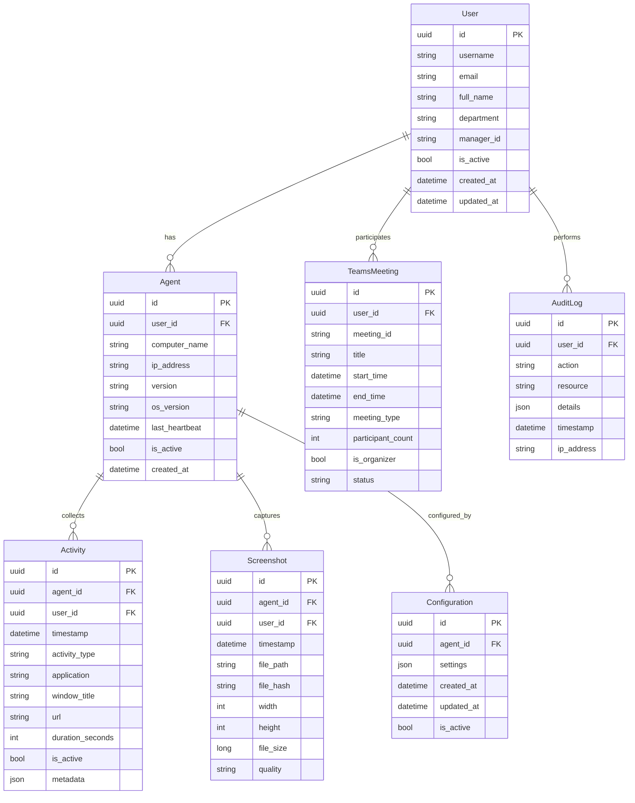

# Employee Activity Monitor (EAM) v5.0 - Modelos de Dados e DTOs

## 1. Modelo de Dados Conceitual

### 1.1 Diagrama de Entidades


## 2. Core Data Models

### 2.1 User Models
```csharp
namespace EAM.Shared.Models.Core
{
    /// <summary>
    /// Modelo de usuário do sistema
    /// </summary>
    public class User
    {
        public Guid Id { get; set; }
        public string Username { get; set; }
        public string Email { get; set; }
        public string FullName { get; set; }
        public string Department { get; set; }
        public Guid? ManagerId { get; set; }
        public bool IsActive { get; set; }
        public DateTime CreatedAt { get; set; }
        public DateTime UpdatedAt { get; set; }
        
        // Relacionamentos
        public User Manager { get; set; }
        public ICollection<User> Subordinates { get; set; }
        public ICollection<Agent> Agents { get; set; }
        public ICollection<Activity> Activities { get; set; }
        public ICollection<TeamsMeeting> TeamsMeetings { get; set; }
        public ICollection<UserRole> UserRoles { get; set; }
    }
    
    /// <summary>
    /// Perfil detalhado do usuário
    /// </summary>
    public class UserProfile
    {
        public Guid UserId { get; set; }
        public string JobTitle { get; set; }
        public string Location { get; set; }
        public string TimeZone { get; set; }
        public string PhoneNumber { get; set; }
        public DateTime? HireDate { get; set; }
        public UserPreferences Preferences { get; set; }
        public WorkSchedule WorkSchedule { get; set; }
    }
    
    /// <summary>
    /// Preferências do usuário
    /// </summary>
    public class UserPreferences
    {
        public bool EnableNotifications { get; set; }
        public bool EnableEmailReports { get; set; }
        public string Language { get; set; }
        public string Theme { get; set; }
        public Dictionary<string, object> CustomSettings { get; set; }
    }
    
    /// <summary>
    /// Horário de trabalho
    /// </summary>
    public class WorkSchedule
    {
        public TimeSpan StartTime { get; set; }
        public TimeSpan EndTime { get; set; }
        public DayOfWeek[] WorkDays { get; set; }
        public TimeSpan BreakDuration { get; set; }
        public string TimeZone { get; set; }
    }
}
```

### 2.2 Agent Models
```csharp
namespace EAM.Shared.Models.Core
{
    /// <summary>
    /// Modelo do agente de monitoramento
    /// </summary>
    public class Agent
    {
        public Guid Id { get; set; }
        public Guid UserId { get; set; }
        public string ComputerName { get; set; }
        public string IpAddress { get; set; }
        public string Version { get; set; }
        public string OsVersion { get; set; }
        public DateTime LastHeartbeat { get; set; }
        public bool IsActive { get; set; }
        public DateTime CreatedAt { get; set; }
        public AgentStatus Status { get; set; }
        public Dictionary<string, object> SystemInfo { get; set; }
        
        // Relacionamentos
        public User User { get; set; }
        public ICollection<Activity> Activities { get; set; }
        public ICollection<Screenshot> Screenshots { get; set; }
        public Configuration Configuration { get; set; }
    }
    
    /// <summary>
    /// Informações do sistema onde o agente roda
    /// </summary>
    public class SystemInfo
    {
        public string MachineName { get; set; }
        public string UserName { get; set; }
        public string DomainName { get; set; }
        public string OsVersion { get; set; }
        public string OsArchitecture { get; set; }
        public long TotalMemory { get; set; }
        public long AvailableMemory { get; set; }
        public string ProcessorName { get; set; }
        public int ProcessorCores { get; set; }
        public string[] NetworkInterfaces { get; set; }
        public string TimeZone { get; set; }
    }
    
    /// <summary>
    /// Status de saúde do agente
    /// </summary>
    public class AgentHealth
    {
        public Guid AgentId { get; set; }
        public DateTime LastCheck { get; set; }
        public HealthStatus Status { get; set; }
        public double CpuUsage { get; set; }
        public double MemoryUsage { get; set; }
        public long DiskUsage { get; set; }
        public int ActiveConnections { get; set; }
        public TimeSpan Uptime { get; set; }
        public string[] Errors { get; set; }
        public string[] Warnings { get; set; }
    }
}
```

### 2.3 Activity Models
```csharp
namespace EAM.Shared.Models.Core
{
    /// <summary>
    /// Modelo de atividade do usuário
    /// </summary>
    public class Activity
    {
        public Guid Id { get; set; }
        public Guid AgentId { get; set; }
        public Guid UserId { get; set; }
        public DateTime Timestamp { get; set; }
        public ActivityType Type { get; set; }
        public string Application { get; set; }
        public string WindowTitle { get; set; }
        public string Url { get; set; }
        public int DurationSeconds { get; set; }
        public bool IsActive { get; set; }
        public ProductivityCategory Category { get; set; }
        public Dictionary<string, object> Metadata { get; set; }
        
        // Relacionamentos
        public Agent Agent { get; set; }
        public User User { get; set; }
    }
    
    /// <summary>
    /// Detalhes da atividade web
    /// </summary>
    public class WebActivity
    {
        public string Url { get; set; }
        public string Domain { get; set; }
        public string Title { get; set; }
        public string Browser { get; set; }
        public string BrowserVersion { get; set; }
        public bool IsIncognito { get; set; }
        public int TabCount { get; set; }
        public TimeSpan ViewTime { get; set; }
        public int ScrollDepth { get; set; }
        public int ClickCount { get; set; }
    }
    
    /// <summary>
    /// Detalhes da atividade de aplicação
    /// </summary>
    public class ApplicationActivity
    {
        public string ProcessName { get; set; }
        public string ProcessPath { get; set; }
        public string WindowTitle { get; set; }
        public string WindowClass { get; set; }
        public Rectangle WindowBounds { get; set; }
        public bool IsMaximized { get; set; }
        public bool IsMinimized { get; set; }
        public TimeSpan FocusTime { get; set; }
        public int Keystrokes { get; set; }
        public int MouseClicks { get; set; }
    }
    
    /// <summary>
    /// Sessão de atividade agrupada
    /// </summary>
    public class ActivitySession
    {
        public Guid Id { get; set; }
        public Guid UserId { get; set; }
        public DateTime StartTime { get; set; }
        public DateTime EndTime { get; set; }
        public TimeSpan Duration { get; set; }
        public string PrimaryApplication { get; set; }
        public ProductivityCategory Category { get; set; }
        public ICollection<Activity> Activities { get; set; }
        public ActivitySessionSummary Summary { get; set; }
    }
    
    /// <summary>
    /// Resumo da sessão de atividade
    /// </summary>
    public class ActivitySessionSummary
    {
        public int TotalActivities { get; set; }
        public int UniqueApplications { get; set; }
        public int UniqueWebsites { get; set; }
        public TimeSpan ActiveTime { get; set; }
        public TimeSpan IdleTime { get; set; }
        public double ProductivityScore { get; set; }
        public Dictionary<string, TimeSpan> ApplicationTime { get; set; }
        public Dictionary<string, TimeSpan> WebsiteTime { get; set; }
    }
}
```

### 2.4 Screenshot Models
```csharp
namespace EAM.Shared.Models.Core
{
    /// <summary>
    /// Modelo de screenshot
    /// </summary>
    public class Screenshot
    {
        public Guid Id { get; set; }
        public Guid AgentId { get; set; }
        public Guid UserId { get; set; }
        public DateTime Timestamp { get; set; }
        public string FilePath { get; set; }
        public string FileHash { get; set; }
        public int Width { get; set; }
        public int Height { get; set; }
        public long FileSize { get; set; }
        public ScreenshotQuality Quality { get; set; }
        public ScreenshotType Type { get; set; }
        public bool IsBlurred { get; set; }
        public Dictionary<string, object> Metadata { get; set; }
        
        // Relacionamentos
        public Agent Agent { get; set; }
        public User User { get; set; }
        public ICollection<DetectedObject> DetectedObjects { get; set; }
    }
    
    /// <summary>
    /// Objetos detectados no screenshot
    /// </summary>
    public class DetectedObject
    {
        public Guid Id { get; set; }
        public Guid ScreenshotId { get; set; }
        public string ObjectType { get; set; }
        public string Name { get; set; }
        public Rectangle Bounds { get; set; }
        public double Confidence { get; set; }
        public Dictionary<string, object> Properties { get; set; }
        
        // Relacionamentos
        public Screenshot Screenshot { get; set; }
    }
    
    /// <summary>
    /// Configuração de screenshot
    /// </summary>
    public class ScreenshotConfiguration
    {
        public bool Enabled { get; set; }
        public int IntervalSeconds { get; set; }
        public ScreenshotQuality Quality { get; set; }
        public bool BlurSensitiveContent { get; set; }
        public bool EnableObjectDetection { get; set; }
        public string[] SensitiveApplications { get; set; }
        public string[] ExcludedApplications { get; set; }
        public Rectangle[] ExcludedRegions { get; set; }
    }
}
```

### 2.5 Teams Integration Models
```csharp
namespace EAM.Shared.Models.Core
{
    /// <summary>
    /// Modelo de reunião Teams
    /// </summary>
    public class TeamsMeeting
    {
        public Guid Id { get; set; }
        public Guid UserId { get; set; }
        public string MeetingId { get; set; }
        public string Title { get; set; }
        public DateTime StartTime { get; set; }
        public DateTime? EndTime { get; set; }
        public MeetingType Type { get; set; }
        public int ParticipantCount { get; set; }
        public bool IsOrganizer { get; set; }
        public MeetingStatus Status { get; set; }
        public Dictionary<string, object> Metadata { get; set; }
        
        // Relacionamentos
        public User User { get; set; }
        public ICollection<MeetingParticipant> Participants { get; set; }
        public ICollection<MeetingActivity> Activities { get; set; }
    }
    
    /// <summary>
    /// Participante da reunião
    /// </summary>
    public class MeetingParticipant
    {
        public Guid Id { get; set; }
        public Guid MeetingId { get; set; }
        public string UserId { get; set; }
        public string DisplayName { get; set; }
        public string Email { get; set; }
        public ParticipantRole Role { get; set; }
        public DateTime JoinTime { get; set; }
        public DateTime? LeaveTime { get; set; }
        public bool IsExternal { get; set; }
        
        // Relacionamentos
        public TeamsMeeting Meeting { get; set; }
    }
    
    /// <summary>
    /// Atividade dentro da reunião
    /// </summary>
    public class MeetingActivity
    {
        public Guid Id { get; set; }
        public Guid MeetingId { get; set; }
        public string UserId { get; set; }
        public MeetingActivityType Type { get; set; }
        public DateTime Timestamp { get; set; }
        public Dictionary<string, object> Details { get; set; }
        
        // Relacionamentos
        public TeamsMeeting Meeting { get; set; }
    }
    
    /// <summary>
    /// Presença do usuário no Teams
    /// </summary>
    public class TeamsPresence
    {
        public Guid Id { get; set; }
        public Guid UserId { get; set; }
        public DateTime Timestamp { get; set; }
        public PresenceStatus Status { get; set; }
        public string Activity { get; set; }
        public string StatusMessage { get; set; }
        public bool IsOutOfOffice { get; set; }
        public DateTime? OutOfOfficeUntil { get; set; }
        
        // Relacionamentos
        public User User { get; set; }
    }
}
```

## 3. Enumerations

### 3.1 Activity Enums
```csharp
namespace EAM.Shared.Models.Enums
{
    /// <summary>
    /// Tipos de atividade
    /// </summary>
    public enum ActivityType
    {
        WindowFocus = 1,
        WebBrowsing = 2,
        ApplicationUsage = 3,
        FileAccess = 4,
        TeamsMeeting = 5,
        SystemEvent = 6,
        UserInput = 7,
        NetworkActivity = 8
    }
    
    /// <summary>
    /// Categorias de produtividade
    /// </summary>
    public enum ProductivityCategory
    {
        Productive = 1,
        Neutral = 2,
        Distracting = 3,
        Personal = 4,
        Administrative = 5,
        Communication = 6,
        Learning = 7,
        Unknown = 8
    }
    
    /// <summary>
    /// Status da atividade
    /// </summary>
    public enum ActivityStatus
    {
        Active = 1,
        Idle = 2,
        Away = 3,
        Locked = 4,
        Suspended = 5
    }
}
```

### 3.2 Agent Enums
```csharp
namespace EAM.Shared.Models.Enums
{
    /// <summary>
    /// Status do agente
    /// </summary>
    public enum AgentStatus
    {
        Online = 1,
        Offline = 2,
        Installing = 3,
        Updating = 4,
        Error = 5,
        Disabled = 6,
        Maintenance = 7
    }
    
    /// <summary>
    /// Status de saúde
    /// </summary>
    public enum HealthStatus
    {
        Healthy = 1,
        Warning = 2,
        Critical = 3,
        Unknown = 4
    }
    
    /// <summary>
    /// Tipos de evento do agente
    /// </summary>
    public enum AgentEventType
    {
        Started = 1,
        Stopped = 2,
        Heartbeat = 3,
        DataSent = 4,
        ConfigUpdated = 5,
        Error = 6,
        Warning = 7
    }
}
```

### 3.3 Screenshot Enums
```csharp
namespace EAM.Shared.Models.Enums
{
    /// <summary>
    /// Qualidade do screenshot
    /// </summary>
    public enum ScreenshotQuality
    {
        Low = 1,      // 480p
        Medium = 2,   // 720p
        High = 3,     // 1080p
        Original = 4  // Resolução original
    }
    
    /// <summary>
    /// Tipo de screenshot
    /// </summary>
    public enum ScreenshotType
    {
        Automatic = 1,
        Manual = 2,
        Triggered = 3,
        Audit = 4
    }
    
    /// <summary>
    /// Formato do arquivo
    /// </summary>
    public enum ImageFormat
    {
        Jpeg = 1,
        Png = 2,
        Webp = 3,
        Bmp = 4
    }
}
```

### 3.4 Teams Enums
```csharp
namespace EAM.Shared.Models.Enums
{
    /// <summary>
    /// Tipos de reunião Teams
    /// </summary>
    public enum MeetingType
    {
        Scheduled = 1,
        Instant = 2,
        Recurring = 3,
        Broadcast = 4,
        Webinar = 5
    }
    
    /// <summary>
    /// Status da reunião
    /// </summary>
    public enum MeetingStatus
    {
        Scheduled = 1,
        InProgress = 2,
        Completed = 3,
        Cancelled = 4,
        Postponed = 5
    }
    
    /// <summary>
    /// Papel do participante
    /// </summary>
    public enum ParticipantRole
    {
        Organizer = 1,
        Presenter = 2,
        Attendee = 3,
        Guest = 4
    }
    
    /// <summary>
    /// Tipos de atividade na reunião
    /// </summary>
    public enum MeetingActivityType
    {
        Joined = 1,
        Left = 2,
        MutedMicrophone = 3,
        UnmutedMicrophone = 4,
        TurnedOnCamera = 5,
        TurnedOffCamera = 6,
        SharedScreen = 7,
        StoppedSharing = 8,
        SendMessage = 9,
        ReactedToMessage = 10
    }
    
    /// <summary>
    /// Status de presença
    /// </summary>
    public enum PresenceStatus
    {
        Available = 1,
        Busy = 2,
        DoNotDisturb = 3,
        Away = 4,
        BeRightBack = 5,
        Offline = 6,
        InMeeting = 7,
        OnCall = 8,
        Presenting = 9,
        OutOfOffice = 10
    }
}
```

## 4. Configuration Models

### 4.1 System Configuration
```csharp
namespace EAM.Shared.Models.Configuration
{
    /// <summary>
    /// Configuração geral do sistema
    /// </summary>
    public class SystemConfiguration
    {
        public Guid Id { get; set; }
        public string Name { get; set; }
        public string Description { get; set; }
        public Dictionary<string, object> Settings { get; set; }
        public DateTime CreatedAt { get; set; }
        public DateTime UpdatedAt { get; set; }
        public bool IsActive { get; set; }
        public string CreatedBy { get; set; }
        public string UpdatedBy { get; set; }
    }
    
    /// <summary>
    /// Configuração de monitoramento
    /// </summary>
    public class MonitoringConfiguration
    {
        public bool EnableWindowTracking { get; set; }
        public bool EnableWebTracking { get; set; }
        public bool EnableTeamsTracking { get; set; }
        public bool EnableScreenshots { get; set; }
        public bool EnableKeylogging { get; set; }
        public bool EnableFileTracking { get; set; }
        public bool EnableNetworkTracking { get; set; }
        
        public int DataSyncInterval { get; set; }
        public int ScreenshotInterval { get; set; }
        public int HeartbeatInterval { get; set; }
        public int IdleTimeout { get; set; }
        
        public string[] MonitoredApplications { get; set; }
        public string[] ExcludedApplications { get; set; }
        public string[] MonitoredWebsites { get; set; }
        public string[] ExcludedWebsites { get; set; }
    }
    
    /// <summary>
    /// Configuração de privacidade
    /// </summary>
    public class PrivacyConfiguration
    {
        public bool BlurSensitiveContent { get; set; }
        public bool ExcludePersonalTime { get; set; }
        public bool AnonymizeData { get; set; }
        public bool EnableDataRetention { get; set; }
        public int DataRetentionDays { get; set; }
        public bool RequireUserConsent { get; set; }
        public bool AllowDataExport { get; set; }
        public bool AllowDataDeletion { get; set; }
        
        public string[] SensitiveApplications { get; set; }
        public string[] SensitiveWebsites { get; set; }
        public string[] SensitiveKeywords { get; set; }
    }
}
```

## 5. Analytics Models

### 5.1 Productivity Models
```csharp
namespace EAM.Shared.Models.Analytics
{
    /// <summary>
    /// Métricas de produtividade
    /// </summary>
    public class ProductivityMetrics
    {
        public Guid UserId { get; set; }
        public DateTime Date { get; set; }
        public TimeSpan TotalActiveTime { get; set; }
        public TimeSpan ProductiveTime { get; set; }
        public TimeSpan DistractingTime { get; set; }
        public TimeSpan IdleTime { get; set; }
        public double ProductivityScore { get; set; }
        public int ApplicationSwitches { get; set; }
        public int WebsiteVisits { get; set; }
        public int MeetingCount { get; set; }
        public TimeSpan MeetingTime { get; set; }
        
        public Dictionary<string, TimeSpan> ApplicationTime { get; set; }
        public Dictionary<string, TimeSpan> WebsiteTime { get; set; }
        public Dictionary<string, int> CategoryBreakdown { get; set; }
    }
    
    /// <summary>
    /// Uso de aplicação
    /// </summary>
    public class ApplicationUsage
    {
        public string ApplicationName { get; set; }
        public string Category { get; set; }
        public TimeSpan TotalTime { get; set; }
        public int LaunchCount { get; set; }
        public double AverageSessionLength { get; set; }
        public DateTime FirstUsed { get; set; }
        public DateTime LastUsed { get; set; }
        public ProductivityCategory ProductivityCategory { get; set; }
    }
    
    /// <summary>
    /// Uso de website
    /// </summary>
    public class WebsiteUsage
    {
        public string Domain { get; set; }
        public string Category { get; set; }
        public TimeSpan TotalTime { get; set; }
        public int VisitCount { get; set; }
        public int PageViews { get; set; }
        public double AverageSessionLength { get; set; }
        public DateTime FirstVisited { get; set; }
        public DateTime LastVisited { get; set; }
        public ProductivityCategory ProductivityCategory { get; set; }
    }
    
    /// <summary>
    /// Distribuição de tempo
    /// </summary>
    public class TimeDistribution
    {
        public Dictionary<string, TimeSpan> HourlyDistribution { get; set; }
        public Dictionary<DayOfWeek, TimeSpan> DailyDistribution { get; set; }
        public Dictionary<string, TimeSpan> CategoryDistribution { get; set; }
        public Dictionary<string, TimeSpan> ApplicationDistribution { get; set; }
        public Dictionary<string, TimeSpan> WebsiteDistribution { get; set; }
    }
}
```

### 5.2 Report Models
```csharp
namespace EAM.Shared.Models.Reports
{
    /// <summary>
    /// Relatório base
    /// </summary>
    public abstract class Report
    {
        public Guid Id { get; set; }
        public string Name { get; set; }
        public string Description { get; set; }
        public ReportType Type { get; set; }
        public DateTime FromDate { get; set; }
        public DateTime ToDate { get; set; }
        public DateTime GeneratedAt { get; set; }
        public string GeneratedBy { get; set; }
        public ReportStatus Status { get; set; }
        public Dictionary<string, object> Parameters { get; set; }
    }
    
    /// <summary>
    /// Relatório de produtividade
    /// </summary>
    public class ProductivityReport : Report
    {
        public ICollection<ProductivityMetrics> UserMetrics { get; set; }
        public ProductivitySummary Summary { get; set; }
        public ICollection<ProductivityTrend> Trends { get; set; }
        public ICollection<ProductivityComparison> Comparisons { get; set; }
    }
    
    /// <summary>
    /// Resumo de produtividade
    /// </summary>
    public class ProductivitySummary
    {
        public int TotalUsers { get; set; }
        public TimeSpan TotalActiveTime { get; set; }
        public TimeSpan AverageActiveTime { get; set; }
        public double AverageProductivityScore { get; set; }
        public int TotalMeetings { get; set; }
        public TimeSpan TotalMeetingTime { get; set; }
        public string TopApplication { get; set; }
        public string TopWebsite { get; set; }
        public Dictionary<string, double> CategoryBreakdown { get; set; }
    }
    
    /// <summary>
    /// Tendência de produtividade
    /// </summary>
    public class ProductivityTrend
    {
        public DateTime Date { get; set; }
        public double ProductivityScore { get; set; }
        public TimeSpan ActiveTime { get; set; }
        public TimeSpan ProductiveTime { get; set; }
        public TimeSpan DistractingTime { get; set; }
        public int UserCount { get; set; }
    }
    
    /// <summary>
    /// Comparação de produtividade
    /// </summary>
    public class ProductivityComparison
    {
        public string Entity { get; set; }
        public string ComparisonType { get; set; }
        public double CurrentValue { get; set; }
        public double PreviousValue { get; set; }
        public double ChangePercentage { get; set; }
        public string ChangeDirection { get; set; }
    }
}
```

## 6. Validation Models

### 6.1 Validation Results
```csharp
namespace EAM.Shared.Models.Validation
{
    /// <summary>
    /// Resultado de validação
    /// </summary>
    public class ValidationResult
    {
        public bool IsValid { get; set; }
        public ICollection<ValidationError> Errors { get; set; }
        public ICollection<ValidationWarning> Warnings { get; set; }
        public Dictionary<string, object> Context { get; set; }
        
        public ValidationResult()
        {
            Errors = new List<ValidationError>();
            Warnings = new List<ValidationWarning>();
            Context = new Dictionary<string, object>();
        }
    }
    
    /// <summary>
    /// Erro de validação
    /// </summary>
    public class ValidationError
    {
        public string Field { get; set; }
        public string Message { get; set; }
        public string Code { get; set; }
        public object Value { get; set; }
        public string Severity { get; set; }
        public Dictionary<string, object> Context { get; set; }
    }
    
    /// <summary>
    /// Aviso de validação
    /// </summary>
    public class ValidationWarning
    {
        public string Field { get; set; }
        public string Message { get; set; }
        public string Code { get; set; }
        public object Value { get; set; }
        public Dictionary<string, object> Context { get; set; }
    }
    
    /// <summary>
    /// Resultado de validação em lote
    /// </summary>
    public class BatchValidationResult
    {
        public int TotalItems { get; set; }
        public int ValidItems { get; set; }
        public int InvalidItems { get; set; }
        public ICollection<ValidationResult> Results { get; set; }
        public ValidationSummary Summary { get; set; }
    }
    
    /// <summary>
    /// Resumo de validação
    /// </summary>
    public class ValidationSummary
    {
        public Dictionary<string, int> ErrorCounts { get; set; }
        public Dictionary<string, int> WarningCounts { get; set; }
        public Dictionary<string, int> FieldErrors { get; set; }
        public TimeSpan ValidationTime { get; set; }
    }
}
```

## 7. Common Models

### 7.1 Paging Models
```csharp
namespace EAM.Shared.Models.Common
{
    /// <summary>
    /// Requisição paginada
    /// </summary>
    public class PagedRequest
    {
        public int Page { get; set; } = 1;
        public int PageSize { get; set; } = 20;
        public string SortBy { get; set; }
        public SortDirection SortDirection { get; set; } = SortDirection.Ascending;
        public Dictionary<string, object> Filters { get; set; }
        
        public PagedRequest()
        {
            Filters = new Dictionary<string, object>();
        }
    }
    
    /// <summary>
    /// Resposta paginada
    /// </summary>
    public class PagedResponse<T>
    {
        public ICollection<T> Data { get; set; }
        public int TotalCount { get; set; }
        public int Page { get; set; }
        public int PageSize { get; set; }
        public int TotalPages { get; set; }
        public bool HasNextPage { get; set; }
        public bool HasPreviousPage { get; set; }
        public Dictionary<string, object> Metadata { get; set; }
        
        public PagedResponse()
        {
            Data = new List<T>();
            Metadata = new Dictionary<string, object>();
        }
    }
    
    /// <summary>
    /// Direção da ordenação
    /// </summary>
    public enum SortDirection
    {
        Ascending = 1,
        Descending = 2
    }
}
```

### 7.2 Result Models
```csharp
namespace EAM.Shared.Models.Common
{
    /// <summary>
    /// Resultado de operação
    /// </summary>
    public class OperationResult
    {
        public bool Success { get; set; }
        public string Message { get; set; }
        public string ErrorCode { get; set; }
        public Dictionary<string, object> Data { get; set; }
        public DateTime Timestamp { get; set; }
        
        public OperationResult()
        {
            Data = new Dictionary<string, object>();
            Timestamp = DateTime.UtcNow;
        }
    }
    
    /// <summary>
    /// Resultado de operação tipado
    /// </summary>
    public class OperationResult<T> : OperationResult
    {
        public T Result { get; set; }
    }
    
    /// <summary>
    /// Resultado de API
    /// </summary>
    public class ApiResponse
    {
        public bool Success { get; set; }
        public string Message { get; set; }
        public object Data { get; set; }
        public ICollection<string> Errors { get; set; }
        public Dictionary<string, object> Metadata { get; set; }
        public DateTime Timestamp { get; set; }
        
        public ApiResponse()
        {
            Errors = new List<string>();
            Metadata = new Dictionary<string, object>();
            Timestamp = DateTime.UtcNow;
        }
    }
    
    /// <summary>
    /// Resultado de API tipado
    /// </summary>
    public class ApiResponse<T> : ApiResponse
    {
        public new T Data { get; set; }
    }
}
```

## 8. Mapping Profiles

### 8.1 AutoMapper Profiles
```csharp
namespace EAM.Shared.Mappings
{
    /// <summary>
    /// Perfil de mapeamento para modelos de usuário
    /// </summary>
    public class UserMappingProfile : Profile
    {
        public UserMappingProfile()
        {
            CreateMap<User, UserResponse>();
            CreateMap<CreateUserRequest, User>();
            CreateMap<UpdateUserRequest, User>();
            CreateMap<UserProfile, UserProfileResponse>();
        }
    }
    
    /// <summary>
    /// Perfil de mapeamento para atividades
    /// </summary>
    public class ActivityMappingProfile : Profile
    {
        public ActivityMappingProfile()
        {
            CreateMap<Activity, ActivityResponse>();
            CreateMap<ActivityData, Activity>();
            CreateMap<ActivitySession, ActivitySessionResponse>();
        }
    }
    
    /// <summary>
    /// Perfil de mapeamento para relatórios
    /// </summary>
    public class ReportMappingProfile : Profile
    {
        public ReportMappingProfile()
        {
            CreateMap<ProductivityMetrics, ProductivityMetricsResponse>();
            CreateMap<ProductivityReport, ProductivityReportResponse>();
            CreateMap<ApplicationUsage, ApplicationUsageResponse>();
            CreateMap<WebsiteUsage, WebsiteUsageResponse>();
        }
    }
}
```

## 9. Extension Methods

### 9.1 Model Extensions
```csharp
namespace EAM.Shared.Extensions
{
    /// <summary>
    /// Extensões para modelos de atividade
    /// </summary>
    public static class ActivityExtensions
    {
        public static bool IsProductive(this Activity activity)
        {
            return activity.Category == ProductivityCategory.Productive;
        }
        
        public static bool IsDistracting(this Activity activity)
        {
            return activity.Category == ProductivityCategory.Distracting;
        }
        
        public static TimeSpan GetDuration(this Activity activity)
        {
            return TimeSpan.FromSeconds(activity.DurationSeconds);
        }
        
        public static bool IsWebActivity(this Activity activity)
        {
            return activity.Type == ActivityType.WebBrowsing && !string.IsNullOrEmpty(activity.Url);
        }
    }
    
    /// <summary>
    /// Extensões para modelos de usuário
    /// </summary>
    public static class UserExtensions
    {
        public static bool IsManager(this User user)
        {
            return user.Subordinates?.Any() == true;
        }
        
        public static bool HasSubordinates(this User user)
        {
            return user.Subordinates?.Any() == true;
        }
        
        public static string GetFullDisplayName(this User user)
        {
            return $"{user.FullName} ({user.Username})";
        }
    }
}
```

## 10. Constants and Configuration

### 10.1 System Constants
```csharp
namespace EAM.Shared.Constants
{
    /// <summary>
    /// Constantes do sistema
    /// </summary>
    public static class SystemConstants
    {
        public const string DefaultDateFormat = "yyyy-MM-dd";
        public const string DefaultDateTimeFormat = "yyyy-MM-dd HH:mm:ss";
        public const int DefaultPageSize = 20;
        public const int MaxPageSize = 100;
        public const int DefaultDataRetentionDays = 365;
        public const int DefaultScreenshotInterval = 300;
        public const int DefaultDataSyncInterval = 60;
        public const int DefaultHeartbeatInterval = 30;
        public const int DefaultIdleTimeout = 300;
    }
    
    /// <summary>
    /// Constantes de configuração
    /// </summary>
    public static class ConfigurationConstants
    {
        public const string DatabaseConnectionString = "DefaultConnection";
        public const string RedisConnectionString = "RedisConnection";
        public const string MinIOConnectionString = "MinIOConnection";
        public const string ActiveDirectoryConnectionString = "ActiveDirectoryConnection";
        public const string JwtSecretKey = "JwtSecret";
        public const string EncryptionKey = "EncryptionKey";
    }
}
```

Essa documentação completa os modelos de dados e DTOs necessários para o sistema EAM v5.0, fornecendo uma base sólida para a implementação dos componentes.