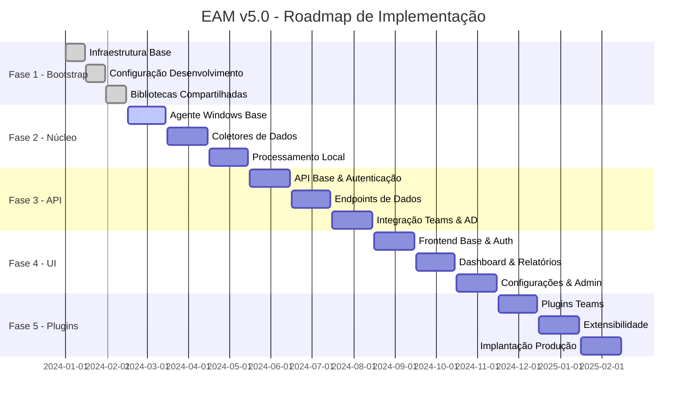

# Employee Activity Monitor (EAM) v5.0 - Estratégia de Implementação por Fases

## 1. Visão Geral da Estratégia

### 1.1 Roadmap de Implementação


### 1.2 Princípios da Estratégia
- **Iterativo e Incremental**: Cada fase entrega valor funcional
- **Risco Controlado**: Validação contínua e feedback rápido
- **Qualidade Contínua**: Testes automatizados desde o início
- **Documentação Viva**: Documentação atualizada a cada fase
- **Arquitetura Evolutiva**: Flexibilidade para mudanças

## 2. Fase 1 - Bootstrap (Semanas 1-6)

### 2.1 Objetivos
- Estabelecer fundação técnica sólida
- Configurar ambiente de desenvolvimento
- Implementar bibliotecas compartilhadas
- Definir padrões de desenvolvimento

### 2.2 Entregáveis

#### 2.2.1 Infraestrutura Base
```
✓ Configuração do repositório Git
✓ Pipeline CI/CD básico
✓ Ambiente Docker para desenvolvimento
✓ Configuração de bancos de dados
✓ Configuração de ferramentas de desenvolvimento
```

#### 2.2.2 Estrutura de Projetos
```
✓ Criação da solução EAM.sln
✓ Estrutura de diretórios padronizada
✓ Configuração de NuGet packages
✓ Configuração de análise estática
✓ Configuração de testes unitários
```

#### 2.2.3 Bibliotecas Compartilhadas
```
✓ EAM.Shared - Modelos e DTOs
✓ EAM.Shared.Contracts - Interfaces
✓ EAM.Shared.Security - Segurança
✓ EAM.Shared.Telemetry - Observabilidade
✓ EAM.Infrastructure.Data - Acesso a dados
```

### 2.3 Critérios de Sucesso
- [ ] Ambiente de desenvolvimento funcional
- [ ] Pipeline CI/CD executando
- [ ] Bibliotecas compartilhadas testadas
- [ ] Documentação técnica atualizada
- [ ] Padrões de desenvolvimento definidos

### 2.4 Riscos e Mitigações
| Risco | Probabilidade | Impacto | Mitigação |
|-------|---------------|---------|-----------|
| Complexidade inicial | Média | Alto | Começar com MVP simples |
| Ferramentas inadequadas | Baixa | Médio | Prova de conceito prévia |
| Equipe não familiarizada | Média | Médio | Treinamento e mentoria |

## 3. Fase 2 - Núcleo (Semanas 7-18)

### 3.1 Objetivos
- Implementar agente Windows funcional
- Desenvolver coletores de dados básicos
- Estabelecer comunicação com API
- Validar arquitetura do agente

### 3.2 Entregáveis

#### 3.2.1 Agente Windows Base
```
Sprint 1 (Semanas 7-9):
✓ Estrutura base do Windows Service
✓ Sistema de configuração
✓ Logging e telemetria
✓ Instalador MSI básico
✓ Testes unitários básicos
```

#### 3.2.2 Coletores de Dados
```
Sprint 2 (Semanas 10-12):
✓ Coletor de foco de janelas
✓ Coletor de URLs de navegadores
✓ Coletor de screenshots básico
✓ Coletor de sistema (CPU, RAM)
✓ Validação e sanitização de dados
```

#### 3.2.3 Processamento Local
```
Sprint 3 (Semanas 13-15):
✓ Engine de processamento de dados
✓ Compactação e criptografia
✓ Fila local para offline
✓ Retry logic para falhas
✓ Métricas de performance
```

#### 3.2.4 Comunicação API
```
Sprint 4 (Semanas 16-18):
✓ Client HTTP para API
✓ Autenticação por certificado
✓ Sincronização de dados
✓ Heartbeat e health checks
✓ Tratamento de erros
```

### 3.3 Critérios de Sucesso
- [ ] Agente coleta dados básicos
- [ ] Dados são processados localmente
- [ ] Comunicação com API funciona
- [ ] Agente é resiliente a falhas
- [ ] Performance adequada (< 5% CPU/RAM)

### 3.4 Testes e Validação
```
Testes Unitários:
✓ Cobertura > 80%
✓ Mocks para APIs externas
✓ Testes de performance

Testes de Integração:
✓ Comunicação com Windows APIs
✓ Integração com navegadores
✓ Persistência local

Testes de Sistema:
✓ Instalação/desinstalação
✓ Cenários de falha
✓ Performance sob carga
```

## 4. Fase 3 - API (Semanas 19-30)

### 4.1 Objetivos
- Implementar API RESTful robusta
- Estabelecer autenticação e autorização
- Integrar com sistemas externos
- Processar dados do agente

### 4.2 Entregáveis

#### 4.2.1 API Base & Autenticação
```
Sprint 5 (Semanas 19-21):
✓ ASP.NET Core API base
✓ Autenticação JWT
✓ Integração Active Directory
✓ Middleware de segurança
✓ Swagger/OpenAPI documentation
```

#### 4.2.2 Endpoints de Dados
```
Sprint 6 (Semanas 22-24):
✓ Endpoints para recepção de dados
✓ Validação de dados de entrada
✓ Processamento e armazenamento
✓ Endpoints de consulta básicos
✓ Rate limiting e throttling
```

#### 4.2.3 Integração Externa
```
Sprint 7 (Semanas 25-27):
✓ Integração Microsoft Teams
✓ Integração Active Directory
✓ Serviço de email/notificações
✓ Backup automático
✓ Monitoramento e alertas
```

#### 4.2.4 Analytics & Relatórios
```
Sprint 8 (Semanas 28-30):
✓ Engine de analytics
✓ Cálculo de métricas
✓ Agregação de dados
✓ Endpoints de relatórios
✓ Cache otimizado
```

### 4.3 Critérios de Sucesso
- [ ] API recebe dados do agente
- [ ] Autenticação funciona
- [ ] Integrações externas operacionais
- [ ] Performance adequada (< 200ms)
- [ ] Escalabilidade para 500 usuários

### 4.4 Arquitetura da API
```
Padrões Aplicados:
✓ Clean Architecture
✓ CQRS (Command Query Responsibility Segregation)
✓ Repository Pattern
✓ Dependency Injection
✓ Mediator Pattern

Tecnologias:
✓ ASP.NET Core 8
✓ Entity Framework Core
✓ PostgreSQL
✓ Redis
✓ MinIO
```

## 5. Fase 4 - UI (Semanas 31-42)

### 5.1 Objetivos
- Implementar interface web moderna
- Criar dashboards interativos
- Desenvolver sistema de relatórios
- Implementar administração do sistema

### 5.2 Entregáveis

#### 5.2.1 Frontend Base & Auth
```
Sprint 9 (Semanas 31-33):
✓ Angular 18 application
✓ Autenticação JWT
✓ Guards e interceptors
✓ Layout base e navegação
✓ Configuração de build/deploy
```

#### 5.2.2 Dashboard & Relatórios
```
Sprint 10 (Semanas 34-36):
✓ Dashboard principal
✓ Gráficos interativos
✓ Relatórios de produtividade
✓ Filtros e busca
✓ Exportação de dados
```

#### 5.2.3 Gestão de Usuários
```
Sprint 11 (Semanas 37-39):
✓ Listagem de usuários
✓ Perfis de usuário
✓ Gestão de permissões
✓ Configurações de privacidade
✓ Audit trail
```

#### 5.2.4 Configurações & Admin
```
Sprint 12 (Semanas 40-42):
✓ Configurações do sistema
✓ Gestão de agentes
✓ Configurações de monitoramento
✓ Backup e restore
✓ Monitoramento do sistema
```

### 5.3 Critérios de Sucesso
- [ ] Interface intuitiva e responsiva
- [ ] Dashboards carregam em < 3s
- [ ] Relatórios são precisos
- [ ] Administração completa
- [ ] Acessibilidade (WCAG 2.1 AA)

### 5.4 Tecnologias Frontend
```
Core:
✓ Angular 18
✓ TypeScript
✓ RxJS
✓ Angular Material

Gráficos:
✓ Chart.js
✓ D3.js (para visualizações avançadas)

Estado:
✓ NgRx (para features complexas)
✓ Angular Services (para estado simples)

Testes:
✓ Jasmine/Karma
✓ Cypress (E2E)
```

## 6. Fase 5 - Plugins (Semanas 43-54)

### 6.1 Objetivos
- Implementar sistema de plugins
- Desenvolver plugin Teams avançado
- Criar extensibilidade para futuras funcionalidades
- Preparar para implantação produção

### 6.2 Entregáveis

#### 6.2.1 Sistema de Plugins
```
Sprint 13 (Semanas 43-45):
✓ Arquitetura de plugins
✓ Interface de plugin
✓ Carregamento dinâmico
✓ Configuração de plugins
✓ Documentação de desenvolvimento
```

#### 6.2.2 Plugin Teams Avançado
```
Sprint 14 (Semanas 46-48):
✓ Integração completa Teams
✓ Análise de reuniões
✓ Detecção de presença
✓ Métricas de colaboração
✓ Relatórios específicos
```

#### 6.2.3 Extensibilidade
```
Sprint 15 (Semanas 49-51):
✓ Plugin de alertas
✓ Plugin de relatórios customizados
✓ Plugin de integrações
✓ SDK para desenvolvimento
✓ Marketplace de plugins
```

#### 6.2.4 Implantação Produção
```
Sprint 16 (Semanas 52-54):
✓ Ambiente de produção
✓ Monitoramento completo
✓ Backup e DR
✓ Documentação operacional
✓ Treinamento da equipe
```

### 6.3 Critérios de Sucesso
- [ ] Plugins funcionam independentemente
- [ ] Sistema é extensível
- [ ] Produção está operacional
- [ ] Monitoramento completo
- [ ] Documentação atualizada

## 7. Estratégia de Testes

### 7.1 Pirâmide de Testes
```
                   /\
                  /  \
                 /    \
                /  E2E  \
               /  Tests  \
              /____________\
             /              \
            /   Integration   \
           /     Tests        \
          /____________________\
         /                      \
        /      Unit Tests        \
       /________________________\
```

### 7.2 Tipos de Testes por Fase

#### Fase 1 - Bootstrap
- **Unit Tests**: Bibliotecas compartilhadas
- **Integration Tests**: Configuração de BD
- **Infrastructure Tests**: Pipeline CI/CD

#### Fase 2 - Núcleo
- **Unit Tests**: Coletores e processadores
- **Integration Tests**: Windows APIs
- **System Tests**: Instalação e performance

#### Fase 3 - API
- **Unit Tests**: Controllers e services
- **Integration Tests**: Banco de dados
- **Contract Tests**: APIs externas
- **Performance Tests**: Carga e stress

#### Fase 4 - UI
- **Unit Tests**: Components e services
- **Integration Tests**: API communication
- **E2E Tests**: Fluxos completos
- **Visual Tests**: Regressão visual

#### Fase 5 - Plugins
- **Unit Tests**: Plugin interfaces
- **Integration Tests**: Plugin loading
- **System Tests**: Produção
- **Acceptance Tests**: Cenários reais

### 7.3 Automação de Testes
```yaml
# Pipeline CI/CD
stages:
  - build
  - test
  - security-scan
  - deploy

test:
  parallel:
    - unit-tests
    - integration-tests
    - performance-tests
    - security-tests
  
  coverage:
    target: 80%
    fail_threshold: 70%
    
  quality_gates:
    - code_coverage
    - security_vulnerabilities
    - performance_benchmarks
```

## 8. Gestão de Riscos

### 8.1 Riscos Técnicos
| Risco | Fase | Probabilidade | Impacto | Mitigação |
|-------|------|---------------|---------|-----------|
| Performance do agente | 2 | Média | Alto | Profiling contínuo |
| Integração Teams | 3 | Alta | Médio | Prova de conceito |
| Escalabilidade API | 3 | Média | Alto | Testes de carga |
| Complexidade UI | 4 | Baixa | Médio | Prototipagem |
| Plugins instáveis | 5 | Média | Médio | Isolamento |

### 8.2 Riscos de Negócio
| Risco | Probabilidade | Impacto | Mitigação |
|-------|---------------|---------|-----------|
| Mudança de requisitos | Alta | Médio | Arquitetura flexível |
| Resistência dos usuários | Média | Alto | Comunicação transparente |
| Compliance/Privacidade | Baixa | Alto | Auditoria legal |
| Concorrência | Baixa | Médio | Diferenciação |

### 8.3 Plano de Contingência
```
Cenário 1: Atraso na integração Teams
- Alternativa: Implementar coleta básica via logs
- Impacto: Redução de funcionalidades
- Prazo: +2 semanas

Cenário 2: Performance inadequada
- Alternativa: Otimização e refatoração
- Impacto: Possível mudança de arquitetura
- Prazo: +4 semanas

Cenário 3: Problemas de privacidade
- Alternativa: Anonimização de dados
- Impacto: Funcionalidades limitadas
- Prazo: +1 semana
```

## 9. Critérios de Qualidade

### 9.1 Métricas de Código
```
Cobertura de Testes: > 80%
Complexidade Ciclomática: < 10
Duplicação de Código: < 5%
Dívida Técnica: < 10h/sprint
Vulnerabilidades: 0 críticas
```

### 9.2 Métricas de Performance
```
API Response Time: < 200ms (95th percentile)
Agent CPU Usage: < 5%
Agent Memory Usage: < 100MB
Database Query Time: < 100ms
UI Load Time: < 3s
```

### 9.3 Métricas de Qualidade
```
Bugs em Produção: < 2/sprint
Disponibilidade: > 99.5%
User Satisfaction: > 4.0/5.0
Time to Recovery: < 2h
Deployment Success: > 95%
```

## 10. Recursos e Cronograma

### 10.1 Equipe Sugerida
```
Arquiteto de Software: 1 pessoa (tempo completo)
Desenvolvedor Backend: 2 pessoas (tempo completo)
Desenvolvedor Frontend: 1 pessoa (tempo completo)
Desenvolvedor Windows: 1 pessoa (tempo completo)
QA Engineer: 1 pessoa (tempo completo)
DevOps Engineer: 0.5 pessoa (tempo parcial)
```

### 10.2 Cronograma Resumido
```
Fase 1 - Bootstrap: 6 semanas
Fase 2 - Núcleo: 12 semanas
Fase 3 - API: 12 semanas
Fase 4 - UI: 12 semanas
Fase 5 - Plugins: 12 semanas

Total: 54 semanas (≈ 13 meses)
```

### 10.3 Marcos Principais
```
M1: Infraestrutura pronta (Semana 6)
M2: Agente funcional (Semana 18)
M3: API operacional (Semana 30)
M4: UI completa (Semana 42)
M5: Sistema em produção (Semana 54)
```

## 11. Considerações Finais

### 11.1 Fatores Críticos de Sucesso
- Comprometimento da equipe
- Comunicação efetiva
- Qualidade desde o início
- Feedback contínuo dos usuários
- Flexibilidade para mudanças

### 11.2 Próximos Passos
1. Aprovação do plano arquitetural
2. Montagem da equipe
3. Preparação do ambiente
4. Início da Fase 1
5. Estabelecimento de rituais ágeis

### 11.3 Revisões e Ajustes
- Revisão semanal de progresso
- Retrospectiva ao final de cada sprint
- Ajuste de escopo conforme necessário
- Documentação contínua
- Comunicação de mudanças