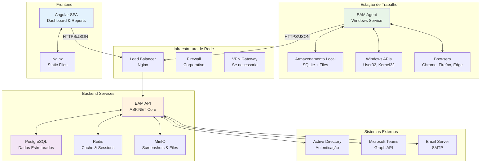
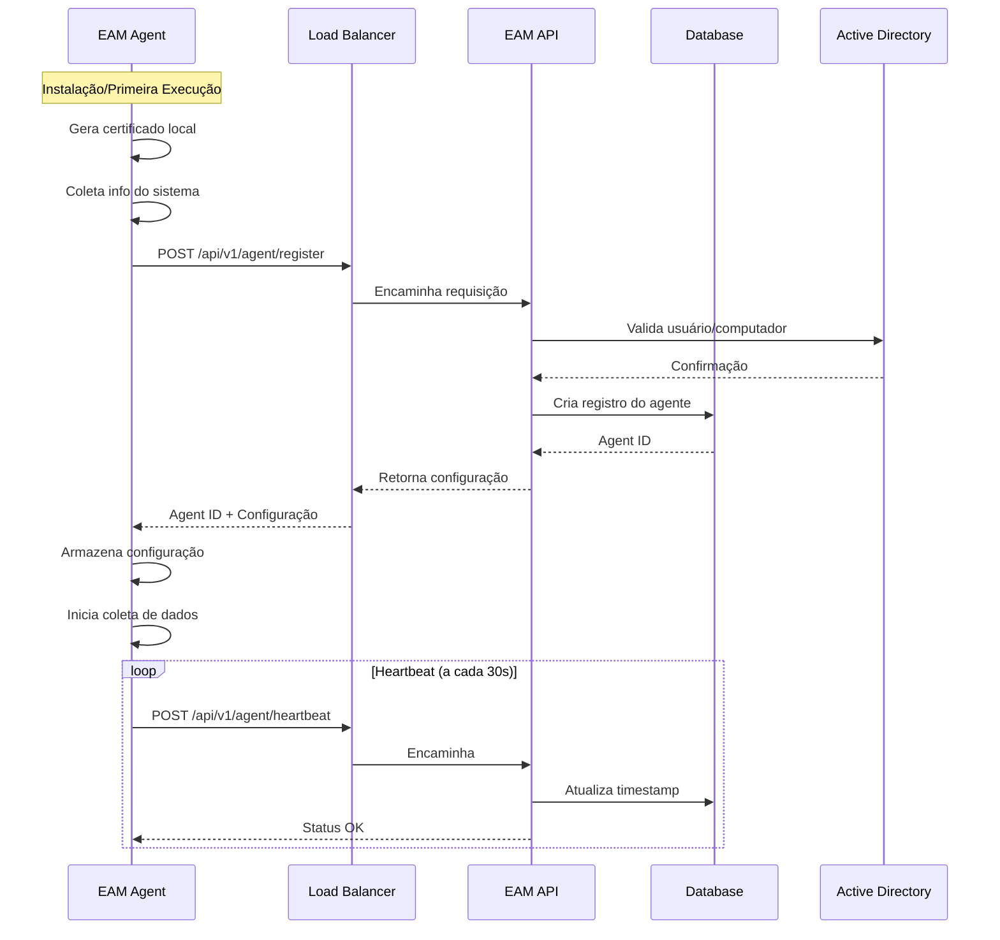
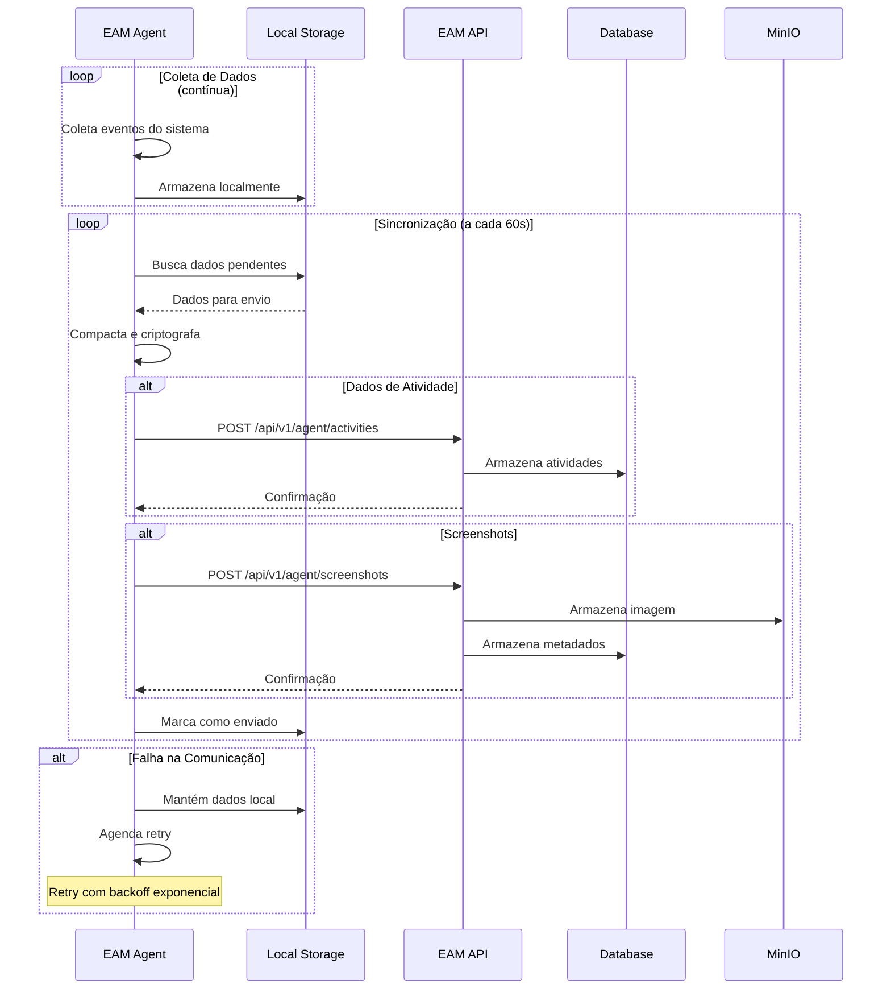
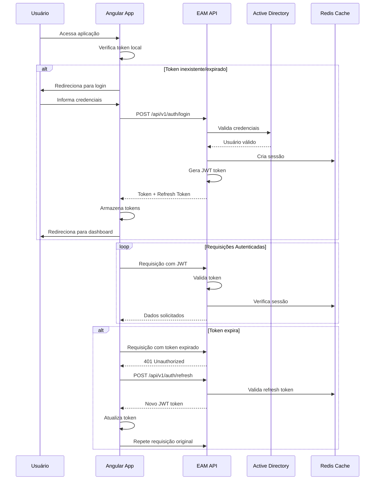
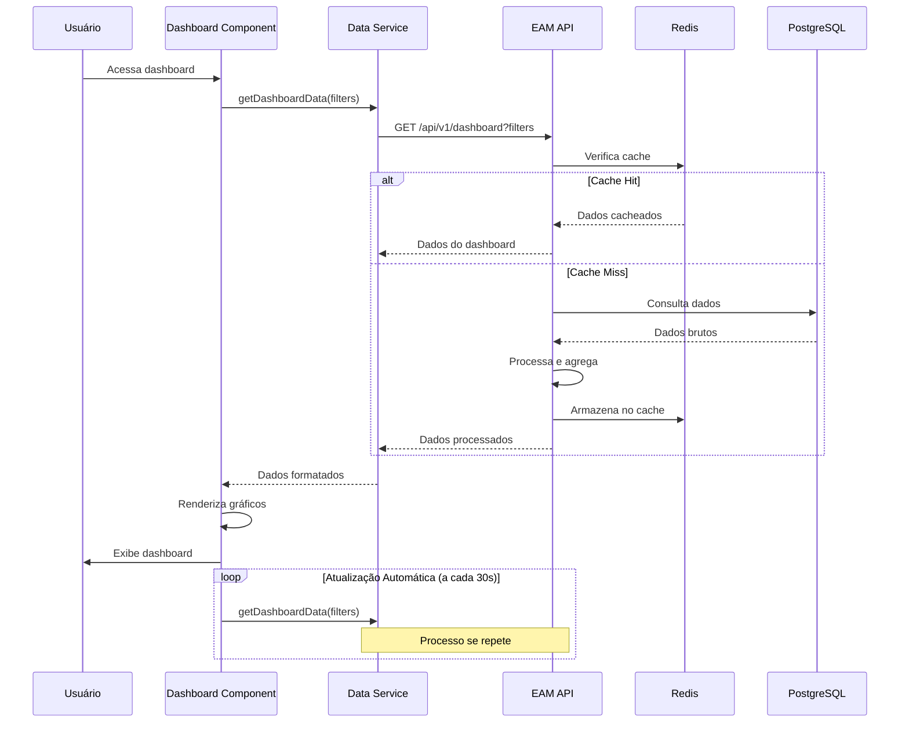

# Employee Activity Monitor (EAM) v5.0 - Plano de Integração

## 1. Visão Geral da Integração

### 1.1 Arquitetura de Integração


### 1.2 Princípios de Integração
- **Loosely Coupled**: Componentes independentes
- **Fault Tolerant**: Resiliente a falhas
- **Scalable**: Suporta crescimento
- **Secure**: Comunicação segura
- **Observable**: Monitoramento completo

## 2. Integração Agente ↔ API

### 2.1 Fluxo de Registro do Agente


### 2.2 Fluxo de Envio de Dados


### 2.3 Protocolo de Comunicação

#### 2.3.1 Autenticação
```csharp
// Certificado mútuo TLS
public class AgentAuthenticationHandler : DelegatingHandler
{
    protected override async Task<HttpResponseMessage> SendAsync(
        HttpRequestMessage request, 
        CancellationToken cancellationToken)
    {
        // Adiciona certificado do agente
        var certificate = GetAgentCertificate();
        request.Headers.Add("X-Agent-Certificate", certificate);
        
        // Adiciona assinatura HMAC
        var signature = GenerateHMACSignature(request);
        request.Headers.Add("X-Agent-Signature", signature);
        
        return await base.SendAsync(request, cancellationToken);
    }
}
```

#### 2.3.2 Formato de Dados
```json
{
  "agentId": "123e4567-e89b-12d3-a456-426614174000",
  "timestamp": "2024-01-15T10:30:00Z",
  "activities": [
    {
      "id": "activity-1",
      "type": "WindowFocus",
      "timestamp": "2024-01-15T10:30:00Z",
      "application": "chrome.exe",
      "windowTitle": "Google Chrome",
      "url": "https://github.com",
      "duration": 45,
      "isActive": true,
      "metadata": {
        "processId": 1234,
        "windowHandle": "0x12345",
        "screenResolution": "1920x1080"
      }
    }
  ],
  "systemInfo": {
    "cpuUsage": 15.5,
    "memoryUsage": 65.2,
    "diskUsage": 45.8
  }
}
```

### 2.4 Tratamento de Erros

#### 2.4.1 Estratégia de Retry
```csharp
public class AgentRetryPolicy
{
    private readonly int[] _retryDelays = { 1000, 2000, 5000, 10000, 30000 };
    
    public async Task<ApiResponse> ExecuteWithRetryAsync<T>(
        Func<Task<ApiResponse>> operation,
        CancellationToken cancellationToken = default)
    {
        var attempt = 0;
        
        while (attempt < _retryDelays.Length)
        {
            try
            {
                return await operation();
            }
            catch (HttpRequestException ex) when (IsRetryableError(ex))
            {
                attempt++;
                if (attempt >= _retryDelays.Length)
                    throw;
                
                await Task.Delay(_retryDelays[attempt - 1], cancellationToken);
            }
        }
        
        throw new MaxRetryAttemptsExceededException();
    }
    
    private bool IsRetryableError(HttpRequestException ex)
    {
        // Erros temporários que justificam retry
        return ex.Message.Contains("timeout") ||
               ex.Message.Contains("connection") ||
               ex.Message.Contains("502") ||
               ex.Message.Contains("503") ||
               ex.Message.Contains("504");
    }
}
```

#### 2.4.2 Armazenamento Offline
```csharp
public class OfflineStorageService
{
    private readonly string _dbPath;
    private readonly int _maxStorageDays = 7;
    
    public async Task StoreDataAsync(ActivityData data)
    {
        using var connection = new SqliteConnection(_dbPath);
        await connection.OpenAsync();
        
        var command = connection.CreateCommand();
        command.CommandText = @"
            INSERT INTO offline_activities 
            (id, data, timestamp, retry_count, is_sent)
            VALUES (@id, @data, @timestamp, 0, 0)";
        
        command.Parameters.AddWithValue("@id", data.Id);
        command.Parameters.AddWithValue("@data", JsonSerializer.Serialize(data));
        command.Parameters.AddWithValue("@timestamp", data.Timestamp);
        
        await command.ExecuteNonQueryAsync();
    }
    
    public async Task<IEnumerable<ActivityData>> GetPendingDataAsync()
    {
        using var connection = new SqliteConnection(_dbPath);
        await connection.OpenAsync();
        
        var command = connection.CreateCommand();
        command.CommandText = @"
            SELECT data FROM offline_activities 
            WHERE is_sent = 0 AND retry_count < 5
            ORDER BY timestamp";
        
        var results = new List<ActivityData>();
        using var reader = await command.ExecuteReaderAsync();
        
        while (await reader.ReadAsync())
        {
            var json = reader.GetString("data");
            var data = JsonSerializer.Deserialize<ActivityData>(json);
            results.Add(data);
        }
        
        return results;
    }
}
```

## 3. Integração API ↔ Frontend

### 3.1 Fluxo de Autenticação


### 3.2 Fluxo de Dados do Dashboard


### 3.3 Interceptors HTTP

#### 3.3.1 Auth Interceptor
```typescript
@Injectable()
export class AuthInterceptor implements HttpInterceptor {
  
  constructor(
    private authService: AuthService,
    private router: Router
  ) {}
  
  intercept(req: HttpRequest<any>, next: HttpHandler): Observable<HttpEvent<any>> {
    const token = this.authService.getToken();
    
    if (token) {
      const authReq = req.clone({
        setHeaders: {
          'Authorization': `Bearer ${token}`,
          'Content-Type': 'application/json'
        }
      });
      
      return next.handle(authReq).pipe(
        catchError((error: HttpErrorResponse) => {
          if (error.status === 401) {
            return this.handle401Error(authReq, next);
          }
          return throwError(() => error);
        })
      );
    }
    
    return next.handle(req);
  }
  
  private handle401Error(
    request: HttpRequest<any>, 
    next: HttpHandler
  ): Observable<HttpEvent<any>> {
    
    if (!this.authService.isRefreshing) {
      this.authService.isRefreshing = true;
      this.authService.refreshTokenSubject.next(null);
      
      return this.authService.refreshToken().pipe(
        switchMap((token: string) => {
          this.authService.isRefreshing = false;
          this.authService.refreshTokenSubject.next(token);
          
          const authReq = request.clone({
            setHeaders: {
              'Authorization': `Bearer ${token}`
            }
          });
          
          return next.handle(authReq);
        }),
        catchError((error) => {
          this.authService.isRefreshing = false;
          this.authService.logout();
          this.router.navigate(['/login']);
          return throwError(() => error);
        })
      );
    }
    
    return this.authService.refreshTokenSubject.pipe(
      filter(token => token !== null),
      take(1),
      switchMap((token) => {
        const authReq = request.clone({
          setHeaders: {
            'Authorization': `Bearer ${token}`
          }
        });
        return next.handle(authReq);
      })
    );
  }
}
```

#### 3.3.2 Error Interceptor
```typescript
@Injectable()
export class ErrorInterceptor implements HttpInterceptor {
  
  constructor(
    private notificationService: NotificationService,
    private logger: LoggerService
  ) {}
  
  intercept(req: HttpRequest<any>, next: HttpHandler): Observable<HttpEvent<any>> {
    return next.handle(req).pipe(
      catchError((error: HttpErrorResponse) => {
        let errorMessage = 'Erro desconhecido';
        
        if (error.error instanceof ErrorEvent) {
          // Erro do lado do cliente
          errorMessage = `Erro: ${error.error.message}`;
        } else {
          // Erro do lado do servidor
          switch (error.status) {
            case 400:
              errorMessage = 'Requisição inválida';
              break;
            case 401:
              errorMessage = 'Não autorizado';
              break;
            case 403:
              errorMessage = 'Acesso negado';
              break;
            case 404:
              errorMessage = 'Recurso não encontrado';
              break;
            case 500:
              errorMessage = 'Erro interno do servidor';
              break;
            default:
              errorMessage = `Erro ${error.status}: ${error.message}`;
          }
        }
        
        this.logger.error('HTTP Error', {
          url: req.url,
          method: req.method,
          error: error
        });
        
        if (error.status !== 401) {
          this.notificationService.showError(errorMessage);
        }
        
        return throwError(() => error);
      })
    );
  }
}
```

### 3.4 State Management

#### 3.4.1 NgRx Effects
```typescript
@Injectable()
export class UserEffects {
  
  loadUsers$ = createEffect(() =>
    this.actions$.pipe(
      ofType(UserActions.loadUsers),
      switchMap(({ page, pageSize, filters }) =>
        this.userService.getUsers(page, pageSize, filters).pipe(
          map(response => UserActions.loadUsersSuccess({
            users: response.data,
            totalCount: response.totalCount,
            page: response.page,
            pageSize: response.pageSize
          })),
          catchError(error => of(UserActions.loadUsersFailure({
            error: error.message
          })))
        )
      )
    )
  );
  
  createUser$ = createEffect(() =>
    this.actions$.pipe(
      ofType(UserActions.createUser),
      switchMap(({ user }) =>
        this.userService.createUser(user).pipe(
          map(createdUser => {
            this.notificationService.showSuccess('Usuário criado com sucesso');
            return UserActions.createUserSuccess({ user: createdUser });
          }),
          catchError(error => {
            this.notificationService.showError('Erro ao criar usuário');
            return of(UserActions.createUserFailure({ error: error.message }));
          })
        )
      )
    )
  );
  
  constructor(
    private actions$: Actions,
    private userService: UserService,
    private notificationService: NotificationService
  ) {}
}
```

## 4. Integração com Sistemas Externos

### 4.1 Active Directory Integration

#### 4.1.1 LDAP Authentication
```csharp
public class ActiveDirectoryService : IActiveDirectoryService
{
    private readonly ActiveDirectoryConfiguration _config;
    private readonly ILogger<ActiveDirectoryService> _logger;
    
    public async Task<bool> AuthenticateUserAsync(string username, string password)
    {
        try
        {
            using var connection = new LdapConnection(_config.ServerInfo);
            connection.Timeout = TimeSpan.FromSeconds(30);
            
            var credential = new NetworkCredential(
                $"{username}@{_config.Domain}", 
                password);
            
            connection.Credential = credential;
            connection.AuthType = AuthType.Basic;
            
            connection.Bind();
            
            _logger.LogInformation("User authenticated successfully: {Username}", username);
            return true;
        }
        catch (LdapException ex)
        {
            _logger.LogWarning(ex, "Authentication failed for user: {Username}", username);
            return false;
        }
    }
    
    public async Task<ActiveDirectoryUser> GetUserInfoAsync(string username)
    {
        using var connection = new LdapConnection(_config.ServerInfo);
        connection.Credential = _config.ServiceCredential;
        connection.Bind();
        
        var searchFilter = $"(&(objectCategory=person)(samAccountName={username}))";
        var searchRequest = new SearchRequest(
            _config.SearchBase,
            searchFilter,
            SearchScope.Subtree,
            new[] { "displayName", "mail", "department", "manager" }
        );
        
        var response = (SearchResponse)await connection.SendRequestAsync(searchRequest);
        
        if (response.Entries.Count == 0)
            return null;
        
        var entry = response.Entries[0];
        
        return new ActiveDirectoryUser
        {
            Username = username,
            DisplayName = entry.Attributes["displayName"]?[0]?.ToString(),
            Email = entry.Attributes["mail"]?[0]?.ToString(),
            Department = entry.Attributes["department"]?[0]?.ToString(),
            Manager = entry.Attributes["manager"]?[0]?.ToString()
        };
    }
}
```

### 4.2 Microsoft Teams Integration

#### 4.2.1 Graph API Integration
```csharp
public class TeamsService : ITeamsService
{
    private readonly GraphServiceClient _graphClient;
    private readonly ILogger<TeamsService> _logger;
    
    public async Task<IEnumerable<TeamsMeeting>> GetUserMeetingsAsync(
        string userId, 
        DateTime fromDate, 
        DateTime toDate)
    {
        try
        {
            var events = await _graphClient.Users[userId].Calendar.Events
                .Request()
                .Filter($"start/dateTime ge '{fromDate:yyyy-MM-ddTHH:mm:ss.fffZ}' and end/dateTime le '{toDate:yyyy-MM-ddTHH:mm:ss.fffZ}'")
                .Select("subject,start,end,attendees,organizer,onlineMeeting")
                .GetAsync();
            
            var meetings = new List<TeamsMeeting>();
            
            foreach (var eventItem in events)
            {
                if (eventItem.OnlineMeeting != null)
                {
                    meetings.Add(new TeamsMeeting
                    {
                        MeetingId = eventItem.OnlineMeeting.JoinUrl,
                        Title = eventItem.Subject,
                        StartTime = eventItem.Start.DateTime,
                        EndTime = eventItem.End.DateTime,
                        IsOrganizer = eventItem.Organizer.EmailAddress.Address == userId,
                        ParticipantCount = eventItem.Attendees.Count()
                    });
                }
            }
            
            return meetings;
        }
        catch (ServiceException ex)
        {
            _logger.LogError(ex, "Error getting meetings for user: {UserId}", userId);
            throw;
        }
    }
    
    public async Task<TeamsPresence> GetUserPresenceAsync(string userId)
    {
        try
        {
            var presence = await _graphClient.Users[userId].Presence
                .Request()
                .GetAsync();
            
            return new TeamsPresence
            {
                UserId = Guid.Parse(userId),
                Status = MapPresenceStatus(presence.Availability),
                Activity = presence.Activity,
                Timestamp = DateTime.UtcNow
            };
        }
        catch (ServiceException ex)
        {
            _logger.LogError(ex, "Error getting presence for user: {UserId}", userId);
            throw;
        }
    }
    
    private PresenceStatus MapPresenceStatus(string availability)
    {
        return availability?.ToLower() switch
        {
            "available" => PresenceStatus.Available,
            "busy" => PresenceStatus.Busy,
            "donotdisturb" => PresenceStatus.DoNotDisturb,
            "away" => PresenceStatus.Away,
            "berightback" => PresenceStatus.BeRightBack,
            _ => PresenceStatus.Unknown
        };
    }
}
```

## 5. Monitoramento e Observabilidade

### 5.1 Health Checks

#### 5.1.1 API Health Checks
```csharp
public class EamHealthCheck : IHealthCheck
{
    private readonly IServiceProvider _serviceProvider;
    
    public async Task<HealthCheckResult> CheckHealthAsync(
        HealthCheckContext context, 
        CancellationToken cancellationToken = default)
    {
        try
        {
            var data = new Dictionary<string, object>();
            
            // Database connectivity
            using var scope = _serviceProvider.CreateScope();
            var dbContext = scope.ServiceProvider.GetRequiredService<EamDbContext>();
            await dbContext.Database.CanConnectAsync(cancellationToken);
            data["database"] = "connected";
            
            // Redis connectivity
            var redis = scope.ServiceProvider.GetRequiredService<IDatabase>();
            await redis.PingAsync();
            data["redis"] = "connected";
            
            // Active Directory
            var adService = scope.ServiceProvider.GetRequiredService<IActiveDirectoryService>();
            var adHealthy = await adService.TestConnectionAsync();
            data["activeDirectory"] = adHealthy ? "connected" : "disconnected";
            
            return HealthCheckResult.Healthy("EAM API is healthy", data);
        }
        catch (Exception ex)
        {
            return HealthCheckResult.Unhealthy("EAM API is unhealthy", ex);
        }
    }
}
```

#### 5.1.2 Agent Health Monitoring
```csharp
public class AgentHealthService
{
    private readonly IApiClient _apiClient;
    private readonly ILogger<AgentHealthService> _logger;
    private readonly Timer _healthTimer;
    
    public AgentHealthService(IApiClient apiClient, ILogger<AgentHealthService> logger)
    {
        _apiClient = apiClient;
        _logger = logger;
        
        // Health check a cada 30 segundos
        _healthTimer = new Timer(SendHealthCheck, null, TimeSpan.Zero, TimeSpan.FromSeconds(30));
    }
    
    private async void SendHealthCheck(object state)
    {
        try
        {
            var healthData = new AgentHealthData
            {
                AgentId = Configuration.AgentId,
                Timestamp = DateTime.UtcNow,
                Status = HealthStatus.Healthy,
                CpuUsage = GetCpuUsage(),
                MemoryUsage = GetMemoryUsage(),
                DiskUsage = GetDiskUsage(),
                LastDataSync = GetLastDataSync(),
                PendingDataCount = GetPendingDataCount(),
                Errors = GetRecentErrors()
            };
            
            await _apiClient.SendHealthDataAsync(healthData);
        }
        catch (Exception ex)
        {
            _logger.LogError(ex, "Failed to send health check");
        }
    }
}
```

### 5.2 Distributed Tracing

#### 5.2.1 OpenTelemetry Configuration
```csharp
// API Startup
services.AddOpenTelemetry()
    .WithTracing(builder =>
    {
        builder
            .AddAspNetCoreInstrumentation()
            .AddHttpClientInstrumentation()
            .AddEntityFrameworkCoreInstrumentation()
            .AddRedisInstrumentation()
            .AddJaegerExporter(options =>
            {
                options.AgentHost = "localhost";
                options.AgentPort = 14268;
            });
    })
    .WithMetrics(builder =>
    {
        builder
            .AddAspNetCoreInstrumentation()
            .AddHttpClientInstrumentation()
            .AddRuntimeInstrumentation()
            .AddPrometheusExporter();
    });
```

#### 5.2.2 Custom Telemetry
```csharp
public class DataProcessingService
{
    private readonly ActivitySource _activitySource;
    private readonly ILogger<DataProcessingService> _logger;
    
    public DataProcessingService(ILogger<DataProcessingService> logger)
    {
        _activitySource = new ActivitySource("EAM.DataProcessing");
        _logger = logger;
    }
    
    public async Task<ProcessingResult> ProcessActivityDataAsync(
        IEnumerable<ActivityData> activities)
    {
        using var activity = _activitySource.StartActivity("ProcessActivityData");
        activity?.SetTag("data.count", activities.Count());
        
        try
        {
            var processingResult = new ProcessingResult();
            
            foreach (var activityData in activities)
            {
                using var itemActivity = _activitySource.StartActivity("ProcessSingleActivity");
                itemActivity?.SetTag("activity.type", activityData.Type.ToString());
                
                var result = await ProcessSingleActivityAsync(activityData);
                processingResult.ProcessedItems++;
                
                if (!result.Success)
                {
                    processingResult.ErrorItems++;
                    itemActivity?.SetStatus(ActivityStatusCode.Error, result.ErrorMessage);
                }
            }
            
            activity?.SetTag("processing.success", processingResult.ProcessedItems);
            activity?.SetTag("processing.errors", processingResult.ErrorItems);
            
            return processingResult;
        }
        catch (Exception ex)
        {
            activity?.SetStatus(ActivityStatusCode.Error, ex.Message);
            _logger.LogError(ex, "Error processing activity data");
            throw;
        }
    }
}
```

## 6. Segurança na Integração

### 6.1 TLS/SSL Configuration

#### 6.1.1 Certificate Management
```csharp
public class CertificateService
{
    public X509Certificate2 GetAgentCertificate()
    {
        // Carrega certificado do agente
        var certificateStore = new X509Store(StoreName.My, StoreLocation.LocalMachine);
        certificateStore.Open(OpenFlags.ReadOnly);
        
        var certificates = certificateStore.Certificates
            .Find(X509FindType.FindBySubjectName, "EAM-Agent", false);
        
        if (certificates.Count == 0)
        {
            throw new InvalidOperationException("Agent certificate not found");
        }
        
        return certificates[0];
    }
    
    public bool ValidateServerCertificate(X509Certificate2 certificate)
    {
        // Valida certificado do servidor
        var chain = new X509Chain();
        chain.ChainPolicy.RevocationMode = X509RevocationMode.Online;
        chain.ChainPolicy.RevocationFlag = X509RevocationFlag.ExcludeRoot;
        
        return chain.Build(certificate);
    }
}
```

### 6.2 API Rate Limiting

#### 6.2.1 Rate Limiting Middleware
```csharp
public class RateLimitingMiddleware
{
    private readonly RequestDelegate _next;
    private readonly IMemoryCache _cache;
    private readonly RateLimitOptions _options;
    
    public async Task InvokeAsync(HttpContext context)
    {
        var clientId = GetClientId(context);
        var key = $"rate_limit:{clientId}";
        
        var requests = _cache.Get<int>(key);
        
        if (requests >= _options.MaxRequests)
        {
            context.Response.StatusCode = 429;
            await context.Response.WriteAsync("Rate limit exceeded");
            return;
        }
        
        _cache.Set(key, requests + 1, TimeSpan.FromMinutes(_options.WindowMinutes));
        
        await _next(context);
    }
    
    private string GetClientId(HttpContext context)
    {
        // Identifica cliente por IP + User-Agent + Certificate
        var ip = context.Connection.RemoteIpAddress?.ToString();
        var userAgent = context.Request.Headers["User-Agent"].ToString();
        var clientCert = context.Connection.ClientCertificate?.Thumbprint;
        
        return $"{ip}:{userAgent}:{clientCert}".GetHashCode().ToString();
    }
}
```

## 7. Testes de Integração

### 7.1 Testes End-to-End

#### 7.1.1 Agent Integration Tests
```csharp
[TestClass]
public class AgentIntegrationTests
{
    private TestServer _server;
    private HttpClient _client;
    private AgentTestFixture _agentFixture;
    
    [TestInitialize]
    public async Task Setup()
    {
        var builder = WebApplication.CreateBuilder();
        // Configure test services
        
        _server = new TestServer(builder);
        _client = _server.CreateClient();
        _agentFixture = new AgentTestFixture(_client);
    }
    
    [TestMethod]
    public async Task Agent_RegisterAndSendData_Success()
    {
        // Arrange
        var registrationRequest = new AgentRegistrationRequest
        {
            ComputerName = "TEST-PC",
            UserName = "testuser",
            Version = "1.0.0"
        };
        
        // Act - Register Agent
        var registrationResponse = await _agentFixture.RegisterAgentAsync(registrationRequest);
        
        // Assert
        Assert.IsTrue(registrationResponse.Success);
        Assert.IsNotNull(registrationResponse.AgentId);
        
        // Act - Send Activity Data
        var activityData = new ActivityData
        {
            Type = ActivityType.WindowFocus,
            Application = "chrome.exe",
            WindowTitle = "Test Window",
            Duration = 30
        };
        
        var dataResponse = await _agentFixture.SendActivityDataAsync(
            registrationResponse.AgentId, 
            new[] { activityData });
        
        // Assert
        Assert.IsTrue(dataResponse.Success);
        Assert.AreEqual(1, dataResponse.ProcessedCount);
    }
}
```

### 7.2 Performance Tests

#### 7.2.1 Load Testing
```csharp
[TestMethod]
public async Task API_HandlesConcurrentRequests()
{
    // Arrange
    var tasks = new List<Task>();
    var concurrentRequests = 100;
    
    // Act
    for (int i = 0; i < concurrentRequests; i++)
    {
        tasks.Add(SendTestRequestAsync());
    }
    
    var results = await Task.WhenAll(tasks);
    
    // Assert
    Assert.IsTrue(results.All(r => r.IsSuccessStatusCode));
}
```

Este plano de integração garante que todos os componentes do sistema EAM v5.0 trabalhem de forma coordenada, segura e eficiente.