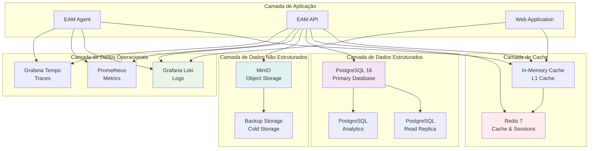

# Employee Activity Monitor (EAM) v5.0 - Arquitetura de Dados e Armazenamento

## 1. Visão Geral da Arquitetura de Dados

### 1.1 Estratégia Multi-Camadas


### 1.2 Características por Camada

#### 1.2.1 Dados Estruturados (PostgreSQL)
- **Tipo**: Dados relacionais, metadados
- **Volume**: ~800MB/mês para 500 usuários
- **Latência**: < 100ms para consultas
- **Consistência**: ACID completo
- **Backup**: Daily automated backups

#### 1.2.2 Cache (Redis)
- **Tipo**: Cache de sessões, consultas frequentes
- **Volume**: ~200MB RAM
- **Latência**: < 1ms
- **Consistência**: Eventual
- **Persistência**: RDB + AOF

#### 1.2.3 Objeto Storage (MinIO)
- **Tipo**: Screenshots, arquivos, backups
- **Volume**: ~200MB/mês (screenshots)
- **Latência**: < 500ms para upload/download
- **Consistência**: Eventual
- **Replicação**: Multi-zone

## 2. Modelo de Dados PostgreSQL

### 2.1 Schema Principal

#### 2.1.1 Tabelas Core
```sql
-- Usuários do sistema
CREATE TABLE users (
    id UUID PRIMARY KEY DEFAULT gen_random_uuid(),
    username VARCHAR(100) NOT NULL UNIQUE,
    email VARCHAR(255) NOT NULL UNIQUE,
    first_name VARCHAR(100) NOT NULL,
    last_name VARCHAR(100) NOT NULL,
    department VARCHAR(100),
    manager_id UUID REFERENCES users(id),
    is_active BOOLEAN DEFAULT true,
    created_at TIMESTAMPTZ DEFAULT CURRENT_TIMESTAMP,
    updated_at TIMESTAMPTZ DEFAULT CURRENT_TIMESTAMP
);

-- Agentes de monitoramento
CREATE TABLE agents (
    id UUID PRIMARY KEY DEFAULT gen_random_uuid(),
    user_id UUID NOT NULL REFERENCES users(id),
    computer_name VARCHAR(255) NOT NULL,
    ip_address INET,
    version VARCHAR(50) NOT NULL,
    os_version VARCHAR(100),
    last_heartbeat TIMESTAMPTZ,
    is_active BOOLEAN DEFAULT true,
    system_info JSONB,
    created_at TIMESTAMPTZ DEFAULT CURRENT_TIMESTAMP,
    updated_at TIMESTAMPTZ DEFAULT CURRENT_TIMESTAMP
);

-- Atividades dos usuários
CREATE TABLE user_activities (
    id UUID PRIMARY KEY DEFAULT gen_random_uuid(),
    agent_id UUID NOT NULL REFERENCES agents(id),
    user_id UUID NOT NULL REFERENCES users(id),
    timestamp TIMESTAMPTZ NOT NULL,
    activity_type VARCHAR(50) NOT NULL,
    application VARCHAR(255),
    window_title VARCHAR(500),
    url TEXT,
    duration_seconds INTEGER NOT NULL CHECK (duration_seconds > 0),
    is_active BOOLEAN DEFAULT true,
    category VARCHAR(50),
    metadata JSONB,
    created_at TIMESTAMPTZ DEFAULT CURRENT_TIMESTAMP
);

-- Screenshots
CREATE TABLE screenshots (
    id UUID PRIMARY KEY DEFAULT gen_random_uuid(),
    agent_id UUID NOT NULL REFERENCES agents(id),
    user_id UUID NOT NULL REFERENCES users(id),
    timestamp TIMESTAMPTZ NOT NULL,
    file_path VARCHAR(500) NOT NULL,
    file_hash VARCHAR(64) NOT NULL,
    width INTEGER NOT NULL,
    height INTEGER NOT NULL,
    file_size BIGINT NOT NULL,
    quality VARCHAR(20) NOT NULL,
    is_blurred BOOLEAN DEFAULT false,
    metadata JSONB,
    created_at TIMESTAMPTZ DEFAULT CURRENT_TIMESTAMP
);

-- Reuniões Teams
CREATE TABLE teams_meetings (
    id UUID PRIMARY KEY DEFAULT gen_random_uuid(),
    user_id UUID NOT NULL REFERENCES users(id),
    meeting_id VARCHAR(255) NOT NULL,
    title VARCHAR(500),
    start_time TIMESTAMPTZ NOT NULL,
    end_time TIMESTAMPTZ,
    meeting_type VARCHAR(50) NOT NULL,
    participant_count INTEGER DEFAULT 0,
    is_organizer BOOLEAN DEFAULT false,
    status VARCHAR(50) NOT NULL,
    metadata JSONB,
    created_at TIMESTAMPTZ DEFAULT CURRENT_TIMESTAMP
);

-- Configurações do sistema
CREATE TABLE system_configurations (
    id UUID PRIMARY KEY DEFAULT gen_random_uuid(),
    agent_id UUID REFERENCES agents(id),
    configuration_type VARCHAR(100) NOT NULL,
    settings JSONB NOT NULL,
    is_active BOOLEAN DEFAULT true,
    created_at TIMESTAMPTZ DEFAULT CURRENT_TIMESTAMP,
    updated_at TIMESTAMPTZ DEFAULT CURRENT_TIMESTAMP
);

-- Auditoria
CREATE TABLE audit_logs (
    id UUID PRIMARY KEY DEFAULT gen_random_uuid(),
    user_id UUID REFERENCES users(id),
    action VARCHAR(100) NOT NULL,
    resource VARCHAR(100) NOT NULL,
    resource_id VARCHAR(255),
    details JSONB,
    ip_address INET,
    user_agent TEXT,
    timestamp TIMESTAMPTZ DEFAULT CURRENT_TIMESTAMP
);
```

#### 2.1.2 Índices Otimizados
```sql
-- Índices para users
CREATE INDEX idx_users_username ON users(username);
CREATE INDEX idx_users_email ON users(email);
CREATE INDEX idx_users_department ON users(department);
CREATE INDEX idx_users_manager_id ON users(manager_id);
CREATE INDEX idx_users_is_active ON users(is_active) WHERE is_active = true;

-- Índices para agents
CREATE INDEX idx_agents_user_id ON agents(user_id);
CREATE INDEX idx_agents_computer_name ON agents(computer_name);
CREATE INDEX idx_agents_last_heartbeat ON agents(last_heartbeat);
CREATE INDEX idx_agents_is_active ON agents(is_active) WHERE is_active = true;

-- Índices para user_activities (particionados por data)
CREATE INDEX idx_user_activities_user_id_timestamp ON user_activities(user_id, timestamp DESC);
CREATE INDEX idx_user_activities_agent_id ON user_activities(agent_id);
CREATE INDEX idx_user_activities_timestamp ON user_activities(timestamp);
CREATE INDEX idx_user_activities_activity_type ON user_activities(activity_type);
CREATE INDEX idx_user_activities_application ON user_activities(application);
CREATE INDEX idx_user_activities_category ON user_activities(category);

-- Índice GIN para busca em metadata
CREATE INDEX idx_user_activities_metadata ON user_activities USING GIN (metadata);

-- Índices para screenshots
CREATE INDEX idx_screenshots_user_id_timestamp ON screenshots(user_id, timestamp DESC);
CREATE INDEX idx_screenshots_agent_id ON screenshots(agent_id);
CREATE INDEX idx_screenshots_timestamp ON screenshots(timestamp);
CREATE INDEX idx_screenshots_file_hash ON screenshots(file_hash);

-- Índices para teams_meetings
CREATE INDEX idx_teams_meetings_user_id ON teams_meetings(user_id);
CREATE INDEX idx_teams_meetings_start_time ON teams_meetings(start_time);
CREATE INDEX idx_teams_meetings_meeting_id ON teams_meetings(meeting_id);
CREATE INDEX idx_teams_meetings_status ON teams_meetings(status);

-- Índices para audit_logs
CREATE INDEX idx_audit_logs_user_id ON audit_logs(user_id);
CREATE INDEX idx_audit_logs_timestamp ON audit_logs(timestamp DESC);
CREATE INDEX idx_audit_logs_action ON audit_logs(action);
CREATE INDEX idx_audit_logs_resource ON audit_logs(resource);
```

### 2.2 Particionamento de Dados

#### 2.2.1 Particionamento por Data
```sql
-- Particiona user_activities por mês
CREATE TABLE user_activities (
    id UUID NOT NULL,
    agent_id UUID NOT NULL,
    user_id UUID NOT NULL,
    timestamp TIMESTAMPTZ NOT NULL,
    activity_type VARCHAR(50) NOT NULL,
    application VARCHAR(255),
    window_title VARCHAR(500),
    url TEXT,
    duration_seconds INTEGER NOT NULL,
    is_active BOOLEAN DEFAULT true,
    category VARCHAR(50),
    metadata JSONB,
    created_at TIMESTAMPTZ DEFAULT CURRENT_TIMESTAMP
) PARTITION BY RANGE (timestamp);

-- Cria partições mensais
CREATE TABLE user_activities_2024_01 PARTITION OF user_activities
    FOR VALUES FROM ('2024-01-01') TO ('2024-02-01');

CREATE TABLE user_activities_2024_02 PARTITION OF user_activities
    FOR VALUES FROM ('2024-02-01') TO ('2024-03-01');

-- Automatiza criação de partições
CREATE OR REPLACE FUNCTION create_monthly_partitions()
RETURNS void AS $$
DECLARE
    start_date DATE;
    end_date DATE;
    partition_name TEXT;
    table_name TEXT;
BEGIN
    -- Cria partições para os próximos 6 meses
    FOR i IN 0..5 LOOP
        start_date := DATE_TRUNC('month', CURRENT_DATE) + (i || ' months')::INTERVAL;
        end_date := start_date + INTERVAL '1 month';
        partition_name := 'user_activities_' || TO_CHAR(start_date, 'YYYY_MM');
        
        -- Verifica se partição já existe
        SELECT schemaname||'.'||tablename INTO table_name
        FROM pg_tables 
        WHERE tablename = partition_name;
        
        IF table_name IS NULL THEN
            EXECUTE format('CREATE TABLE %I PARTITION OF user_activities FOR VALUES FROM (%L) TO (%L)',
                          partition_name, start_date, end_date);
            
            -- Cria índices específicos da partição
            EXECUTE format('CREATE INDEX idx_%I_user_id_timestamp ON %I(user_id, timestamp DESC)',
                          partition_name, partition_name);
        END IF;
    END LOOP;
END;
$$ LANGUAGE plpgsql;

-- Agenda criação automática de partições
SELECT cron.schedule('create-monthly-partitions', '0 0 1 * *', 'SELECT create_monthly_partitions();');
```

### 2.3 Stored Procedures e Functions

#### 2.3.1 Funções de Analytics
```sql
-- Calcula score de produtividade
CREATE OR REPLACE FUNCTION calculate_productivity_score(
    p_user_id UUID,
    p_from_date TIMESTAMPTZ,
    p_to_date TIMESTAMPTZ
) RETURNS DECIMAL(5,2)
LANGUAGE plpgsql
AS $$
DECLARE
    v_productive_time INTEGER := 0;
    v_total_time INTEGER := 0;
    v_score DECIMAL(5,2) := 0.00;
BEGIN
    -- Calcula tempo produtivo vs total
    SELECT 
        SUM(CASE 
            WHEN category IN ('productive', 'neutral') THEN duration_seconds 
            ELSE 0 
        END) as productive_time,
        SUM(duration_seconds) as total_time
    INTO v_productive_time, v_total_time
    FROM user_activities
    WHERE user_id = p_user_id
      AND timestamp BETWEEN p_from_date AND p_to_date
      AND is_active = true;
    
    -- Calcula score
    IF v_total_time > 0 THEN
        v_score := (v_productive_time::DECIMAL / v_total_time::DECIMAL) * 100;
    END IF;
    
    RETURN ROUND(v_score, 2);
END;
$$;

-- Agrega dados diários
CREATE OR REPLACE FUNCTION aggregate_daily_activities(
    p_date DATE
) RETURNS void
LANGUAGE plpgsql
AS $$
BEGIN
    -- Insere/atualiza agregação diária
    INSERT INTO daily_activity_summary (
        user_id,
        date,
        total_active_time,
        productive_time,
        distracting_time,
        neutral_time,
        application_count,
        website_count,
        productivity_score,
        created_at
    )
    SELECT 
        user_id,
        p_date,
        SUM(duration_seconds) as total_active_time,
        SUM(CASE WHEN category = 'productive' THEN duration_seconds ELSE 0 END) as productive_time,
        SUM(CASE WHEN category = 'distracting' THEN duration_seconds ELSE 0 END) as distracting_time,
        SUM(CASE WHEN category = 'neutral' THEN duration_seconds ELSE 0 END) as neutral_time,
        COUNT(DISTINCT application) as application_count,
        COUNT(DISTINCT CASE WHEN url IS NOT NULL THEN 
            REGEXP_REPLACE(url, '^https?://([^/]+).*', '\1') 
        END) as website_count,
        calculate_productivity_score(user_id, p_date::TIMESTAMPTZ, (p_date + INTERVAL '1 day')::TIMESTAMPTZ),
        CURRENT_TIMESTAMP
    FROM user_activities
    WHERE timestamp::DATE = p_date
      AND is_active = true
    GROUP BY user_id
    ON CONFLICT (user_id, date) DO UPDATE SET
        total_active_time = EXCLUDED.total_active_time,
        productive_time = EXCLUDED.productive_time,
        distracting_time = EXCLUDED.distracting_time,
        neutral_time = EXCLUDED.neutral_time,
        application_count = EXCLUDED.application_count,
        website_count = EXCLUDED.website_count,
        productivity_score = EXCLUDED.productivity_score,
        updated_at = CURRENT_TIMESTAMP;
END;
$$;

-- Trigger para manutenção automática
CREATE OR REPLACE FUNCTION trigger_daily_aggregation()
RETURNS TRIGGER AS $$
BEGIN
    -- Agenda agregação para a data da atividade
    PERFORM pg_notify('daily_aggregation', NEW.timestamp::DATE::TEXT);
    RETURN NEW;
END;
$$ LANGUAGE plpgsql;

CREATE TRIGGER tr_user_activities_aggregation
    AFTER INSERT ON user_activities
    FOR EACH ROW
    EXECUTE FUNCTION trigger_daily_aggregation();
```

## 3. Estratégia de Cache (Redis)

### 3.1 Configuração Redis

#### 3.1.1 Configuração de Cluster
```yaml
# redis.conf
port 6379
cluster-enabled yes
cluster-config-file nodes.conf
cluster-node-timeout 5000
appendonly yes
appendfsync everysec

# Configuração de memória
maxmemory 512mb
maxmemory-policy allkeys-lru

# Configuração de persistência
save 900 1
save 300 10
save 60 10000

# Configuração de rede
bind 127.0.0.1
protected-mode yes
timeout 300
```

#### 3.1.2 Estrutura de Chaves
```
# Sessões de usuário
session:{user_id}:{session_id} -> {session_data}
TTL: 30 minutes

# Cache de consultas
query:{hash} -> {query_result}
TTL: 5 minutes

# Dados de dashboard
dashboard:{user_id}:{date} -> {dashboard_data}
TTL: 10 minutes

# Configurações de agente
agent_config:{agent_id} -> {configuration}
TTL: 1 hour

# Rate limiting
rate_limit:{client_id} -> {request_count}
TTL: 1 minute

# Locks distribuídos
lock:{resource_id} -> {lock_holder}
TTL: 30 seconds
```

### 3.2 Implementação do Cache

#### 3.2.1 Cache Service
```csharp
public class RedisCacheService : ICacheService
{
    private readonly IDatabase _database;
    private readonly ILogger<RedisCacheService> _logger;
    private readonly JsonSerializerOptions _jsonOptions;
    
    public RedisCacheService(
        IConnectionMultiplexer redis,
        ILogger<RedisCacheService> logger)
    {
        _database = redis.GetDatabase();
        _logger = logger;
        _jsonOptions = new JsonSerializerOptions
        {
            PropertyNamingPolicy = JsonNamingPolicy.CamelCase
        };
    }
    
    public async Task<T> GetAsync<T>(string key) where T : class
    {
        try
        {
            var value = await _database.StringGetAsync(key);
            
            if (value.HasValue)
            {
                return JsonSerializer.Deserialize<T>(value, _jsonOptions);
            }
            
            return null;
        }
        catch (Exception ex)
        {
            _logger.LogError(ex, "Error getting cache value for key: {Key}", key);
            return null;
        }
    }
    
    public async Task SetAsync<T>(string key, T value, TimeSpan expiration) where T : class
    {
        try
        {
            var json = JsonSerializer.Serialize(value, _jsonOptions);
            await _database.StringSetAsync(key, json, expiration);
        }
        catch (Exception ex)
        {
            _logger.LogError(ex, "Error setting cache value for key: {Key}", key);
        }
    }
    
    public async Task<bool> TryLockAsync(string resource, string holder, TimeSpan expiration)
    {
        try
        {
            var key = $"lock:{resource}";
            var result = await _database.StringSetAsync(key, holder, expiration, When.NotExists);
            return result;
        }
        catch (Exception ex)
        {
            _logger.LogError(ex, "Error acquiring lock for resource: {Resource}", resource);
            return false;
        }
    }
    
    public async Task ReleaseLockAsync(string resource, string holder)
    {
        try
        {
            var key = $"lock:{resource}";
            const string script = @"
                if redis.call('GET', KEYS[1]) == ARGV[1] then
                    return redis.call('DEL', KEYS[1])
                else
                    return 0
                end";
            
            await _database.ScriptEvaluateAsync(script, new RedisKey[] { key }, new RedisValue[] { holder });
        }
        catch (Exception ex)
        {
            _logger.LogError(ex, "Error releasing lock for resource: {Resource}", resource);
        }
    }
}
```

#### 3.2.2 Cache Patterns
```csharp
public class DataService
{
    private readonly ICacheService _cache;
    private readonly IDataRepository _repository;
    
    // Cache-Aside Pattern
    public async Task<DashboardData> GetDashboardDataAsync(Guid userId, DateTime date)
    {
        var cacheKey = $"dashboard:{userId}:{date:yyyy-MM-dd}";
        
        // Tenta buscar no cache
        var cachedData = await _cache.GetAsync<DashboardData>(cacheKey);
        if (cachedData != null)
        {
            return cachedData;
        }
        
        // Busca no banco de dados
        var data = await _repository.GetDashboardDataAsync(userId, date);
        
        // Armazena no cache
        await _cache.SetAsync(cacheKey, data, TimeSpan.FromMinutes(10));
        
        return data;
    }
    
    // Write-Through Pattern
    public async Task<User> UpdateUserAsync(Guid userId, UpdateUserRequest request)
    {
        // Atualiza no banco
        var user = await _repository.UpdateUserAsync(userId, request);
        
        // Atualiza no cache
        var cacheKey = $"user:{userId}";
        await _cache.SetAsync(cacheKey, user, TimeSpan.FromMinutes(30));
        
        return user;
    }
    
    // Write-Behind Pattern (Background Jobs)
    public async Task TrackUserActivityAsync(ActivityData activity)
    {
        // Armazena no cache imediatamente
        var cacheKey = $"activity:{activity.UserId}:{DateTime.UtcNow:yyyyMMddHHmm}";
        await _cache.SetAsync(cacheKey, activity, TimeSpan.FromMinutes(5));
        
        // Agenda para persistência em batch
        await _backgroundJobService.EnqueueAsync<ActivityPersistenceJob>(
            job => job.PersistActivityAsync(activity));
    }
}
```

## 4. Armazenamento de Objetos (MinIO)

### 4.1 Configuração MinIO

#### 4.1.1 Estrutura de Buckets
```yaml
# Buckets organizados por tipo e período
buckets:
  - name: "screenshots"
    versioning: enabled
    lifecycle:
      - rule: "delete-old"
        expiration: 90 days
      - rule: "transition-to-cold"
        transition: 30 days
        
  - name: "backups"
    versioning: enabled
    lifecycle:
      - rule: "delete-old"
        expiration: 365 days
        
  - name: "reports"
    versioning: enabled
    lifecycle:
      - rule: "delete-old"
        expiration: 180 days
        
  - name: "temp"
    versioning: disabled
    lifecycle:
      - rule: "delete-temp"
        expiration: 7 days
```

#### 4.1.2 Política de Acesso
```json
{
  "Version": "2012-10-17",
  "Statement": [
    {
      "Effect": "Allow",
      "Principal": {
        "AWS": "arn:aws:iam::eam:user/eam-api"
      },
      "Action": [
        "s3:GetObject",
        "s3:PutObject",
        "s3:DeleteObject"
      ],
      "Resource": "arn:aws:s3:::screenshots/*"
    },
    {
      "Effect": "Allow",
      "Principal": {
        "AWS": "arn:aws:iam::eam:user/eam-backup"
      },
      "Action": [
        "s3:GetObject",
        "s3:PutObject",
        "s3:ListBucket"
      ],
      "Resource": [
        "arn:aws:s3:::backups",
        "arn:aws:s3:::backups/*"
      ]
    }
  ]
}
```

### 4.2 Implementação do Storage Service

#### 4.2.1 MinIO Client
```csharp
public class MinIOStorageService : IStorageService
{
    private readonly IMinioClient _minioClient;
    private readonly ILogger<MinIOStorageService> _logger;
    private readonly StorageConfiguration _config;
    
    public MinIOStorageService(
        IMinioClient minioClient,
        ILogger<MinIOStorageService> logger,
        IOptions<StorageConfiguration> config)
    {
        _minioClient = minioClient;
        _logger = logger;
        _config = config.Value;
    }
    
    public async Task<string> StoreScreenshotAsync(
        Guid userId,
        Guid screenshotId,
        Stream imageStream,
        string contentType)
    {
        try
        {
            var bucketName = "screenshots";
            var objectName = $"{userId}/{DateTime.UtcNow:yyyy/MM/dd}/{screenshotId}.jpg";
            
            // Verifica se bucket existe
            var bucketExists = await _minioClient.BucketExistsAsync(
                new BucketExistsArgs().WithBucket(bucketName));
            
            if (!bucketExists)
            {
                await _minioClient.MakeBucketAsync(
                    new MakeBucketArgs().WithBucket(bucketName));
            }
            
            // Faz upload do arquivo
            await _minioClient.PutObjectAsync(
                new PutObjectArgs()
                    .WithBucket(bucketName)
                    .WithObject(objectName)
                    .WithStreamData(imageStream)
                    .WithObjectSize(imageStream.Length)
                    .WithContentType(contentType));
            
            _logger.LogInformation("Screenshot stored successfully: {ObjectName}", objectName);
            
            return objectName;
        }
        catch (Exception ex)
        {
            _logger.LogError(ex, "Error storing screenshot for user: {UserId}", userId);
            throw;
        }
    }
    
    public async Task<Stream> GetScreenshotAsync(string objectName)
    {
        try
        {
            var bucketName = "screenshots";
            var memoryStream = new MemoryStream();
            
            await _minioClient.GetObjectAsync(
                new GetObjectArgs()
                    .WithBucket(bucketName)
                    .WithObject(objectName)
                    .WithCallbackStream(stream => stream.CopyTo(memoryStream)));
            
            memoryStream.Position = 0;
            return memoryStream;
        }
        catch (Exception ex)
        {
            _logger.LogError(ex, "Error retrieving screenshot: {ObjectName}", objectName);
            throw;
        }
    }
    
    public async Task DeleteScreenshotAsync(string objectName)
    {
        try
        {
            var bucketName = "screenshots";
            
            await _minioClient.RemoveObjectAsync(
                new RemoveObjectArgs()
                    .WithBucket(bucketName)
                    .WithObject(objectName));
            
            _logger.LogInformation("Screenshot deleted successfully: {ObjectName}", objectName);
        }
        catch (Exception ex)
        {
            _logger.LogError(ex, "Error deleting screenshot: {ObjectName}", objectName);
            throw;
        }
    }
}
```

## 5. Backup e Disaster Recovery

### 5.1 Estratégia de Backup

#### 5.1.1 Backup Automático PostgreSQL
```bash
#!/bin/bash
# backup_postgres.sh

DB_NAME="eam_db"
DB_USER="eam_user"
DB_HOST="localhost"
BACKUP_DIR="/backups/postgres"
RETENTION_DAYS=30

# Cria diretório de backup
mkdir -p $BACKUP_DIR

# Backup completo
BACKUP_FILE="$BACKUP_DIR/eam_backup_$(date +%Y%m%d_%H%M%S).sql"

pg_dump -h $DB_HOST -U $DB_USER -d $DB_NAME \
    --verbose --clean --create \
    --format=custom \
    --file=$BACKUP_FILE

# Compacta backup
gzip $BACKUP_FILE

# Remove backups antigos
find $BACKUP_DIR -name "*.sql.gz" -mtime +$RETENTION_DAYS -delete

# Upload para storage remoto
aws s3 cp $BACKUP_FILE.gz s3://eam-backups/postgres/

echo "Backup completed: $BACKUP_FILE.gz"
```

#### 5.1.2 Backup Incremental
```sql
-- Configuração WAL-E para backup incremental
-- postgresql.conf
wal_level = replica
archive_mode = on
archive_command = 'wal-e wal-push %p'
archive_timeout = 60

-- Backup incremental automático
SELECT pg_start_backup('daily_backup', false, false);
-- Copia arquivos do banco
SELECT pg_stop_backup(false, true);
```

### 5.2 Disaster Recovery

#### 5.2.1 Plano de Recuperação
```yaml
# disaster_recovery.yml
recovery_procedures:
  database:
    rto: 4 hours    # Recovery Time Objective
    rpo: 15 minutes # Recovery Point Objective
    
    steps:
      1. "Restore from latest backup"
      2. "Apply WAL files"
      3. "Verify data integrity"
      4. "Update DNS records"
      5. "Restart services"
      
  storage:
    rto: 2 hours
    rpo: 1 hour
    
    steps:
      1. "Restore from replicated storage"
      2. "Verify file integrity"
      3. "Update service configuration"
      
  cache:
    rto: 30 minutes
    rpo: 5 minutes
    
    steps:
      1. "Restore Redis from RDB"
      2. "Warm cache from database"
      3. "Verify cache consistency"
```

## 6. Otimizações de Performance

### 6.1 Otimizações de Consultas

#### 6.1.1 Materialized Views
```sql
-- View materializada para dashboard
CREATE MATERIALIZED VIEW mv_user_daily_stats AS
SELECT 
    user_id,
    DATE(timestamp) as activity_date,
    COUNT(*) as total_activities,
    SUM(duration_seconds) as total_duration,
    COUNT(DISTINCT application) as unique_applications,
    AVG(duration_seconds) as avg_duration,
    MAX(timestamp) as last_activity
FROM user_activities
WHERE timestamp >= CURRENT_DATE - INTERVAL '90 days'
GROUP BY user_id, DATE(timestamp);

-- Índice único para refresh
CREATE UNIQUE INDEX idx_mv_user_daily_stats ON mv_user_daily_stats(user_id, activity_date);

-- Refresh automático
CREATE OR REPLACE FUNCTION refresh_daily_stats()
RETURNS void AS $$
BEGIN
    REFRESH MATERIALIZED VIEW CONCURRENTLY mv_user_daily_stats;
END;
$$ LANGUAGE plpgsql;

-- Agenda refresh diário
SELECT cron.schedule('refresh-daily-stats', '0 6 * * *', 'SELECT refresh_daily_stats();');
```

#### 6.1.2 Query Optimization
```sql
-- Otimização de consultas com window functions
CREATE OR REPLACE FUNCTION get_user_productivity_trend(
    p_user_id UUID,
    p_days INTEGER DEFAULT 30
) RETURNS TABLE (
    date DATE,
    productivity_score DECIMAL(5,2),
    trend_direction VARCHAR(10),
    change_percentage DECIMAL(5,2)
) AS $$
BEGIN
    RETURN QUERY
    WITH daily_scores AS (
        SELECT 
            DATE(timestamp) as activity_date,
            calculate_productivity_score(
                p_user_id, 
                DATE(timestamp)::TIMESTAMPTZ, 
                (DATE(timestamp) + INTERVAL '1 day')::TIMESTAMPTZ
            ) as score
        FROM user_activities
        WHERE user_id = p_user_id
          AND timestamp >= CURRENT_DATE - p_days
        GROUP BY DATE(timestamp)
        ORDER BY DATE(timestamp)
    ),
    trends AS (
        SELECT 
            activity_date,
            score,
            LAG(score) OVER (ORDER BY activity_date) as prev_score,
            CASE 
                WHEN score > LAG(score) OVER (ORDER BY activity_date) THEN 'up'
                WHEN score < LAG(score) OVER (ORDER BY activity_date) THEN 'down'
                ELSE 'stable'
            END as direction,
            CASE 
                WHEN LAG(score) OVER (ORDER BY activity_date) > 0 THEN
                    ROUND(((score - LAG(score) OVER (ORDER BY activity_date)) / 
                           LAG(score) OVER (ORDER BY activity_date)) * 100, 2)
                ELSE 0
            END as change_pct
        FROM daily_scores
    )
    SELECT 
        activity_date,
        score,
        direction,
        change_pct
    FROM trends
    WHERE prev_score IS NOT NULL
    ORDER BY activity_date;
END;
$$ LANGUAGE plpgsql;
```

### 6.2 Connection Pooling

#### 6.2.1 Configuração PgBouncer
```ini
# pgbouncer.ini
[databases]
eam_db = host=localhost port=5432 dbname=eam_db

[pgbouncer]
listen_port = 6432
listen_addr = 127.0.0.1
auth_type = md5
auth_file = /etc/pgbouncer/userlist.txt

# Pool settings
pool_mode = transaction
default_pool_size = 25
max_client_conn = 100
reserve_pool_size = 5
reserve_pool_timeout = 5

# Logging
log_connections = 1
log_disconnections = 1
log_pooler_errors = 1
```

#### 6.2.2 Application Configuration
```csharp
services.AddDbContext<EamDbContext>(options =>
{
    options.UseNpgsql(connectionString, npgsqlOptions =>
    {
        npgsqlOptions.CommandTimeout(30);
        npgsqlOptions.EnableRetryOnFailure(3);
    });
}, ServiceLifetime.Scoped);

services.AddDbContextPool<EamDbContext>(options =>
{
    options.UseNpgsql(connectionString);
}, poolSize: 128);
```

## 7. Monitoramento e Manutenção

### 7.1 Métricas de Banco de Dados

#### 7.1.1 Queries de Monitoramento
```sql
-- Consultas mais lentas
SELECT 
    query,
    calls,
    total_time,
    mean_time,
    max_time,
    stddev_time
FROM pg_stat_statements
ORDER BY total_time DESC
LIMIT 20;

-- Tabelas com mais I/O
SELECT 
    schemaname,
    tablename,
    heap_blks_read,
    heap_blks_hit,
    idx_blks_read,
    idx_blks_hit
FROM pg_statio_user_tables
ORDER BY heap_blks_read + idx_blks_read DESC;

-- Conexões ativas
SELECT 
    datname,
    usename,
    client_addr,
    state,
    query_start,
    query
FROM pg_stat_activity
WHERE state = 'active'
ORDER BY query_start;

-- Tamanho das tabelas
SELECT 
    schemaname,
    tablename,
    pg_size_pretty(pg_total_relation_size(schemaname||'.'||tablename)) as size
FROM pg_tables
WHERE schemaname = 'public'
ORDER BY pg_total_relation_size(schemaname||'.'||tablename) DESC;
```

### 7.2 Maintenance Tasks

#### 7.2.1 Automated Maintenance
```sql
-- Vacuum automático
ALTER TABLE user_activities SET (
    autovacuum_vacuum_scale_factor = 0.1,
    autovacuum_analyze_scale_factor = 0.05
);

-- Reindex periódico
CREATE OR REPLACE FUNCTION reindex_large_tables()
RETURNS void AS $$
DECLARE
    table_name TEXT;
BEGIN
    FOR table_name IN 
        SELECT tablename FROM pg_tables 
        WHERE schemaname = 'public' 
        AND tablename LIKE '%activities%'
    LOOP
        EXECUTE format('REINDEX TABLE %I', table_name);
    END LOOP;
END;
$$ LANGUAGE plpgsql;

-- Agenda manutenção semanal
SELECT cron.schedule('weekly-maintenance', '0 2 * * 0', 'SELECT reindex_large_tables();');
```

### 7.3 Alertas e Notificações

#### 7.3.1 Health Check Queries
```sql
-- Verifica saúde do banco
CREATE OR REPLACE FUNCTION check_database_health()
RETURNS TABLE (
    metric VARCHAR(50),
    value NUMERIC,
    status VARCHAR(20),
    message TEXT
) AS $$
BEGIN
    -- Conexões ativas
    RETURN QUERY
    SELECT 
        'active_connections'::VARCHAR(50),
        COUNT(*)::NUMERIC,
        CASE WHEN COUNT(*) > 80 THEN 'WARNING' ELSE 'OK' END::VARCHAR(20),
        'Active connections: ' || COUNT(*)::TEXT
    FROM pg_stat_activity
    WHERE state = 'active';
    
    -- Tamanho do banco
    RETURN QUERY
    SELECT 
        'database_size_mb'::VARCHAR(50),
        (pg_database_size(current_database()) / 1024 / 1024)::NUMERIC,
        'OK'::VARCHAR(20),
        'Database size: ' || pg_size_pretty(pg_database_size(current_database()))
    ;
    
    -- Consultas lentas
    RETURN QUERY
    SELECT 
        'slow_queries'::VARCHAR(50),
        COUNT(*)::NUMERIC,
        CASE WHEN COUNT(*) > 5 THEN 'WARNING' ELSE 'OK' END::VARCHAR(20),
        'Slow queries: ' || COUNT(*)::TEXT
    FROM pg_stat_activity
    WHERE state = 'active' 
    AND query_start < NOW() - INTERVAL '5 minutes';
END;
$$ LANGUAGE plpgsql;
```

Esta arquitetura de dados garante escalabilidade, performance e confiabilidade para o sistema EAM v5.0, suportando até 500 usuários com ~1GB de dados mensais.