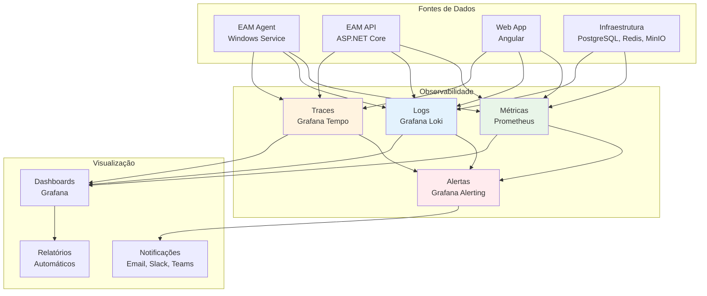

# Employee Activity Monitor (EAM) v5.0 - Telemetria e Observabilidade

## 1. Estratégia de Observabilidade

### 1.1 Pilares da Observabilidade


### 1.2 Objetivos da Observabilidade
- **Detecção Proativa**: Identificar problemas antes que afetem usuários
- **Troubleshooting Rápido**: Reduzir MTTR (Mean Time to Recovery)
- **Insights de Performance**: Otimizar continuamente o sistema
- **Compliance**: Auditoria e conformidade regulatória
- **Capacity Planning**: Prever necessidades de recursos

## 2. OpenTelemetry Implementation

### 2.1 Configuração OpenTelemetry

#### 2.1.1 EAM Agent (C#)
```csharp
// Program.cs
using OpenTelemetry;
using OpenTelemetry.Metrics;
using OpenTelemetry.Trace;
using OpenTelemetry.Logs;

var builder = Host.CreateDefaultBuilder(args)
    .ConfigureServices((context, services) =>
    {
        // OpenTelemetry Tracing
        services.AddOpenTelemetry()
            .WithTracing(builder =>
            {
                builder
                    .SetSampler(new AlwaysOnSampler())
                    .AddSource("EAM.Agent")
                    .AddHttpClientInstrumentation()
                    .AddJaegerExporter(options =>
                    {
                        options.AgentHost = "localhost";
                        options.AgentPort = 14268;
                    });
            })
            .WithMetrics(builder =>
            {
                builder
                    .AddMeter("EAM.Agent")
                    .AddHttpClientInstrumentation()
                    .AddRuntimeInstrumentation()
                    .AddPrometheusExporter();
            });
            
        // Structured Logging
        services.AddSerilog(config =>
        {
            config
                .WriteTo.Console()
                .WriteTo.File("logs/eam-agent-.log", rollingInterval: RollingInterval.Day)
                .WriteTo.Grafana.Loki("http://loki:3100")
                .Enrich.WithProperty("Service", "EAM.Agent")
                .Enrich.WithProperty("Environment", Environment.GetEnvironmentVariable("ASPNETCORE_ENVIRONMENT"))
                .Enrich.FromLogContext();
        });
    })
    .UseWindowsService();

// Instrumentação customizada
public class AgentTelemetry
{
    private static readonly ActivitySource ActivitySource = new("EAM.Agent");
    private static readonly Meter Meter = new("EAM.Agent");
    
    // Métricas
    private static readonly Counter<int> DataCollectedCounter = 
        Meter.CreateCounter<int>("eam_agent_data_collected_total");
    
    private static readonly Histogram<double> DataSyncDuration = 
        Meter.CreateHistogram<double>("eam_agent_data_sync_duration_seconds");
    
    private static readonly Gauge<int> PendingDataCount = 
        Meter.CreateGauge<int>("eam_agent_pending_data_count");
    
    public static void RecordDataCollected(string type, int count)
    {
        DataCollectedCounter.Add(count, new KeyValuePair<string, object?>("type", type));
    }
    
    public static void RecordDataSyncDuration(double duration)
    {
        DataSyncDuration.Record(duration);
    }
    
    public static void UpdatePendingDataCount(int count)
    {
        PendingDataCount.Record(count);
    }
}
```

#### 2.1.2 EAM API (ASP.NET Core)
```csharp
// Program.cs
var builder = WebApplication.CreateBuilder(args);

// OpenTelemetry
builder.Services.AddOpenTelemetry()
    .WithTracing(builder =>
    {
        builder
            .SetSampler(new AlwaysOnSampler())
            .AddSource("EAM.API")
            .AddAspNetCoreInstrumentation(options =>
            {
                options.RecordException = true;
                options.Filter = httpContext => 
                    !httpContext.Request.Path.StartsWithSegments("/health");
            })
            .AddHttpClientInstrumentation()
            .AddEntityFrameworkCoreInstrumentation()
            .AddRedisInstrumentation()
            .AddJaegerExporter();
    })
    .WithMetrics(builder =>
    {
        builder
            .AddMeter("EAM.API")
            .AddAspNetCoreInstrumentation()
            .AddHttpClientInstrumentation()
            .AddEntityFrameworkCoreInstrumentation()
            .AddRuntimeInstrumentation()
            .AddPrometheusExporter();
    });

// Logging
builder.Services.AddSerilog(config =>
{
    config
        .ReadFrom.Configuration(builder.Configuration)
        .WriteTo.Console()
        .WriteTo.Grafana.Loki("http://loki:3100")
        .Enrich.WithProperty("Service", "EAM.API")
        .Enrich.WithProperty("Environment", builder.Environment.EnvironmentName)
        .Enrich.FromLogContext()
        .Enrich.WithCorrelationId();
});

var app = builder.Build();

// Custom telemetry
public class ApiTelemetry
{
    private static readonly ActivitySource ActivitySource = new("EAM.API");
    private static readonly Meter Meter = new("EAM.API");
    
    // Métricas de negócio
    private static readonly Counter<int> DataReceivedCounter = 
        Meter.CreateCounter<int>("eam_api_data_received_total");
    
    private static readonly Counter<int> UsersActiveCounter = 
        Meter.CreateCounter<int>("eam_api_users_active_total");
    
    private static readonly Histogram<double> DataProcessingDuration = 
        Meter.CreateHistogram<double>("eam_api_data_processing_duration_seconds");
    
    private static readonly Gauge<int> DatabaseConnections = 
        Meter.CreateGauge<int>("eam_api_database_connections_active");
    
    public static Activity? StartActivity(string name)
    {
        return ActivitySource.StartActivity(name);
    }
    
    public static void RecordDataReceived(string dataType, int count)
    {
        DataReceivedCounter.Add(count, new KeyValuePair<string, object?>("data_type", dataType));
    }
    
    public static void RecordUserActivity(string userId)
    {
        UsersActiveCounter.Add(1, new KeyValuePair<string, object?>("user_id", userId));
    }
    
    public static void RecordProcessingDuration(string operation, double duration)
    {
        DataProcessingDuration.Record(duration, new KeyValuePair<string, object?>("operation", operation));
    }
}
```

#### 2.1.3 Web App (Angular)
```typescript
// telemetry.service.ts
import { Injectable } from '@angular/core';
import { trace, metrics, logs } from '@opentelemetry/api';
import { WebTracerProvider } from '@opentelemetry/sdk-trace-web';
import { getWebAutoInstrumentations } from '@opentelemetry/auto-instrumentations-web';
import { Resource } from '@opentelemetry/resources';
import { SemanticResourceAttributes } from '@opentelemetry/semantic-conventions';

@Injectable({
  providedIn: 'root'
})
export class TelemetryService {
  private tracer = trace.getTracer('EAM.WebApp');
  private meter = metrics.getMeter('EAM.WebApp');
  
  // Métricas
  private pageViewCounter = this.meter.createCounter('eam_webapp_page_views_total');
  private apiCallCounter = this.meter.createCounter('eam_webapp_api_calls_total');
  private errorCounter = this.meter.createCounter('eam_webapp_errors_total');
  private loadTimeHistogram = this.meter.createHistogram('eam_webapp_load_time_seconds');
  
  constructor() {
    this.initializeOpenTelemetry();
  }
  
  private initializeOpenTelemetry(): void {
    const provider = new WebTracerProvider({
      resource: new Resource({
        [SemanticResourceAttributes.SERVICE_NAME]: 'EAM.WebApp',
        [SemanticResourceAttributes.SERVICE_VERSION]: '1.0.0',
        [SemanticResourceAttributes.DEPLOYMENT_ENVIRONMENT]: environment.production ? 'production' : 'development'
      })
    });
    
    provider.addSpanProcessor(
      new BatchSpanProcessor(
        new JaegerExporter({
          endpoint: 'http://localhost:14268/api/traces'
        })
      )
    );
    
    provider.register({
      instrumentations: [getWebAutoInstrumentations()]
    });
  }
  
  public trackPageView(pageName: string): void {
    const span = this.tracer.startSpan('page_view', {
      attributes: {
        'page.name': pageName,
        'page.url': window.location.href
      }
    });
    
    this.pageViewCounter.add(1, { page: pageName });
    
    span.end();
  }
  
  public trackApiCall(method: string, endpoint: string, duration: number, success: boolean): void {
    const span = this.tracer.startSpan('api_call', {
      attributes: {
        'http.method': method,
        'http.url': endpoint,
        'http.status_code': success ? 200 : 500
      }
    });
    
    this.apiCallCounter.add(1, { 
      method: method,
      endpoint: endpoint,
      success: success.toString()
    });
    
    span.end();
  }
  
  public trackError(error: Error, context?: any): void {
    const span = this.tracer.startSpan('error', {
      attributes: {
        'error.message': error.message,
        'error.stack': error.stack,
        'error.context': JSON.stringify(context)
      }
    });
    
    this.errorCounter.add(1, { 
      type: error.constructor.name,
      message: error.message
    });
    
    span.recordException(error);
    span.end();
  }
  
  public trackLoadTime(operation: string, duration: number): void {
    this.loadTimeHistogram.record(duration, { operation: operation });
  }
}
```

## 3. Métricas e KPIs

### 3.1 Métricas de Sistema

#### 3.1.1 Agent Metrics
```yaml
# Métricas do Agente
agent_metrics:
  system:
    - name: "eam_agent_cpu_usage_percent"
      description: "CPU usage by agent process"
      type: "gauge"
      
    - name: "eam_agent_memory_usage_bytes"
      description: "Memory usage by agent process"
      type: "gauge"
      
    - name: "eam_agent_disk_usage_bytes"
      description: "Disk usage by agent process"
      type: "gauge"
      
  data_collection:
    - name: "eam_agent_data_collected_total"
      description: "Total data points collected"
      type: "counter"
      labels: ["type", "source"]
      
    - name: "eam_agent_data_sync_duration_seconds"
      description: "Time taken to sync data to API"
      type: "histogram"
      
    - name: "eam_agent_pending_data_count"
      description: "Number of pending data items"
      type: "gauge"
      
    - name: "eam_agent_sync_errors_total"
      description: "Total sync errors"
      type: "counter"
      labels: ["error_type"]
      
  health:
    - name: "eam_agent_heartbeat_success_total"
      description: "Successful heartbeats"
      type: "counter"
      
    - name: "eam_agent_last_heartbeat_timestamp"
      description: "Last successful heartbeat timestamp"
      type: "gauge"
```

#### 3.1.2 API Metrics
```yaml
# Métricas da API
api_metrics:
  http:
    - name: "eam_api_http_requests_total"
      description: "Total HTTP requests"
      type: "counter"
      labels: ["method", "endpoint", "status_code"]
      
    - name: "eam_api_http_request_duration_seconds"
      description: "HTTP request duration"
      type: "histogram"
      labels: ["method", "endpoint"]
      
    - name: "eam_api_http_concurrent_requests"
      description: "Concurrent HTTP requests"
      type: "gauge"
      
  business:
    - name: "eam_api_data_received_total"
      description: "Total data received from agents"
      type: "counter"
      labels: ["data_type", "agent_id"]
      
    - name: "eam_api_users_active_total"
      description: "Active users"
      type: "counter"
      labels: ["department"]
      
    - name: "eam_api_data_processing_duration_seconds"
      description: "Data processing duration"
      type: "histogram"
      labels: ["operation"]
      
  database:
    - name: "eam_api_database_connections_active"
      description: "Active database connections"
      type: "gauge"
      
    - name: "eam_api_database_query_duration_seconds"
      description: "Database query duration"
      type: "histogram"
      labels: ["query_type"]
      
    - name: "eam_api_database_errors_total"
      description: "Database errors"
      type: "counter"
      labels: ["error_type"]
```

### 3.2 Métricas de Negócio

#### 3.2.1 User Activity Metrics
```yaml
# Métricas de atividade do usuário
user_activity_metrics:
  productivity:
    - name: "eam_user_productivity_score"
      description: "User productivity score"
      type: "gauge"
      labels: ["user_id", "department"]
      
    - name: "eam_user_active_time_seconds"
      description: "User active time"
      type: "counter"
      labels: ["user_id"]
      
    - name: "eam_user_application_usage_seconds"
      description: "Application usage time"
      type: "counter"
      labels: ["user_id", "application"]
      
  engagement:
    - name: "eam_user_meetings_total"
      description: "Total meetings attended"
      type: "counter"
      labels: ["user_id", "meeting_type"]
      
    - name: "eam_user_meeting_duration_seconds"
      description: "Meeting duration"
      type: "histogram"
      labels: ["user_id", "meeting_type"]
      
    - name: "eam_user_website_visits_total"
      description: "Website visits"
      type: "counter"
      labels: ["user_id", "domain", "category"]
```

### 3.3 Implementação de Métricas

#### 3.3.1 Custom Metrics Service
```csharp
public class MetricsService : IMetricsService
{
    private readonly Meter _meter;
    private readonly ILogger<MetricsService> _logger;
    
    // Contadores
    private readonly Counter<int> _dataReceivedCounter;
    private readonly Counter<int> _usersActiveCounter;
    private readonly Counter<int> _errorsCounter;
    
    // Histogramas
    private readonly Histogram<double> _processingDurationHistogram;
    private readonly Histogram<double> _databaseQueryDurationHistogram;
    
    // Gauges
    private readonly Gauge<int> _activeConnectionsGauge;
    private readonly Gauge<double> _memoryUsageGauge;
    
    public MetricsService(ILogger<MetricsService> logger)
    {
        _logger = logger;
        _meter = new Meter("EAM.API");
        
        // Inicializa métricas
        _dataReceivedCounter = _meter.CreateCounter<int>("eam_api_data_received_total");
        _usersActiveCounter = _meter.CreateCounter<int>("eam_api_users_active_total");
        _errorsCounter = _meter.CreateCounter<int>("eam_api_errors_total");
        
        _processingDurationHistogram = _meter.CreateHistogram<double>("eam_api_data_processing_duration_seconds");
        _databaseQueryDurationHistogram = _meter.CreateHistogram<double>("eam_api_database_query_duration_seconds");
        
        _activeConnectionsGauge = _meter.CreateGauge<int>("eam_api_database_connections_active");
        _memoryUsageGauge = _meter.CreateGauge<double>("eam_api_memory_usage_bytes");
    }
    
    public void RecordDataReceived(string dataType, string agentId, int count)
    {
        _dataReceivedCounter.Add(count, new KeyValuePair<string, object?>[]
        {
            new("data_type", dataType),
            new("agent_id", agentId)
        });
    }
    
    public void RecordUserActivity(string userId, string department)
    {
        _usersActiveCounter.Add(1, new KeyValuePair<string, object?>[]
        {
            new("user_id", userId),
            new("department", department)
        });
    }
    
    public void RecordProcessingDuration(string operation, TimeSpan duration)
    {
        _processingDurationHistogram.Record(duration.TotalSeconds, 
            new KeyValuePair<string, object?>("operation", operation));
    }
    
    public void RecordError(string errorType, string context)
    {
        _errorsCounter.Add(1, new KeyValuePair<string, object?>[]
        {
            new("error_type", errorType),
            new("context", context)
        });
    }
    
    public void UpdateActiveConnections(int count)
    {
        _activeConnectionsGauge.Record(count);
    }
    
    public void UpdateMemoryUsage(double bytes)
    {
        _memoryUsageGauge.Record(bytes);
    }
}
```

## 4. Logging Estruturado

### 4.1 Configuração de Logging

#### 4.1.1 Serilog Configuration
```csharp
// appsettings.json
{
  "Serilog": {
    "Using": ["Serilog.Sinks.Console", "Serilog.Sinks.File", "Serilog.Sinks.Grafana.Loki"],
    "MinimumLevel": {
      "Default": "Information",
      "Override": {
        "Microsoft": "Warning",
        "System": "Warning",
        "Microsoft.EntityFrameworkCore": "Warning"
      }
    },
    "WriteTo": [
      {
        "Name": "Console",
        "Args": {
          "outputTemplate": "{Timestamp:yyyy-MM-dd HH:mm:ss} [{Level:u3}] {Message:lj} {Properties:j}{NewLine}{Exception}"
        }
      },
      {
        "Name": "File",
        "Args": {
          "path": "logs/eam-api-.log",
          "rollingInterval": "Day",
          "retainedFileCountLimit": 30,
          "outputTemplate": "{Timestamp:yyyy-MM-dd HH:mm:ss} [{Level:u3}] {Message:lj} {Properties:j}{NewLine}{Exception}"
        }
      },
      {
        "Name": "GrafanaLoki",
        "Args": {
          "uri": "http://loki:3100",
          "labels": [
            {
              "key": "service",
              "value": "eam-api"
            },
            {
              "key": "environment",
              "value": "production"
            }
          ]
        }
      }
    ],
    "Enrich": [
      "FromLogContext",
      "WithMachineName",
      "WithProcessId",
      "WithThreadId",
      "WithCorrelationId"
    ]
  }
}
```

#### 4.1.2 Structured Logging Examples
```csharp
public class UserService
{
    private readonly ILogger<UserService> _logger;
    
    public async Task<User> GetUserAsync(Guid userId)
    {
        using var activity = Activity.Current?.Source.StartActivity("GetUser");
        activity?.SetTag("user.id", userId.ToString());
        
        _logger.LogInformation("Starting user retrieval for {UserId}", userId);
        
        try
        {
            var user = await _userRepository.FindByIdAsync(userId);
            
            if (user == null)
            {
                _logger.LogWarning("User not found {UserId}", userId);
                return null;
            }
            
            _logger.LogInformation("User retrieved successfully {UserId} {UserName}", 
                userId, user.Username);
            
            return user;
        }
        catch (Exception ex)
        {
            _logger.LogError(ex, "Error retrieving user {UserId}", userId);
            throw;
        }
    }
    
    public async Task<OperationResult> ProcessUserDataAsync(Guid userId, ActivityData[] activities)
    {
        using var activity = Activity.Current?.Source.StartActivity("ProcessUserData");
        activity?.SetTag("user.id", userId.ToString());
        activity?.SetTag("data.count", activities.Length);
        
        var stopwatch = Stopwatch.StartNew();
        
        _logger.LogInformation("Processing {Count} activities for user {UserId}", 
            activities.Length, userId);
        
        try
        {
            var result = await _dataProcessor.ProcessActivitiesAsync(activities);
            
            stopwatch.Stop();
            
            _logger.LogInformation("Data processing completed for user {UserId} in {Duration}ms. " +
                "Processed: {ProcessedCount}, Errors: {ErrorCount}", 
                userId, stopwatch.ElapsedMilliseconds, result.ProcessedCount, result.ErrorCount);
            
            return result;
        }
        catch (Exception ex)
        {
            stopwatch.Stop();
            
            _logger.LogError(ex, "Data processing failed for user {UserId} after {Duration}ms", 
                userId, stopwatch.ElapsedMilliseconds);
            
            throw;
        }
    }
}
```

### 4.2 Log Categories

#### 4.2.1 Application Logs
```csharp
// Categorias de logs
public static class LogCategories
{
    public const string Authentication = "EAM.Authentication";
    public const string DataProcessing = "EAM.DataProcessing";
    public const string AgentCommunication = "EAM.AgentCommunication";
    public const string UserActivity = "EAM.UserActivity";
    public const string SystemHealth = "EAM.SystemHealth";
    public const string Security = "EAM.Security";
    public const string Performance = "EAM.Performance";
    public const string Audit = "EAM.Audit";
}

// Eventos estruturados
public static class LogEvents
{
    public static readonly EventId UserAuthenticated = new(1001, "UserAuthenticated");
    public static readonly EventId UserAuthenticationFailed = new(1002, "UserAuthenticationFailed");
    public static readonly EventId DataReceived = new(2001, "DataReceived");
    public static readonly EventId DataProcessed = new(2002, "DataProcessed");
    public static readonly EventId DataProcessingFailed = new(2003, "DataProcessingFailed");
    public static readonly EventId AgentConnected = new(3001, "AgentConnected");
    public static readonly EventId AgentDisconnected = new(3002, "AgentDisconnected");
    public static readonly EventId SecurityViolation = new(4001, "SecurityViolation");
    public static readonly EventId PerformanceThresholdExceeded = new(5001, "PerformanceThresholdExceeded");
}

// Uso estruturado
public class AuthenticationService
{
    private readonly ILogger<AuthenticationService> _logger;
    
    public async Task<AuthResult> AuthenticateAsync(string username, string password)
    {
        try
        {
            var result = await _authProvider.AuthenticateAsync(username, password);
            
            if (result.Success)
            {
                _logger.LogInformation(LogEvents.UserAuthenticated, 
                    "User {Username} authenticated successfully from {IPAddress}", 
                    username, GetClientIpAddress());
            }
            else
            {
                _logger.LogWarning(LogEvents.UserAuthenticationFailed,
                    "Authentication failed for user {Username} from {IPAddress}. Reason: {Reason}",
                    username, GetClientIpAddress(), result.FailureReason);
            }
            
            return result;
        }
        catch (Exception ex)
        {
            _logger.LogError(ex, LogEvents.UserAuthenticationFailed,
                "Authentication error for user {Username} from {IPAddress}",
                username, GetClientIpAddress());
            
            throw;
        }
    }
}
```

## 5. Distributed Tracing

### 5.1 Trace Context Propagation

#### 5.1.1 HTTP Headers
```csharp
// Middleware para propagação de contexto
public class TraceContextMiddleware
{
    private readonly RequestDelegate _next;
    private readonly ILogger<TraceContextMiddleware> _logger;
    
    public async Task InvokeAsync(HttpContext context)
    {
        // Extrai contexto do header
        var traceId = context.Request.Headers["X-Trace-Id"].FirstOrDefault();
        var spanId = context.Request.Headers["X-Span-Id"].FirstOrDefault();
        
        if (!string.IsNullOrEmpty(traceId))
        {
            Activity.Current?.SetTag("trace.id", traceId);
            Activity.Current?.SetTag("span.id", spanId);
        }
        
        // Adiciona contexto ao response
        context.Response.Headers.Add("X-Trace-Id", Activity.Current?.TraceId.ToString());
        context.Response.Headers.Add("X-Span-Id", Activity.Current?.SpanId.ToString());
        
        await _next(context);
    }
}

// HTTP Client com propagação
public class EamHttpClient
{
    private readonly HttpClient _httpClient;
    
    public EamHttpClient(HttpClient httpClient)
    {
        _httpClient = httpClient;
    }
    
    public async Task<T> PostAsync<T>(string endpoint, object data)
    {
        using var activity = Activity.Current?.Source.StartActivity("HttpPost");
        activity?.SetTag("http.method", "POST");
        activity?.SetTag("http.url", endpoint);
        
        // Adiciona headers de trace
        if (Activity.Current != null)
        {
            _httpClient.DefaultRequestHeaders.Add("X-Trace-Id", Activity.Current.TraceId.ToString());
            _httpClient.DefaultRequestHeaders.Add("X-Span-Id", Activity.Current.SpanId.ToString());
        }
        
        var json = JsonSerializer.Serialize(data);
        var content = new StringContent(json, Encoding.UTF8, "application/json");
        
        var response = await _httpClient.PostAsync(endpoint, content);
        
        activity?.SetTag("http.status_code", (int)response.StatusCode);
        
        if (response.IsSuccessStatusCode)
        {
            var responseContent = await response.Content.ReadAsStringAsync();
            return JsonSerializer.Deserialize<T>(responseContent);
        }
        
        throw new HttpRequestException($"HTTP {response.StatusCode}: {response.ReasonPhrase}");
    }
}
```

### 5.2 Custom Spans

#### 5.2.1 Business Operation Tracing
```csharp
public class DataProcessingService
{
    private static readonly ActivitySource ActivitySource = new("EAM.DataProcessing");
    private readonly ILogger<DataProcessingService> _logger;
    
    public async Task<ProcessingResult> ProcessUserActivitiesAsync(
        Guid userId, 
        IEnumerable<ActivityData> activities)
    {
        using var activity = ActivitySource.StartActivity("ProcessUserActivities");
        activity?.SetTag("user.id", userId.ToString());
        activity?.SetTag("data.count", activities.Count());
        
        var result = new ProcessingResult();
        
        try
        {
            // Validação
            using var validationActivity = ActivitySource.StartActivity("ValidateActivities");
            var validationResult = await ValidateActivitiesAsync(activities);
            validationActivity?.SetTag("validation.errors", validationResult.ErrorCount);
            
            if (!validationResult.IsValid)
            {
                activity?.SetStatus(ActivityStatusCode.Error, "Validation failed");
                return result;
            }
            
            // Processamento
            using var processingActivity = ActivitySource.StartActivity("ProcessActivities");
            foreach (var activityData in activities)
            {
                using var itemActivity = ActivitySource.StartActivity("ProcessSingleActivity");
                itemActivity?.SetTag("activity.type", activityData.Type.ToString());
                itemActivity?.SetTag("activity.application", activityData.Application);
                
                try
                {
                    await ProcessSingleActivityAsync(activityData);
                    result.ProcessedCount++;
                    
                    itemActivity?.SetStatus(ActivityStatusCode.Ok);
                }
                catch (Exception ex)
                {
                    result.ErrorCount++;
                    itemActivity?.SetStatus(ActivityStatusCode.Error, ex.Message);
                    itemActivity?.RecordException(ex);
                }
            }
            
            // Agregação
            using var aggregationActivity = ActivitySource.StartActivity("AggregateData");
            await AggregateUserDataAsync(userId);
            
            activity?.SetStatus(ActivityStatusCode.Ok);
            return result;
        }
        catch (Exception ex)
        {
            activity?.SetStatus(ActivityStatusCode.Error, ex.Message);
            activity?.RecordException(ex);
            throw;
        }
    }
}
```

## 6. Alertas e Monitoramento

### 6.1 Configuração de Alertas

#### 6.1.1 Grafana Alerts
```yaml
# alerting-rules.yml
groups:
  - name: eam-system-alerts
    rules:
      - alert: EAM_API_High_Error_Rate
        expr: rate(eam_api_errors_total[5m]) > 0.1
        for: 2m
        labels:
          severity: warning
          service: eam-api
        annotations:
          summary: "High error rate detected in EAM API"
          description: "Error rate is {{ $value | humanizePercentage }} over the last 5 minutes"
          
      - alert: EAM_API_High_Response_Time
        expr: histogram_quantile(0.95, rate(eam_api_http_request_duration_seconds_bucket[5m])) > 1.0
        for: 2m
        labels:
          severity: warning
          service: eam-api
        annotations:
          summary: "High response time in EAM API"
          description: "95th percentile response time is {{ $value }}s"
          
      - alert: EAM_Agent_Disconnected
        expr: time() - eam_agent_last_heartbeat_timestamp > 300
        for: 1m
        labels:
          severity: critical
          service: eam-agent
        annotations:
          summary: "EAM Agent disconnected"
          description: "Agent {{ $labels.agent_id }} has not sent heartbeat for over 5 minutes"
          
      - alert: EAM_Database_Connection_Pool_Exhausted
        expr: eam_api_database_connections_active > 20
        for: 1m
        labels:
          severity: critical
          service: eam-api
        annotations:
          summary: "Database connection pool exhausted"
          description: "Active connections: {{ $value }}"
          
      - alert: EAM_Memory_Usage_High
        expr: eam_api_memory_usage_bytes > 1073741824  # 1GB
        for: 5m
        labels:
          severity: warning
          service: eam-api
        annotations:
          summary: "High memory usage"
          description: "Memory usage is {{ $value | humanizeBytes }}"
```

#### 6.1.2 Notification Channels
```yaml
# notification-channels.yml
notification_policies:
  - match:
      severity: critical
    group_by: ['service', 'instance']
    group_wait: 10s
    group_interval: 10s
    repeat_interval: 1h
    receiver: 'critical-alerts'
    
  - match:
      severity: warning
    group_by: ['service']
    group_wait: 30s
    group_interval: 5m
    repeat_interval: 4h
    receiver: 'warning-alerts'

receivers:
  - name: 'critical-alerts'
    email_configs:
      - to: 'ops-team@company.com'
        subject: '[CRITICAL] EAM System Alert'
        body: |
          Alert: {{ range .Alerts }}{{ .Annotations.summary }}
          Description: {{ .Annotations.description }}
          Service: {{ .Labels.service }}
          Severity: {{ .Labels.severity }}
          {{ end }}
    slack_configs:
      - api_url: 'https://hooks.slack.com/services/...'
        channel: '#alerts-critical'
        title: 'EAM Critical Alert'
        text: '{{ range .Alerts }}{{ .Annotations.summary }}{{ end }}'
        
  - name: 'warning-alerts'
    email_configs:
      - to: 'dev-team@company.com'
        subject: '[WARNING] EAM System Alert'
        body: |
          Alert: {{ range .Alerts }}{{ .Annotations.summary }}
          Description: {{ .Annotations.description }}
          {{ end }}
```

### 6.2 Health Checks

#### 6.2.1 Comprehensive Health Checks
```csharp
public class EamHealthCheck : IHealthCheck
{
    private readonly IServiceProvider _serviceProvider;
    private readonly ILogger<EamHealthCheck> _logger;
    
    public async Task<HealthCheckResult> CheckHealthAsync(
        HealthCheckContext context, 
        CancellationToken cancellationToken = default)
    {
        var healthData = new Dictionary<string, object>();
        var overallHealthy = true;
        var issues = new List<string>();
        
        try
        {
            using var scope = _serviceProvider.CreateScope();
            
            // Database Health
            var dbHealthy = await CheckDatabaseHealthAsync(scope, healthData);
            if (!dbHealthy)
            {
                overallHealthy = false;
                issues.Add("Database connectivity issues");
            }
            
            // Redis Health
            var redisHealthy = await CheckRedisHealthAsync(scope, healthData);
            if (!redisHealthy)
            {
                overallHealthy = false;
                issues.Add("Redis connectivity issues");
            }
            
            // MinIO Health
            var minioHealthy = await CheckMinIOHealthAsync(scope, healthData);
            if (!minioHealthy)
            {
                overallHealthy = false;
                issues.Add("MinIO connectivity issues");
            }
            
            // External Services Health
            var externalHealthy = await CheckExternalServicesHealthAsync(scope, healthData);
            if (!externalHealthy)
            {
                overallHealthy = false;
                issues.Add("External service connectivity issues");
            }
            
            // System Resources
            var resourcesHealthy = await CheckSystemResourcesAsync(healthData);
            if (!resourcesHealthy)
            {
                overallHealthy = false;
                issues.Add("System resource constraints");
            }
            
            if (overallHealthy)
            {
                return HealthCheckResult.Healthy("All systems operational", healthData);
            }
            else
            {
                return HealthCheckResult.Degraded($"Issues detected: {string.Join(", ", issues)}", data: healthData);
            }
        }
        catch (Exception ex)
        {
            _logger.LogError(ex, "Health check failed");
            return HealthCheckResult.Unhealthy("Health check failed", ex, healthData);
        }
    }
    
    private async Task<bool> CheckDatabaseHealthAsync(IServiceScope scope, Dictionary<string, object> healthData)
    {
        try
        {
            var dbContext = scope.ServiceProvider.GetRequiredService<EamDbContext>();
            var canConnect = await dbContext.Database.CanConnectAsync();
            
            if (canConnect)
            {
                // Check query performance
                var stopwatch = Stopwatch.StartNew();
                var userCount = await dbContext.Users.CountAsync();
                stopwatch.Stop();
                
                healthData["database_connection"] = "healthy";
                healthData["database_user_count"] = userCount;
                healthData["database_query_time_ms"] = stopwatch.ElapsedMilliseconds;
                
                return stopwatch.ElapsedMilliseconds < 1000; // Less than 1 second
            }
            else
            {
                healthData["database_connection"] = "unhealthy";
                return false;
            }
        }
        catch (Exception ex)
        {
            healthData["database_connection"] = $"error: {ex.Message}";
            return false;
        }
    }
    
    private async Task<bool> CheckSystemResourcesAsync(Dictionary<string, object> healthData)
    {
        try
        {
            var process = Process.GetCurrentProcess();
            
            // Memory usage
            var memoryUsage = process.WorkingSet64;
            var memoryUsageMB = memoryUsage / 1024 / 1024;
            healthData["memory_usage_mb"] = memoryUsageMB;
            
            // CPU usage (simplified)
            var cpuCounter = new PerformanceCounter("Process", "% Processor Time", process.ProcessName);
            var cpuUsage = cpuCounter.NextValue();
            healthData["cpu_usage_percent"] = cpuUsage;
            
            // Disk space
            var driveInfo = new DriveInfo(Path.GetPathRoot(Environment.CurrentDirectory));
            var freeSpaceGB = driveInfo.AvailableFreeSpace / 1024 / 1024 / 1024;
            healthData["disk_free_space_gb"] = freeSpaceGB;
            
            // Check thresholds
            var memoryHealthy = memoryUsageMB < 1024; // Less than 1GB
            var diskHealthy = freeSpaceGB > 5; // More than 5GB
            
            return memoryHealthy && diskHealthy;
        }
        catch (Exception ex)
        {
            healthData["system_resources"] = $"error: {ex.Message}";
            return false;
        }
    }
}
```

## 7. Dashboards

### 7.1 Grafana Dashboards

#### 7.1.1 System Overview Dashboard
```json
{
  "dashboard": {
    "title": "EAM System Overview",
    "panels": [
      {
        "title": "System Health",
        "type": "stat",
        "targets": [
          {
            "expr": "up{job=\"eam-api\"}",
            "legendFormat": "API Status"
          },
          {
            "expr": "up{job=\"eam-agent\"}",
            "legendFormat": "Agent Status"
          }
        ]
      },
      {
        "title": "Request Rate",
        "type": "graph",
        "targets": [
          {
            "expr": "rate(eam_api_http_requests_total[5m])",
            "legendFormat": "Requests/sec"
          }
        ]
      },
      {
        "title": "Response Time",
        "type": "graph",
        "targets": [
          {
            "expr": "histogram_quantile(0.95, rate(eam_api_http_request_duration_seconds_bucket[5m]))",
            "legendFormat": "95th percentile"
          },
          {
            "expr": "histogram_quantile(0.50, rate(eam_api_http_request_duration_seconds_bucket[5m]))",
            "legendFormat": "50th percentile"
          }
        ]
      },
      {
        "title": "Error Rate",
        "type": "graph",
        "targets": [
          {
            "expr": "rate(eam_api_errors_total[5m])",
            "legendFormat": "Errors/sec"
          }
        ]
      },
      {
        "title": "Active Users",
        "type": "stat",
        "targets": [
          {
            "expr": "eam_api_users_active_total",
            "legendFormat": "Active Users"
          }
        ]
      },
      {
        "title": "Data Processing",
        "type": "graph",
        "targets": [
          {
            "expr": "rate(eam_api_data_received_total[5m])",
            "legendFormat": "Data Points/sec"
          }
        ]
      }
    ]
  }
}
```

#### 7.1.2 Business Metrics Dashboard
```json
{
  "dashboard": {
    "title": "EAM Business Metrics",
    "panels": [
      {
        "title": "User Productivity Score",
        "type": "graph",
        "targets": [
          {
            "expr": "eam_user_productivity_score",
            "legendFormat": "{{ user_id }}"
          }
        ]
      },
      {
        "title": "Application Usage",
        "type": "piechart",
        "targets": [
          {
            "expr": "sum by (application) (eam_user_application_usage_seconds)",
            "legendFormat": "{{ application }}"
          }
        ]
      },
      {
        "title": "Meeting Statistics",
        "type": "stat",
        "targets": [
          {
            "expr": "sum(eam_user_meetings_total)",
            "legendFormat": "Total Meetings"
          },
          {
            "expr": "avg(eam_user_meeting_duration_seconds)",
            "legendFormat": "Avg Duration"
          }
        ]
      }
    ]
  }
}
```

## 8. SLAs e SLOs

### 8.1 Service Level Objectives

#### 8.1.1 System SLOs
```yaml
# Service Level Objectives
slos:
  availability:
    api:
      target: 99.5%
      measurement: "up{job=\"eam-api\"}"
      window: "30d"
      
    agent:
      target: 99.0%
      measurement: "up{job=\"eam-agent\"}"
      window: "30d"
      
  performance:
    api_response_time:
      target: 95%  # 95% of requests under 500ms
      measurement: "histogram_quantile(0.95, rate(eam_api_http_request_duration_seconds_bucket[5m])) < 0.5"
      window: "24h"
      
    data_processing_time:
      target: 95%  # 95% of processing under 10s
      measurement: "histogram_quantile(0.95, rate(eam_api_data_processing_duration_seconds_bucket[5m])) < 10"
      window: "24h"
      
  error_rate:
    api_errors:
      target: 99.9%  # Error rate < 0.1%
      measurement: "rate(eam_api_errors_total[5m]) < 0.001"
      window: "24h"
      
    data_loss:
      target: 99.99%  # Data loss < 0.01%
      measurement: "rate(eam_agent_sync_errors_total[5m]) < 0.0001"
      window: "7d"
```

### 8.2 Error Budgets

#### 8.2.1 Error Budget Tracking
```csharp
public class ErrorBudgetService
{
    private readonly IMetricsService _metricsService;
    private readonly ILogger<ErrorBudgetService> _logger;
    
    public async Task<ErrorBudgetStatus> GetErrorBudgetStatusAsync(string service, TimeSpan window)
    {
        var totalRequests = await GetTotalRequestsAsync(service, window);
        var errorRequests = await GetErrorRequestsAsync(service, window);
        
        var errorRate = (double)errorRequests / totalRequests;
        var availabilityTarget = GetAvailabilityTarget(service);
        var errorBudget = 1.0 - availabilityTarget;
        
        var budgetUsed = errorRate / errorBudget;
        var budgetRemaining = Math.Max(0, 1.0 - budgetUsed);
        
        return new ErrorBudgetStatus
        {
            Service = service,
            Window = window,
            TotalRequests = totalRequests,
            ErrorRequests = errorRequests,
            ErrorRate = errorRate,
            AvailabilityTarget = availabilityTarget,
            ErrorBudget = errorBudget,
            BudgetUsed = budgetUsed,
            BudgetRemaining = budgetRemaining,
            IsExhausted = budgetUsed >= 1.0
        };
    }
    
    private double GetAvailabilityTarget(string service)
    {
        return service switch
        {
            "eam-api" => 0.995,      // 99.5%
            "eam-agent" => 0.99,     // 99.0%
            _ => 0.99                // Default 99.0%
        };
    }
}
```

## 9. Deployment e Configuração

### 9.1 Docker Compose

#### 9.1.1 Observability Stack
```yaml
# docker-compose.observability.yml
version: '3.8'

services:
  prometheus:
    image: prom/prometheus:latest
    ports:
      - "9090:9090"
    volumes:
      - ./prometheus.yml:/etc/prometheus/prometheus.yml
      - ./alerting-rules.yml:/etc/prometheus/alerting-rules.yml
    command:
      - '--config.file=/etc/prometheus/prometheus.yml'
      - '--storage.tsdb.path=/prometheus'
      - '--web.console.libraries=/etc/prometheus/console_libraries'
      - '--web.console.templates=/etc/prometheus/consoles'
      - '--web.enable-lifecycle'
      - '--web.enable-admin-api'

  grafana:
    image: grafana/grafana:latest
    ports:
      - "3000:3000"
    environment:
      - GF_SECURITY_ADMIN_PASSWORD=admin
    volumes:
      - grafana-storage:/var/lib/grafana
      - ./grafana/dashboards:/var/lib/grafana/dashboards
      - ./grafana/provisioning:/etc/grafana/provisioning

  loki:
    image: grafana/loki:latest
    ports:
      - "3100:3100"
    command: -config.file=/etc/loki/local-config.yaml
    volumes:
      - ./loki-config.yaml:/etc/loki/local-config.yaml

  tempo:
    image: grafana/tempo:latest
    ports:
      - "3200:3200"
      - "14268:14268"
    command: -config.file=/etc/tempo/tempo.yaml
    volumes:
      - ./tempo-config.yaml:/etc/tempo/tempo.yaml

  jaeger:
    image: jaegertracing/all-in-one:latest
    ports:
      - "16686:16686"
      - "14268:14268"
    environment:
      - COLLECTOR_OTLP_ENABLED=true

volumes:
  grafana-storage:
```

Esta estratégia de telemetria e observabilidade garante visibilidade completa do sistema EAM v5.0, permitindo monitoramento proativo, troubleshooting eficiente e otimização contínua de performance.